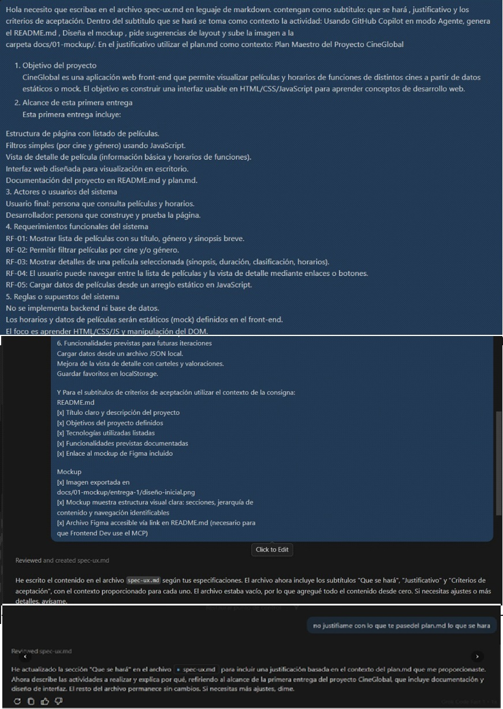

# Registro de Prompt #1

## Datos Generales

- **Integrante:** Santiago Ariel Samitier
- **Rol:** Documentador / Diseñador UX
- **Archivo aplicado:** `docs/03-specs/actividad-obligatoria-1/spec-ux.md`
- **Relación con Plan Maestro:** RF-UX-01 — Especificación técnica del rol UX antes del desarrollo

## Configuración de IA

- **Modelo IA utilizado:** GitHub Copilot (claude-3.5-sonnet)
- **Método de Prompting:** Role prompting

## Ejecución

### Prompt exacto:

```
Hola necesito que escribas en el archivo spec-ux.md en lenguaje de markdown.
Que contengan como subtitulo: que se hará, justificativo y los criterios de aceptación.
Dentro del subtitulo "que se hará" se toma como contexto la actividad:
Usando GitHub Copilot en modo Agente, genera el README.md, Diseña el mockup,
pide sugerencias de layout y sube la imagen a la carpeta docs/01-mockup/.
En el justificativo utilizar el plan.md como contexto.
No justifiques con lo que te pasé del plan.md lo que se hará.
```

### Resultado esperado:

Obtener un archivo `spec-ux.md` en formato Markdown con las secciones requeridas por la metodología SDD: qué se hará, justificación y criterios de aceptación en formato checklist, usando el `plan.md` como contexto para la justificación.

### Resultado obtenido:

GitHub Copilot generó el archivo `spec-ux.md` con las tres secciones solicitadas. La sección "qué se hará" describió correctamente las tareas del rol UX. El justificativo tomó el contexto del `plan.md`. Los criterios de aceptación quedaron en formato de lista.

### Evidencia:

> Captura disponible en el historial de conversación con GitHub Copilot Agent.



## Refinamiento Humano

- Se corrigió el justificativo para que no repitiera textualmente lo del "qué se hará" — se indicó a Copilot que los separe conceptualmente.
- Se ajustaron los criterios de aceptación para que queden en formato checklist (`- [ ]`) en lugar de lista simple.
- Se revisó la redacción para que fuera coherente con el `plan.md` real del proyecto CineGlobal.

---

**Archivo o sección del proyecto donde se aplicó:** `docs/03-specs/actividad-obligatoria-1/spec-ux.md`

*Validado por el Especialista en IA: Alejandro Bartomioli*

