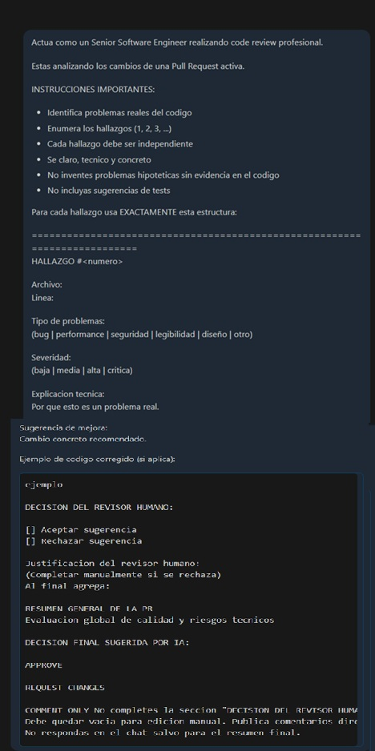

# Registro de Prompt #3

## Datos Generales

- **Integrante:** Alejandro Bartomioli
- **Rol:** Especialista en IA y Prompt Engineering
- **Archivo aplicado:** `docs/02-prompts/sdd-decisions.md` y `docs/03-specs/actividad-obligatoria-1/spec-template.md`
- **Relación con Plan Maestro:** RF-IA-01 — Investigación e implementación de la metodología SDD en el equipo

## Configuración de IA

- **Modelo IA utilizado:** Gemini 1.5 Pro (Google)
- **Método de Prompting:** Chain-of-thought prompting (se le pidió que razone paso a paso: primero explicar qué es SDD, luego cómo aplica al contexto del proyecto, y finalmente generar el template concreto)

## Ejecución

### Prompt exacto:

```
Investiga la metodología SDD (Spec-driven development) y define cómo
se aplica al proyecto: qué información debe tener cada spec-[rol].md,
en qué orden se escriben, y cómo se validan contra el plan.md.
```

### Resultado esperado:

Obtener una explicación clara de SDD aplicada al contexto del proyecto, con el orden correcto de escritura de los archivos spec y las instrucciones para validarlos contra el `plan.md` maestro.

### Resultado obtenido:

Gemini respondió definiendo SDD como un enfoque donde las especificaciones detalladas actúan como "fuente de verdad" antes de escribir una sola línea de código funcional. Estructuró la respuesta en dos secciones principales:

**1. El Orden de Escritura (Flujo de Trabajo)** — jerarquía lógica de 4 niveles:
1. `plan.md` — el mapa de ruta de alto nivel (el "Qué" y el "Por qué")
2. `spec-arquitecto.md` — la estructura técnica y flujo de datos (el "Cómo")
3. `spec-frontend.md` / `spec-backend.md` — los detalles de implementación específicos por rol
4. `spec-qo.md` — los criterios de aceptación y pruebas

**2. Contenido de cada `spec-[rol].md`** — definiendo que cada archivo debe funcionar como un contrato técnico sin ambigüedades.

### Evidencia:



## Refinamiento Humano

- Se ajustó el template para agregar una sección de "Trazabilidad con plan.md" que Gemini no incluyó en el primer intento.
- Se simplificó el lenguaje de algunas secciones para que sea más directo y útil para el equipo.
- Se distribuyó el template a cada integrante antes de que empezaran a desarrollar, verificando que lo usaran correctamente en sus specs individuales.

---

**Archivo o sección del proyecto donde se aplicó:** `docs/02-prompts/sdd-decisions.md` y `docs/03-specs/actividad-obligatoria-1/spec-template.md`

*Validado por el Especialista en IA: Alejandro Bartomioli*
