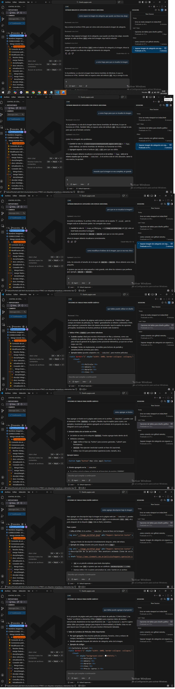

# Registro de Prompt #4

## Datos Generales

- **Integrante:** Milagros Magali Araujo
- **Rol:** Desarrollador Frontend
- **Archivo aplicado:** `index.html`
- **Relación con Plan Maestro:** RF-FE-01 — Estructura HTML5 de la página principal con imágenes, tablas y elementos semánticos

## Configuración de IA

- **Modelo IA utilizado:** GitHub Copilot — Claude Haiku 4.5 (Anthropic)
- **Método de Prompting:** Few-shot prompting (se proporcionó el archivo `index.html` como contexto en cada consulta, y se fue refinando el resultado con preguntas sucesivas)

## Ejecución

### Prompt exacto:

```
como separo la imagen de categoria, que quede una linea mas abajo
```

Seguido de refinamientos iterativos en la misma sesión:

```
y como hago para que se visualice la imagen
```
```
por que no se visualiza la imagen?
```
```
necesito que la imagen se vea completa, en grande
```
```
como modificar el tamaño de la imagen, que se vea mas chica
```

Y en una segunda sesión sobre estructura tabular:

```
que tablas puedo utilizar en diseño
```
```
que tablas puedo agregar al proyecto?
```
```
como agregar un boton
```
```
como agrego descripcion bajo la imagen
```

### Resultado esperado:

Corregir la visualización de imágenes en el `index.html` (rutas, tamaños, separación visual) y enriquecer la estructura HTML con tablas de cartelera, botones y descripciones bajo las imágenes, todo integrado al contexto real del proyecto CineGlobal.

### Resultado obtenido:

**Sesión 1 — Imágenes:**
Claude Haiku detectó dos problemas concretos en el `index.html`: la ruta de la imagen usaba barras invertidas de Windows (`C:\Users\Usuario\Desktop\...`) que no funcionan en HTML, y faltaba un espacio entre los atributos `src` y `alt`. Corrigió la ruta a una relativa (`../image_eec56fad.jpeg`) y ajustó el tamaño de `600x700` a `300x350` cuando se pidió que se vea más pequeña.

**Sesión 2 — Tablas y botones:**
Copilot leyó el `spec-fronted.md` como contexto y sugirió una tabla de cartelera con columnas Película, Género, Horario, Cine y Precio. También explicó la sintaxis de `<button>` y cómo agregar descripción debajo de una imagen usando `<p>` o `<h4>` inmediatamente después de la etiqueta ``.

### Evidencia:

> Capturas de las sesiones en GitHub Copilot dentro de VS Code (ver imágenes adjuntas).


## Refinamiento Humano

- Se corrigió manualmente la ruta de la imagen luego de que Copilot la ajustara, ya que el archivo estaba en una ubicación diferente a la asumida por el modelo.
- Se eligió el tamaño final de la imagen (`300x350`) entre las opciones sugeridas por Copilot.
- Se seleccionó qué tablas incorporar al proyecto de las varias opciones sugeridas (se eligió la tabla de cartelera como la más relevante para CineGlobal).
- Se adaptó el código de ejemplo del botón al contexto del formulario existente en `index.html`.

---

**Archivo o sección del proyecto donde se aplicó:** `index.html` — sección de cartelera, imágenes y formulario

*Validado por el Especialista en IA: Alejandro Bartomioli*
