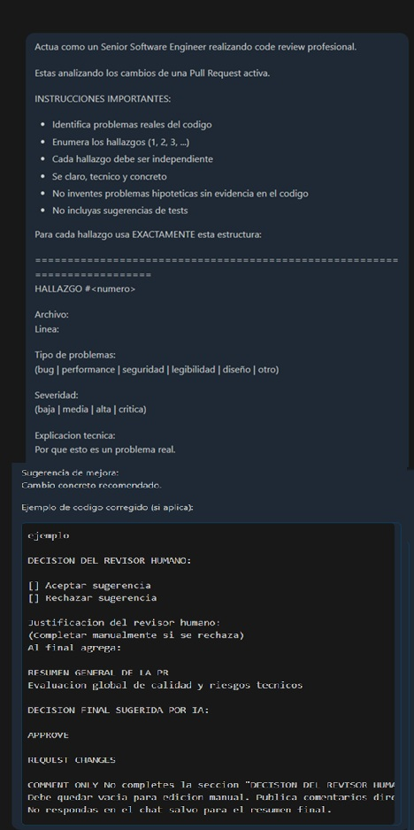

# Registro de Prompt #4

## Datos Generales

- **Integrante:** Marc Holste
- **Rol:** Coordinador / DevOps
- **Archivo aplicado:** Pull Request #16 — revisión del código HTML del Frontend
- **Relación con Plan Maestro:** RF-DEV-03 — Administración de Pull Requests con code review asistido por IA

## Configuración de IA

- **Modelo IA utilizado:** GPT-4o (OpenAI)
- **Método de Prompting:** Zero-shot prompting (instrucciones directas sin ejemplos previos, con estructura de output definida)

## Ejecución

### Prompt exacto:

```
Actúa como un Senior Software Engineer realizando code review profesional.
Estás analizando los cambios de una Pull Request activa.

INSTRUCCIONES IMPORTANTES:
- Identifica problemas reales del código
- Enumera los hallazgos (1, 2, 3, ...)
- Cada hallazgo debe ser independiente
- Sé claro, técnico y concreto
- No inventes problemas hipotéticos sin evidencia en el código
- No incluyas sugerencias de tests

Para cada hallazgo usa EXACTAMENTE esta estructura:

==========================================================================
HALLAZGO #<numero>
Archivo:
Linea:
Tipo de problema:
(bug | performance | seguridad | legibilidad | diseño | otro)
Severidad:
(baja | media | alta | critica)
Explicación técnica:
Por qué esto es un problema real.
Sugerencia de mejora:
Cambio concreto recomendado.
Ejemplo de código corregido (si aplica):
```codigo
ejemplo
```
DECISION DEL REVISOR HUMANO:
[ ] Aceptar sugerencia
[ ] Rechazar sugerencia
Justificación del revisor humano:
(Completar manualmente si se rechaza)

Al final agrega:
RESUMEN GENERAL DE LA PR
Evaluación global de calidad y riesgos técnicos

DECISIÓN FINAL SUGERIDA POR IA:
APPROVE / REQUEST CHANGES / COMMENT ONLY

No completes la sección "DECISION DEL REVISOR HUMANO".
Debe quedar vacía para edición manual.
Publica comentarios directamente en la Pull Request en las líneas correspondientes.
No respondas en el chat salvo para el resumen final.


### Resultado esperado:

Obtener un análisis estructurado y profesional del código HTML del Frontend (PR #16), con hallazgos concretos enumerados, severidad clasificada, sugerencias de mejora con código de ejemplo, y una decisión final sugerida por la IA para que el revisor humano complete manualmente.

### Resultado obtenido:

GPT-4o generó el análisis de la PR con hallazgos sobre el HTML: etiquetas semánticas faltantes, atributos `alt` incompletos en imágenes, `<label>` del formulario sin asociación correcta con `for`, y comentarios CSS/JS insuficientes. Emitió una decisión REQUEST CHANGES indicando que el HTML necesitaba ajustes menores antes del merge.

### Evidencia:



## Refinamiento Humano

- El Coordinador revisó cada hallazgo marcando "Aceptar" o "Rechazar" manualmente.
- Se descartó el hallazgo sobre performance por estar fuera del alcance de esta entrega (HTML estático sin JS).
- Se aceptaron las sugerencias sobre semántica y atributos `alt`.
- Los comentarios fueron publicados en las líneas exactas del diff de la PR.

---

**Archivo o sección del proyecto donde se aplicó:** PR #16 — `index.html` (code review asistido)

*Validado por el Especialista en IA: Alejandro Bartomioli*