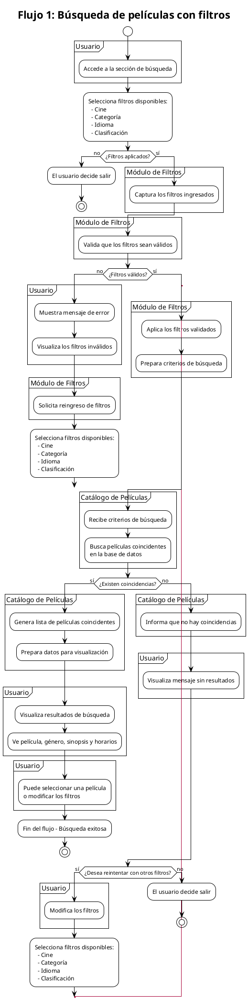

# Especificación del rol Arquitecto de Diagramas de Actividades - Actividad Obligatoria 3 (A3)

## BEFORE

### 1. Identificación de los 4 flujos principales

Para esta entrega se definieron cuatro flujos principales del proyecto CineGlobal. La selección de estos flujos se realizó tomando como base el mockup actualizado, la implementación visual actual del sitio y las funcionalidades incorporadas para esta actividad. Se buscó que cada flujo representara una acción distinta dentro del sistema, evitando dividir un mismo recorrido en pasos artificiales.

#### Flujo 1: Búsqueda de películas con filtros
Este flujo permite al usuario buscar películas disponibles mediante filtros de cine, categoría, idioma y clasificación.

- **Objetivo del flujo:** ayudar al usuario a encontrar películas según criterios específicos.
- **Actor principal:** Usuario.
- **Actores funcionales involucrados:** Módulo de Filtros y Catálogo de Películas.
- **Respuesta esperada del sistema:** validar los filtros ingresados, aplicar los criterios de búsqueda y mostrar resultados coincidentes o informar que no se encontraron coincidencias.
- **Decisiones principales:**  
  - si el usuario desea aplicar filtros o salir del flujo,  
  - si los filtros ingresados son válidos,  
  - si existen películas que coincidan con la búsqueda.
- **Ciclos previstos:**  
  - reintento de búsqueda si no hay resultados,  
  - repetición del proceso de selección de filtros,  
  - posibilidad de volver al menú principal.

Este flujo fue seleccionado porque representa la funcionalidad de exploración principal del proyecto y se vincula directamente con la sección de cartelera y sus filtros.

#### Flujo 2: Inicio de sesión / registro de usuario
Este flujo permite al usuario iniciar sesión si ya posee cuenta o registrarse en caso contrario.

- **Objetivo del flujo:** simular el acceso o alta de usuario dentro del sistema.
- **Actor principal:** Usuario.
- **Actores funcionales involucrados:** Módulo de Autenticación y Gestión de Usuarios.
- **Respuesta esperada del sistema:** validar los datos ingresados, verificar si la cuenta existe o registrar un nuevo usuario, y mostrar un mensaje de confirmación o error.
- **Decisiones principales:**  
  - si el usuario ya tiene cuenta o necesita registrarse,  
  - si los datos obligatorios fueron ingresados correctamente,  
  - si las contraseñas coinciden en el caso del registro,  
  - si las credenciales de acceso son válidas.
- **Ciclos previstos:**  
  - reintento de ingreso de credenciales,  
  - reingreso de datos de registro si hay errores,  
  - retorno al menú principal.

Este flujo fue incorporado porque agrega una funcionalidad distinta a la navegación de cartelera y permite modelar validaciones y bifurcaciones claras entre dos recorridos relacionados: login y registro.

#### Flujo 3: Contacto con soporte mediante formulario
Este flujo permite al usuario enviar una consulta al equipo de soporte a través de un formulario de contacto.

- **Objetivo del flujo:** permitir el envío de una consulta con datos básicos de contacto y descripción del problema o solicitud.
- **Actor principal:** Usuario.
- **Actores funcionales involucrados:** Formulario de Contacto y Soporte.
- **Respuesta esperada del sistema:** validar los datos ingresados, registrar la consulta y mostrar confirmación de envío o mensaje de error.
- **Decisiones principales:**  
  - si el usuario completa todos los campos obligatorios,  
  - si el correo electrónico tiene formato válido,  
  - si desea corregir los datos antes de enviar.
- **Ciclos previstos:**  
  - corrección y reingreso de datos,  
  - nuevo intento de envío,  
  - retorno al menú principal.

Este flujo fue elegido porque representa una acción independiente de la compra y de la exploración del catálogo, y además se relaciona con la nueva funcionalidad agregada en la sección de contacto.

#### Flujo 4: Compra de entradas
Este flujo permite al usuario seleccionar una película, elegir cine, idioma, horario y cantidad de asientos, ingresar datos de pago y confirmar la compra.

- **Objetivo del flujo:** simular la compra completa de entradas de cine.
- **Actor principal:** Usuario.
- **Actores funcionales involucrados:** Módulo de Compra, Pasarela de Pago y Gestión de Entradas.
- **Respuesta esperada del sistema:** validar la selección de función, procesar los datos de pago y mostrar una confirmación final de compra o un mensaje para corregir datos.
- **Decisiones principales:**  
  - si la película elegida tiene funciones disponibles,  
  - si el usuario completó correctamente cine, idioma, horario y cantidad de asientos,  
  - si los datos de la tarjeta son válidos,  
  - si la operación puede confirmarse o debe corregirse la información.
- **Ciclos previstos:**  
  - reintento de selección de datos de la función,  
  - corrección de datos de pago,  
  - repetición del proceso si la compra no puede completarse,  
  - retorno al menú principal.

Este flujo fue seleccionado porque representa la funcionalidad de mayor peso dentro del dominio del proyecto y concentra varias decisiones, validaciones y pasos encadenados.

---

### 2. Decisión sobre swimlanes

Se decidió utilizar swimlanes en los cuatro diagramas para separar responsabilidades entre el **Usuario** y los distintos **módulos funcionales** que intervienen en cada flujo.

Inicialmente se había considerado una separación general entre **Usuario** y **Sistema**, pero se ajustó este criterio para lograr una representación más precisa y útil del proceso. Utilizar un único lane llamado “Sistema” resulta demasiado amplio y no permite distinguir con claridad qué parte de la lógica corresponde a cada responsabilidad específica dentro del proyecto.

Por este motivo, en los diagramas se emplearán actores más concretos según el flujo, tales como módulos de filtros, catálogo de películas, autenticación, gestión de usuarios, contacto, soporte, compra, pago y gestión de entradas. Esta decisión mejora la legibilidad del diagrama, permite identificar mejor las responsabilidades de cada etapa y facilita la posterior traducción de los flujos a lógica de negocio en JavaScript.

Aplicación de swimlanes por flujo:

- **Flujo 1: Búsqueda de películas con filtros**  
  Se utilizarán los swimlanes **Usuario**, **Módulo de Filtros** y **Catálogo de Películas**.  
  El usuario selecciona criterios de búsqueda, el módulo de filtros valida y aplica esos criterios, y el catálogo procesa la búsqueda y devuelve resultados coincidentes o informa que no hay coincidencias.

- **Flujo 2: Inicio de sesión / registro de usuario**  
  Se utilizarán los swimlanes **Usuario**, **Módulo de Autenticación** y **Gestión de Usuarios**.  
  El usuario ingresa credenciales o datos de registro, el módulo de autenticación valida el formato y las reglas de acceso, y la gestión de usuarios verifica si la cuenta existe o registra un nuevo usuario.

- **Flujo 3: Contacto con soporte mediante formulario**  
  Se utilizarán los swimlanes **Usuario**, **Formulario de Contacto** y **Soporte**.  
  El usuario completa los campos requeridos, el formulario valida los datos ingresados y el área o módulo de soporte registra la consulta y confirma su envío.

- **Flujo 4: Compra de entradas**  
  Se utilizarán los swimlanes **Usuario**, **Módulo de Compra**, **Pasarela de Pago** y **Gestión de Entradas**.  
  El usuario selecciona película, función y cantidad de asientos e ingresa los datos de pago; el módulo de compra valida la selección, la pasarela de pago procesa la información de la tarjeta y la gestión de entradas confirma la reserva o emisión final.

Esta estructura permitirá que cada diagrama refleje no solo las acciones del usuario, sino también las responsabilidades internas del sistema de forma más clara, específica y coherente con el dominio funcional de CineGlobal.

---

### 3. Criterios de aceptación

- [ ] Se identificaron claramente los 4 flujos principales del proyecto.
- [ ] Cada diagrama representará un flujo distinto y coherente con el dominio de CineGlobal.
- [ ] Cada diagrama incluirá inicio (`start`) y fin (`stop`).
- [ ] Cada diagrama incluirá actividades expresadas con sintaxis correcta de PlantUML.
- [ ] Cada diagrama incluirá decisiones condicionales con estructuras `if / then / else`.
- [ ] Cada diagrama incluirá ciclos o repeticiones cuando el flujo lo requiera.
- [ ] Se utilizarán swimlanes `Usuario` y `Sistema` para separar responsabilidades.
- [ ] Los flujos modelados serán coherentes con la implementación planificada en `plan.md`, con el `index.html` actualizado y con el mockup del proyecto.
- [ ] Cada diagrama se exportará en formato `.puml` y `.png`.
- [ ] Se creará el archivo `diagramas-doc.md` con índice, descripción de cada flujo, enlaces a los archivos editables e imágenes embebidas.
- [ ] Los diagramas servirán como base para que el Desarrollador JavaScript implemente la lógica del sistema en la siguiente etapa.

## AT CLOSE

### Prompt utilizado en Copilot Agent

```text
Actuá como Arquitecto de Diagramas de Actividades para el proyecto CineGlobal.

Con el contexto adjunto (plan.md, index.html, diseño-con-flujos.png y spec-arq-diagramas.md), generá el archivo:

docs/05-diagramas/01-diagrama-de-actividades/actividad-flujo-1-busqueda-peliculas.puml

Debe representar el flujo: Búsqueda de películas con filtros.

Condiciones:
- usar sintaxis correcta de PlantUML para diagrama de actividades
- incluir start y stop
- incluir actividades con formato :Nombre de la actividad;
- incluir decisiones con if / then / else
- incluir ciclos cuando corresponda
- usar estos swimlanes:
  Usuario | Módulo de Filtros | Catálogo de Películas
- contemplar selección de filtros, validación, búsqueda de coincidencias y resultado final
- contemplar reintento si no hay resultados o si los filtros son inválidos

Quiero que generes o actualices directamente ese archivo
```

### Archivos utilizados como contexto

- `plan.md`
- `index.html`
- `diseño-con-flujos.png`
- `docs/03-specs/actividad-obligatoria-3/spec-arq-diagramas.md`

### Fragmento del `.puml` generado por Copilot



### Ajustes manuales realizados en el flujo 1

A partir del archivo generado por Copilot Agent para el flujo **“Búsqueda de películas con filtros”**, se realizaron varios ajustes manuales para corregir inconsistencias con el proyecto, simplificar la lógica del diagrama y mejorar su legibilidad.

#### 1. Eliminación de validaciones innecesarias sobre los filtros
En la versión generada por Copilot se modeló una validación de filtros con actividades como:
- `Valida que los filtros sean válidos`
- `Muestra mensaje de error`
- `Visualiza los filtros inválidos`
- `Solicita reingreso de filtros`

Estos pasos se eliminaron porque no eran coherentes con la implementación real del proyecto. En CineGlobal los filtros se seleccionan mediante **dropdowns con opciones predefinidas**, por lo que el usuario no ingresa valores libres que requieran validación de formato o corrección por error.  
Por este motivo, el flujo se simplificó a:
- selección de filtros,
- recepción de la selección,
- aplicación de criterios de búsqueda.

#### 2. Reemplazo de una lógica de error por una lógica de búsqueda real
La versión inicial asumía que el principal problema del flujo era que los filtros pudieran ser inválidos. Sin embargo, en este caso el escenario más relevante no es un error de validación, sino la posibilidad de que la búsqueda:
- devuelva resultados, o
- no encuentre coincidencias.

Por eso se eliminó la decisión `¿Filtros válidos?` y se reemplazó por una decisión más coherente con el dominio del proyecto:
- `¿Hay resultados?`

Este cambio permitió representar mejor el comportamiento esperado del catálogo de películas.

#### 3. Simplificación de actividades demasiado detalladas o técnicas
Copilot generó actividades con un nivel de detalle excesivo o demasiado técnico, por ejemplo:
- `Busca películas coincidentes en la base de datos`
- `Prepara datos para visualización`
- `Ve película, género, sinopsis y horarios`

Estas actividades se simplificaron porque el objetivo del diagrama es modelar el flujo funcional, no describir detalles de infraestructura ni de interfaz con tanto nivel de precisión.  
Se reemplazaron por acciones más claras y generales, como:
- `Busca películas coincidentes`
- `Obtiene resultados`
- `Genera resultados de búsqueda`
- `Genera mensaje sin coincidencias`
- `Visualiza contenido de resultados`

#### 4. Eliminación de pasos redundantes de salida o cierre
La versión inicial incluía actividades como:
- `El usuario decide salir`
- `Fin del flujo - Búsqueda exitosa`

Estas acciones se eliminaron porque resultaban redundantes dentro de un diagrama de actividades que ya utiliza `start` y `stop` como puntos formales de inicio y fin.  
Se optó por un cierre más limpio del flujo mediante el `stop` final.

#### 5. Reemplazo de `partition` por swimlanes explícitos
La versión generada por Copilot utilizaba `partition`, pero en la práctica esa estructura no producía una visualización clara de swimlanes continuos.  
Para mejorar la presentación y representar mejor las responsabilidades, se reemplazó por lanes explícitos con:
- `|Usuario|`
- `|Módulo de Filtros|`
- `|Catálogo de Películas|`

Este cambio también permitió incorporar color de fondo a cada swimlane para diferenciar visualmente a los actores del flujo.

#### 6. Eliminación de `goto` y `label`
El resultado generado por Copilot utilizaba `goto validar_filtros` y `label validar_filtros` para volver a una etapa anterior del flujo.  
Se decidió eliminar esa estructura porque:
- vuelve el diagrama más difícil de leer,
- complica la trazabilidad del flujo,
- y no está alineada con una representación limpia de ciclos en diagramas de actividades.

En su lugar, se utilizó una estructura de repetición con `repeat ... repeat while`, que representa de forma más clara la posibilidad de realizar una nueva búsqueda.

#### 7. Reubicación de decisiones en el actor correspondiente
Se revisó especialmente dónde ubicar la decisión:
- `¿Hay resultados?`

Finalmente, esa decisión se dejó en el lane **Catálogo de Películas**, ya que no es una decisión del usuario sino una condición que surge del procesamiento del catálogo después de aplicar los criterios de búsqueda.  
En cambio, la decisión:
- `¿Desea realizar otra búsqueda?`

se mantuvo en el lane **Usuario**, porque corresponde a una acción voluntaria del usuario dentro del flujo.

#### 8. Ajuste del alcance del flujo
En la versión inicial Copilot incluyó acciones posteriores a la búsqueda, como la posibilidad de seleccionar una película o modificar filtros.  
Se decidió acotar el diagrama estrictamente al flujo de **búsqueda con filtros**, sin extenderlo a otros recorridos del sistema como la selección de película o el inicio del flujo de compra.  
Esto permitió que el diagrama representara un único flujo principal, más claro y mejor delimitado.

#### 9. Mejora visual del diagrama final
En la versión final se añadieron mejoras visuales para hacer el diagrama más legible:
- color gris para el swimlane de **Usuario**,
- color celeste para **Módulo de Filtros**,
- color verde claro para **Catálogo de Películas**,
- flecha verde para la rama **Sí** de `¿Hay resultados?`,
- flecha roja para la rama **No**,
- flecha azul para el ciclo de repetición.

Estas decisiones no modifican la lógica del flujo, pero mejoran la lectura y ayudan a distinguir más fácilmente las bifurcaciones y el bucle principal.

### Resultado final del ajuste
Luego de los cambios manuales, el flujo 1 quedó modelado como un proceso más coherente con la implementación real de CineGlobal:

1. El usuario selecciona filtros disponibles.  
2. El módulo de filtros recibe la selección y aplica criterios de búsqueda.  
3. El catálogo busca películas coincidentes y obtiene resultados.  
4. Si hay resultados, genera resultados de búsqueda.  
5. Si no hay resultados, genera un mensaje sin coincidencias.  
6. El usuario visualiza el contenido resultante.  
7. El usuario decide si desea realizar otra búsqueda.  

De esta manera, el diagrama final refleja mejor la lógica real del proyecto y sirve como una base más consistente para la futura implementación en JavaScript.