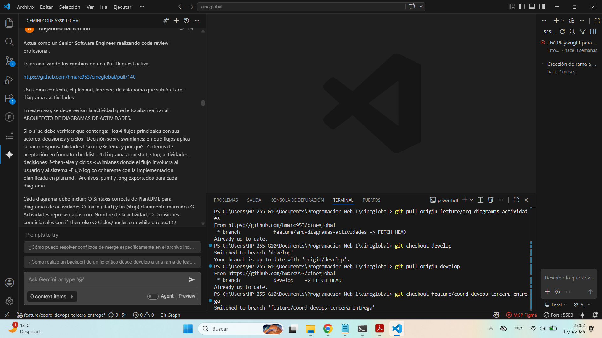
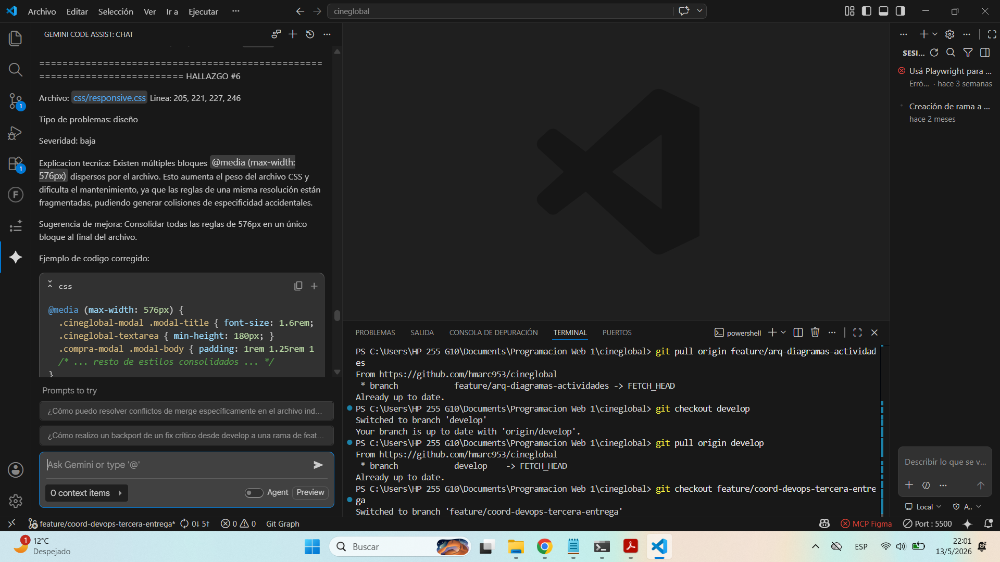
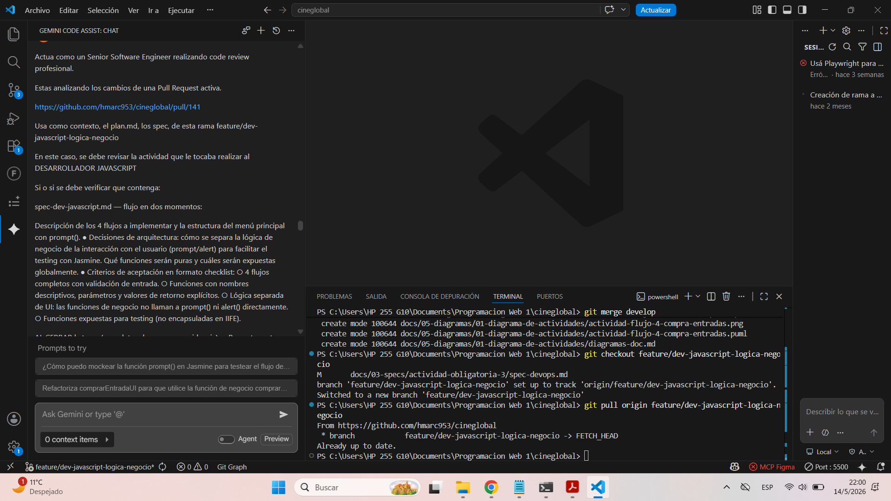
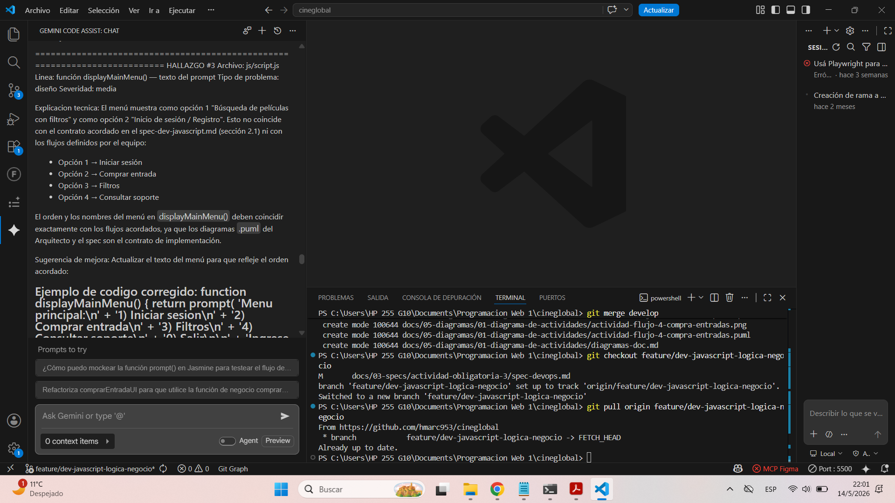
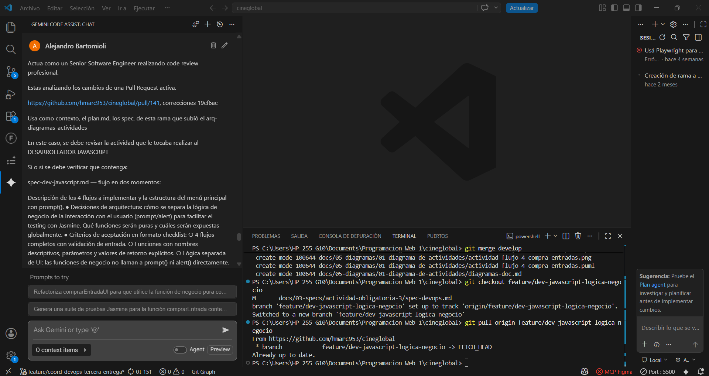
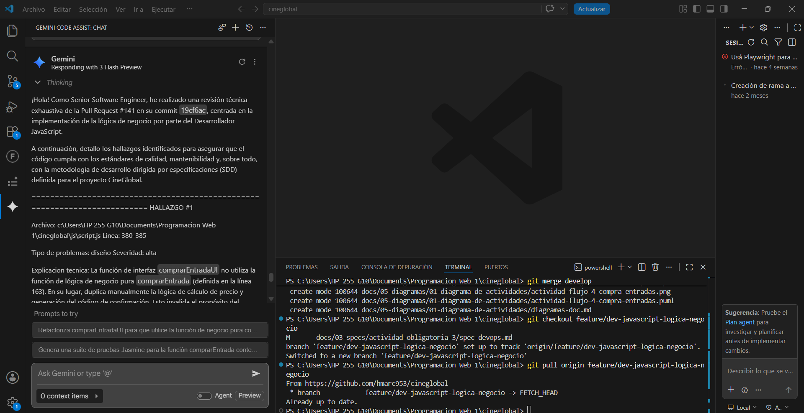
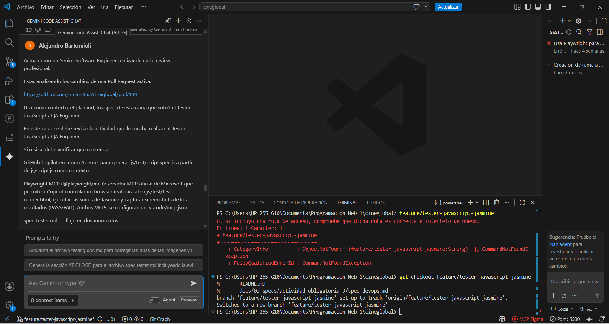
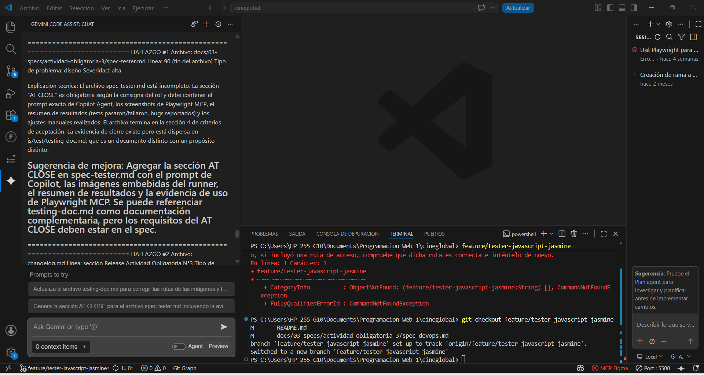

# Especificación del rol Coordinador / DevOps - Actividad Obligatoria 3 (A3)

## 1. Objetivo del rol DevOps
Garantizar una transición fluida desde el Primer Parcial hacia la nueva iteración del proyecto, asegurando la integridad del código base mediante una estrategia de integración por etapas y el uso de inteligencia artificial para la validación de calidad técnica.

## 2. Plan de Coordinación (Estrategia de Integración)
Para esta entrega, el flujo de trabajo se dividirá en tres fases críticas para mantener la estabilidad del repositorio:

1.  **Integración de Fixes del Primer Parcial:** Se priorizará la resolución de todas las observaciones y bugs detectados durante la evaluación del parcial. Ninguna funcionalidad nueva será integrada hasta que los "fix/" pendientes estén cerrados.
2.  **Ejecución de Backports:** Se identificarán mejoras de estructura o documentación realizadas en ramas tardías que deban replicarse en las ramas base, asegurando que `develop` y `main` mantengan paridad técnica.
3.  **Implementación de Nuevas Features:** Una vez estabilizada la base, se procederá con el desarrollo de los nuevos requerimientos funcionales previstos para A3, operando bajo el esquema estricto de `feature/` branches.

## 3. Herramientas y Metodología de Revisión
Se declara oficialmente el uso de **GitHub Copilot en Agent Mode** para las revisiones de código (Code Reviews). 

**Justificación Técnica:**
A diferencia de una revisión manual que suele centrarse en la superficie (estilo o sintaxis), el modo Agente de Copilot permite:
- **Validación Estructural:** Comprobar que los nuevos componentes no rompan la arquitectura definida en el `plan.md`.
- **Análisis Lógico Profundo:** Detectar inconsistencias en el flujo de datos o estados que podrían pasar desapercibidos.
- **Verificación de Accesibilidad:** Auditoría automática de etiquetas ARIA y roles semánticos conforme a WCAG 2.1 Level AA, reportando hallazgos en el log de revisión (sección 5).

## 4. Criterios de Aceptación (Checklist DevOps)
Los siguientes criterios deben validarse al finalizar la A3. Este checklist servirá como registro de cumplimiento y se marcará progresivamente conforme se completen las tareas en el repositorio:

- [ ] **GitHub Pages:** El sitio debe estar desplegado y actualizado automáticamente mediante GitHub Actions o configuración manual validada.
- [ ] **Gestión de Releases:** Se debe haber generado un tag de versión y una "Release" formal en GitHub que resuma los cambios de A3.
- [ ] **Verificación de Backports:** Confirmar que las mejoras críticas han sido aplicadas retroactivamente donde corresponda.
- [ ] **Trazabilidad de Fixes:** Evidencia en el `changelog.md` de que los errores del parcial fueron subsanados.
- [ ] **Documentación Actualizada:** El `plan.md` y `README.md` deben reflejar el estado actual y las nuevas capacidades del sistema.

## 5. Control de Calidad en Pull Requests
Cada PR debe incluir obligatoriamente:
1.  Resumen del impacto del cambio.
2.  Log de revisión generado por Copilot Agent (según lineamientos en 5.1).
3.  Confirmación de que el diseño sigue siendo 100% fiel al Mockup PP/A3.

### 5.1 Documentación de Logs de Copilot Agent
Para garantizar la trazabilidad y calidad técnica, los logs de revisión se manejarán bajo los siguientes lineamientos:
- **Formato:** Formato Markdown, estructurado con un resumen de hallazgos clave y el log técnico detallado encerrado en bloques de código.
- **Ubicación:** El log debe pegarse directamente en el cuerpo de la descripción del Pull Request (PR Description).
- **Responsable de validación:** El Coordinador / DevOps será el encargado de verificar la presencia y coherencia del log antes de la aprobación final.
- **Retención:** Los logs se preservarán de forma permanente como parte del historial de Pull Requests del repositorio en GitHub.

---
*Documento preparado para la fase de inicio de la Actividad Obligatoria 3.*
## AT CLOSE — Evidencia de Code Reviews

### Code Review #1 — PR #140 [@hmarc953 — Arquitecto de Diagramas de Actividades]

**Archivos adjuntados como contexto en Copilot Agent:**
- `docs/03-specs/actividad-obligatoria-3/spec-arq-diagramas.md`
- `docs/05-diagramas/01-diagrama-de-actividades/actividad-flujo-1-busqueda-peliculas.puml`
- `docs/05-diagramas/01-diagrama-de-actividades/actividad-flujo-2-login-registro.puml`
- `docs/05-diagramas/01-diagrama-de-actividades/actividad-flujo-3-contacto-soporte.puml`
- `docs/05-diagramas/01-diagrama-de-actividades/actividad-flujo-4-compra-entradas.puml`
- `docs/05-diagramas/01-diagrama-de-actividades/diagramas-doc.md`
- `plan.md`

**Prompt exacto utilizado en Copilot Agent:**

```plaintext
Actuá como un Senior Software Engineer realizando un code review profesional
sobre la Pull Request #140 del repositorio CineGlobal.

Contexto del proyecto:
- Es una aplicación web front-end para visualizar películas y horarios de cines.
- Los 4 flujos definidos para esta entrega son: Iniciar sesión, Comprar entrada,
  Filtros y Consultar soporte.
- El rol revisado es el Arquitecto de Diagramas de Actividades.

Archivos adjuntos como contexto:
- plan.md (objetivo y alcance del proyecto)
- spec-arq-diagramas.md (especificación del rol)
- Los 4 archivos .puml de los diagramas de actividades
- diagramas-doc.md (índice y documentación)

Verificá que:
1. Los 4 diagramas correspondan exactamente a los flujos acordados
   (Iniciar sesión, Comprar entrada, Filtros, Consultar soporte).
2. Cada .puml contenga: start, stop, actividades con :nombre;,
   decisiones if-then-else, ciclos while o repeat, y swimlanes
   |Usuario| |Sistema| donde aplique.
3. El diagramas-doc.md tenga índice, descripción de cada flujo,
   enlace al .puml, imagen .png embebida e instrucciones de edición.
4. Los flujos sean coherentes con el plan.md.
5. El spec-arq-diagramas.md tenga sección BEFORE completa antes
   que los .puml (verificable en historial de commits).

Identificá problemas reales con evidencia en el código.
Para cada hallazgo indicá: archivo, línea, tipo, severidad,
explicación técnica y sugerencia de mejora.
```

---

**Qué se validó:**
- Correspondencia entre nombres de flujos en los `.puml` y los flujos acordados por el equipo
- Presencia de elementos obligatorios en cada diagrama PlantUML (start/stop, decisiones, ciclos, swimlanes)
- Coherencia del `diagramas-doc.md` con los archivos generados
- Orden de commits (spec antes que `.puml`)
- Consistencia de los cambios CSS agregados en la misma PR
- Revisión manual del `spec-arq-diagramas.md` para verificar secciones requeridas por la consigna

---

**CHANGES_REQUESTED cargados:**

| # | Archivo | Descripción del hallazgo | Severidad |
|---|---------|--------------------------|-----------|
| 1 | `actividad-flujo-1-busqueda-peliculas.puml` | El flujo modelado no coincide con ninguno de los 4 flujos acordados por el equipo. El nombre "búsqueda de películas" no forma parte del contrato de implementación. | Alta |
| 2 | `actividad-flujo-2-login-registro.puml` | Un solo diagrama combina dos flujos distintos (login + registro), rompiendo la correspondencia 1:1 flujo → suite de Jasmine. | Media |
| 3 | `spec-arq-diagramas.md` | Omite la sección "Decisión sobre swimlanes" y los "Criterios de aceptación en formato checklist", ambos requeridos explícitamente por la consigna del rol. Sin estos elementos el equipo carece de un marco de validación arquitectónico. | Alta |
| 4 | `spec-arq-diagramas.md` | Requiere verificación manual de que la sección BEFORE estaba completa en el commit inicial (`5d05661`, May 11) y no fue completada recién al cerrar el spec (`f462e65`, May 13). | Alta |
| 5 | `diagramas-doc.md` — descripción Flujo 3 | La descripción menciona "formulario de contacto", lo que implica manipulación del DOM. Contradice el requerimiento de la A3 que exige lógica pura con `prompt()`, sin eventos ni elementos HTML. | Media |
| 6 | `spec-arq-diagramas.md` — descripción Flujo 2 | Se describe el uso de "líneas de color verde/rojo" para distinguir login y registro, lo que no reemplaza el uso formal de particiones `\|Usuario\|` y `\|Sistema\|` requeridas por la consigna. | Baja |
| 7 | `README.md` | Línea de Mockup PP duplicada con dos links distintos. | Baja |
| 8 | `changelog.md` | El campo de rol en la entrada del changelog está vacío: `@hmarc953 ()`. | Baja |
| 9 | `css/responsive.css` | Tres bloques `@media (max-width: 576px)` separados en lugar de uno consolidado. Deuda técnica de mantenimiento. | Baja |
| 10 | `css/bootstrap-overrides.css` | Clase `.cineglobal-modal .modal-header` declarada dos veces en el mismo archivo. La segunda sobreescribe parcialmente la primera de forma silenciosa. | Media |
| 11 | `css/components.css` | Clase `.cineglobal-confirm-text` definida también en `bootstrap-overrides.css`, generando ambigüedad de cascada según el orden de carga de los `<link>` en el HTML. | Media |

> **Nota:** Los hallazgos #3, #5 y #6 fueron identificados mediante revisión manual
> del spec y la documentación, complementando el análisis asistido por Copilot Agent.

---

**Resumen general del review:**

La PR cumple con la entrega estructural del Arquitecto: los 4 archivos `.puml` están
presentes, sus correspondientes `.png` están exportados, el `spec-arq-diagramas.md`
existe, y el `diagramas-doc.md` fue creado. El trabajo de actualización visual
(mockup, HTML, CSS) es sólido y consistente con el diseño de CineGlobal.

Sin embargo, existen cuatro problemas de severidad alta y media que afectan
directamente la coherencia del proyecto como entrega integrada:

1. El flujo "búsqueda de películas" (flujo-1) no coincide con los flujos acordados
por el equipo (Iniciar sesión, Comprar entrada, Filtros, Consultar soporte). Esto
rompe el contrato de implementación que el Dev JS necesita para generar `script.js`
y que el Tester necesita para las suites de Jasmine.

2. La verificación del orden de commits del spec vs los `.puml` requiere confirmación
manual para acreditar los puntos correspondientes.

3. El `spec-arq-diagramas.md` omite dos secciones requeridas explícitamente por la
consigna del rol: la justificación de decisión sobre swimlanes y los criterios de
aceptación en formato checklist. Sin estos elementos el equipo carece de un marco
de validación arquitectónico formal para esta entrega.

4. La descripción del Flujo 3 hace referencia a un "formulario de contacto", término
que implica manipulación del DOM. Esto contradice el requerimiento central de la A3,
que exige lógica pura con `prompt()` sin eventos ni elementos HTML.

Adicionalmente, se detectó en revisión manual que el Flujo 2 describe el uso de
colores (verde/rojo) para distinguir login y registro en lugar de particiones formales
`|Usuario|` y `|Sistema|`. Esto no cumple con el estándar de swimlanes requerido y
puede generar problemas de accesibilidad.

Los problemas de CSS (media queries duplicadas, regla duplicada, clase en dos archivos)
son deuda técnica menor pero deben ser corregidos antes del merge para mantener la
calidad del código.

**Decisión sugerida por IA:** `REQUEST CHANGES`

**Decisión del revisor humano:** _______________________________________________

**Evidencia**




### Code Review #2 — PR #141 [@Santi22-7 — Desarrollador JavaScript]

**Archivos adjuntados como contexto en Copilot Agent:**
- `docs/03-specs/actividad-obligatoria-3/spec-dev-javascript.md`
- `docs/05-diagramas/01-diagrama-de-actividades/actividad-flujo-1-busqueda-peliculas.puml`
- `docs/05-diagramas/01-diagrama-de-actividades/actividad-flujo-2-login-registro.puml`
- `docs/05-diagramas/01-diagrama-de-actividades/actividad-flujo-3-contacto-soporte.puml`
- `docs/05-diagramas/01-diagrama-de-actividades/actividad-flujo-4-compra-entradas.puml`
- `plan.md`

**Prompt exacto utilizado en Copilot Agent:**

```plaintext
Actua como un Senior Software Engineer realizando code review profesional.
Estas analizando los cambios de una Pull Request activa.
[https://github.com/hmarc953/cineglobal/pull/141](https://github.com/hmarc953/cineglobal/pull/141)
Usa como contexto, el plan.md, los spec, de esta rama feature/dev-javascript-logica-negocio

En este caso, se debe revisar la actividad que le tocaba realizar al DESARROLLADOR JAVASCRIPT
Si o si se debe verificar que contenga:
spec-dev-javascript.md — flujo en dos momentos:
Descripción de los 4 flujos a implementar y la estructura del menú principal con prompt(). 
Decisiones de arquitectura: cómo se separa la lógica de negocio de la interacción con el usuario (prompt/alert) para facilitar el testing con Jasmine. Qué funciones serán puras y cuáles serán expuestas globalmente. 
Criterios de aceptación en formato checklist: 
- 4 flujos completos con validación de entrada. 
- Funciones con nombres descriptivos, parámetros y valores de retorno explícitos. 
- Lógica separada de UI: las funciones de negocio no llaman a prompt() ni alert() directamente. 
- Funciones expuestas para testing (no encapsuladas en IIFE).

AL CERRAR la tarea (completar el spec como evidencia): 
- Prompt exacto utilizado en Copilot Agent (en bloque de código), incluyendo qué archivos se adjuntaron como contexto (los .puml del Arquitecto y el spec-dev-javascript.md) 
- Fragmento del código generado por Copilot para al menos uno de los flujos y los ajustes manuales realizados para mejorar la testabilidad. 
- Decisiones finales sobre la estructura del código y cómo facilita el trabajo del Tester.

Utilizar GitHub Copilot en modo Agente adjuntando los .puml del Arquitecto de Diagramas y el spec-dev-javascript.md como contexto para generar js/script.js. Los diagramas de actividades son el contrato de implementación: el código debe reflejar los flujos, decisiones y ciclos modelados. Revisar el output, verificar que las funciones sean testeables y realizar los ajustes necesarios. 
- Implementar los 4 flujos principales del proyecto en JavaScript puro, basándose en los diagramas de actividades creados 
- Crear archivo js/script.js con toda la lógica de negocio
- Implementar un menú principal mediante prompt() que permita al usuario elegir entre los 4 flujos 
- Desarrollar funciones específicas para cada flujo, siguiendo principios de código limpio: Nombres descriptivos, Funciones con responsabilidad única, Parámetros y valores de retorno apropiados 
- Implementar algoritmos condicionales y ciclos de manera eficiente 
- Crear y manipular arrays y objetos relevantes al contexto del proyecto 
- Validar entradas del usuario 
- Mostrar resultados mediante alert() y/o console.log() 

IMPORTANTE: No manipular el DOM ni usar eventos en esta entrega (solo lógica con prompt/alert) 
CRÍTICO para testing: Estructurar el código de forma que las funciones sean testeables: Separar lógica de negocio de interacción con usuario (prompt/alert), Crear funciones puras que reciban parámetros y retornen valores, Evitar side effects innecesarios, Exponer funciones necesarias para testing (no anidar todo en IIFE si se va a testear) 
- Documentar funciones complejas con comentarios JSDoc

INSTRUCCIONES IMPORTANTES:
Identifica problemas reales del codigo. Enumerá los hallazgos. Cada hallazgo debe ser independiente. Sé claro, técnico y concreto. No inventes problemas hipotéticos sin evidencia en el código. No incluyas sugerencias de tests.
```
---
**Qué se validó:**

- Estructura y secciones del spec-dev-javascript.md tanto en la fase inicial como al cierre.

- Invocación global y compatibilidad del script principal con entornos de testing automatizado (Jasmine).

- Existencia y validez de las referencias a funciones dentro del menú interactivo.

- Coherencia del menú de prompt() frente al orden de los flujos acordados como contrato.

- Aislamiento de funciones de negocio puras evitando efectos secundarios no deterministas (Math.random()).

- Cobertura de esquemas de validación de entradas (seats, inputs de soporte) según los criterios de aceptación.

- Uso correcto del contexto de diagramas PlantUML en la IA y remoción de duplicaciones de lógica.

---

**CHANGES_REQUESTED cargados:**

# | Archivo | Descripción del hallazgo | Severidad |
|---|---------|--------------------------|-----------|
| 1 | `js/script.js` | Se invoca `runMainMenu()` automáticamente al cargar el archivo, lo que rompe los tests de Jasmine al ejecutar `prompt()` sin control. Se recomienda envolver la ejecución con `if (typeof jasmine === 'undefined')`. | Alta |
| 2 | `js/script.js` | Se llaman funciones inexistentes (`handleMovieSearchFlow`, `handleAuthFlow`, `handleContactFlow`, `handlePurchaseFlow`), generando `ReferenceError` en runtime. Deben reemplazarse por funciones válidas del sistema. | Alta |
| 3 | `js/script.js` | El menú principal no respeta el orden definido en el spec funcional (Iniciar sesión, Comprar entrada, Filtros, Consultar soporte), generando inconsistencias con los flujos acordados. | Media |
| 4 | `js/script.js` | La función `calculateTotalPrice(movie, seats)` recibe el parámetro `movie` pero no lo utiliza, lo que indica una mala definición de la interfaz o código innecesario. | Media |
| 5 | `js/script.js` | Se utiliza `Math.random()` dentro de `comprarEntrada()`, lo que rompe la testabilidad. Se recomienda inyectar el generador como parámetro para permitir mocks en testing. | Media |
| 6 | `js/script.js` | La función `solicitarConsultaSoporte()` no valida los inputs del usuario, lo que puede generar datos inválidos. Se sugiere aplicar validaciones reutilizando `promptUntilValid()`. | Media |
| 7 | `js/script.js` | No se valida el valor de `seats`, permitiendo ingresar valores 0 o negativos, lo que genera inconsistencias en la lógica de compra. | Media |
| 8 | `spec-dev-javascript.md` | No se evidencia el uso de archivos `.puml` como contexto en Copilot, incumpliendo parcialmente la consigna del rol. | Baja |
| 9 | `js/script.js` | Las credenciales están hardcodeadas en `USER_DATABASE`. Aunque sea un entorno de prueba, se recomienda aclarar explícitamente que son datos mock para evitar malas prácticas. | Baja |
| 10 | `js/script.js` | Existe duplicación de lógica entre `filtrarPeliculas()` y `searchMovies()`, lo que afecta la mantenibilidad. Se recomienda unificar ambas funciones. | Baja |

---

**Resumen general del review:**

✔ Correcto:

Separación UI / lógica
Uso de JSDoc
Buen patrón de retorno
❌ Problemas críticos:

runMainMenu rompe tests
Funciones inexistentes en el menú
⚠️ Mejoras:

Orden incorrecto del menú
Falta validación de entradas
Problemas de testabilidad


**Decisión sugerida por IA:** `REQUEST CHANGES`

**Decisión del revisor humano:** _______________________________________________

**Evidencia**




### Code Review #3 — PR #141 [@Santi22-7 — Desarrollador JavaScript]

**Archivos adjuntados como contexto en Copilot Agent:**
- `docs/03-specs/actividad-obligatoria-3/spec-dev-javascript.md`
- `docs/05-diagramas/01-diagrama-de-actividades/actividad-flujo-1-busqueda-peliculas.puml`
- `docs/05-diagramas/01-diagrama-de-actividades/actividad-flujo-2-login-registro.puml`
- `docs/05-diagramas/01-diagrama-de-actividades/actividad-flujo-3-contacto-soporte.puml`
- `docs/05-diagramas/01-diagrama-de-actividades/actividad-flujo-4-compra-entradas.puml`
- `plan.md`

**Prompt exacto utilizado en Copilot Agent:**

```plaintext
Actua como un Senior Software Engineer realizando code review profesional.

Estas analizando los cambios de una Pull Request activa.

https://github.com/hmarc953/cineglobal/pull/141, correcciones 19cf6ac

Usa como contexto, el plan.md, los spec, de esta rama que subió el arq-diagramas-actividades

En este caso, se debe revisar la actividad que le tocaba realizar al DESARROLLADOR JAVASCRIPT

Si o si se debe verificar que contenga:


spec-dev-javascript.md — flujo en dos momentos:

Descripción de los 4 flujos a implementar y la estructura del menú principal con prompt().
● Decisiones de arquitectura: cómo se separa la lógica de negocio de la interacción con el usuario (prompt/alert) para facilitar el testing con Jasmine. Qué funciones serán puras y cuáles serán expuestas globalmente.
● Criterios de aceptación en formato checklist:
○ 4 flujos completos con validación de entrada.
○ Funciones con nombres descriptivos, parámetros y valores de retorno explícitos.
○ Lógica separada de UI: las funciones de negocio no llaman a prompt() ni alert() directamente.
○ Funciones expuestas para testing (no encapsuladas en IIFE).

AL CERRAR la tarea (completar el spec como evidencia):
● Prompt exacto utilizado en Copilot Agent (en bloque de código), incluyendo qué archivos se adjuntaron como contexto (los .puml del Arquitecto y el spec-dev-javascript.md)
● Fragmento del código generado por Copilot para al menos uno de los flujos y los ajustes manuales realizados para mejorar la testabilidad.
● Decisiones finales sobre la estructura del código y cómo facilita el trabajo del Tester.

Utilizar GitHub Copilot en modo Agente adjuntando los .puml del Arquitecto de Diagramas y el spec-dev-javascript.md como contexto para generar js/script.js. Los diagramas de actividades son el contrato de implementación: el código debe reflejar los flujos, decisiones y ciclos modelados. Revisar el output, verificar que las funciones sean testeables y realizar los ajustes necesarios.
● Implementar los 4 flujos principales del proyecto en JavaScript puro, basándose en los diagramas de actividades creados
● Crear archivo js/script.js con toda la lógica de negocio

Implementar un menú principal mediante prompt() que permita al usuario elegir entre los 4 flujos
● Desarrollar funciones específicas para cada flujo, siguiendo principios de código limpio:
○ Nombres descriptivos
○ Funciones con responsabilidad única
○ Parámetros y valores de retorno apropiados
● Implementar algoritmos condicionales y ciclos de manera eficiente
● Crear y manipular arrays y objetos relevantes al contexto del proyecto
● Validar entradas del usuario
● Mostrar resultados mediante alert() y/o console.log()
IMPORTANTE: No manipular el DOM ni usar eventos en esta entrega (solo lógica con prompt/alert)
● CRÍTICO para testing: Estructurar el código de forma que las funciones sean testeables:
○ Separar lógica de negocio de interacción con usuario (prompt/alert)
○ Crear funciones puras que reciban parámetros y retornen valores
○ Evitar side effects innecesarios
○ Exponer funciones necesarias para testing (no anidar todo en IIFE si se va a testear)
● Documentar funciones complejas con comentarios JSDoc


INSTRUCCIONES IMPORTANTES:

Identifica problemas reales del codigo Enumera los hallazgos (1, 2, 3, ...) Cada hallazgo debe ser independiente Se claro, tecnico y concreto No inventes problemas hipoteticas sin evidencia en el codigo No incluyas sugerencias de tests Para cada hallazgo usa EXACTAMENTE esta estructura:

========================================================================== HALLAZGO #<numero>

Archivo: Linea:

Tipo de problemas: (bug | performance | seguridad | legibilidad | diseño | otro)

Severidad: (baja | media | alta | critica)

Explicacion tecnica: Por que esto es un problema real.

Sugerencia de mejora: Cambio concreto recomendado.

Ejemplo de codigo corregido (si aplica):

codigo ejemplo

Al final agrega:

RESUMEN GENERAL DE LA PR Evaluacion global de calidad y riesgos tecnicos

DECISION FINAL SUGERIDA POR IA:

APPROVE

REQUEST CHANGES

COMMENT ONLY No completes la seccion "DECISION DEL REVISOR HUMANO". Debe quedar vacia para edicion manual. Publica comentarios directamente en la Pull Request en las lineas correspondientes. No respondas en el chat salvo para el resumen final.

```
---
**Qué se validó:**

-  Dos momentos del Spec de JS (spec-dev-javascript.md): Presencia de la descripción de los 4 flujos, la estructura inicial del menú interactivo, las decisiones de arquitectura de aislamiento para testing automatizado mediante Jasmine y la disponibilidad de los criterios de aceptación en formato checklist.

-  Evidencia de Cierre de Tarea (Commit 19cf6ac): Inclusión en el archivo de - especificación del bloque de código con los prompts exactos enviados a Copilot Agent, constatando la incorporación tardía pero explícita de las especificaciones PlantUML (.puml) como contexto del Agente para modelar la lógica de negocio.

- Trazabilidad del Contrato Arquitectónico: Verificación del fragmento de código expuesto en el spec para el flujo de compra de entradas, validando la documentación de exclusión temporal de bloques de código no presentes en la rama estable de develop.

- Pureza y Estructuración del Código base: Cumplimiento del aislamiento crítico para testing mediante funciones expuestas globalmente (sin encapsular en IIFE), parametrizadas y con valores de retorno explícitos, evitando efectos secundarios innecesarios.

- Validación de Entradas y Control de Interfaz: Verificación del correcto diseño de algoritmos condicionales, ciclos eficientes, manipulación de arrays u objetos y visualización de datos usando exclusivamente prompt() y alert() / console.log().

- Restricción Estricta del DOM: Cumplimiento absoluto de la prohibición de manipular elementos HTML o delegar eventos en esta entrega, manteniendo la lógica en JavaScript puro.

- Documentación Técnica Estándar: Verificación de la presencia de comentarios JSDoc estructurados y descriptivos para la comprensión de las funciones compleja.

---

**CHANGES_REQUESTED cargados:**

# | Archivo | Descripción del hallazgo | Severidad |
|---|---------|--------------------------|-----------|
| 1 | `js/script.js` | La función `calculateTotalPrice(seats, generatorFn)` incluye el parámetro `generatorFn` que no se utiliza y no tiene sentido semántico en una función de cálculo de precio. Indica un refactor incompleto y genera confusión. | Alta |
| 2 | `js/script.js` | La función `comprarEntrada(seats, paymentData, generatorFn)` eliminó el parámetro `movie`, pero sigue utilizando `movie.title` en el retorno, lo que genera `ReferenceError: movie is not defined` en runtime. | Alta |
| 3 | `js/script.js` | Inconsistencia en la lógica de negocio: `comprarEntrada()` ya no recibe `movie`, por lo que el precio no puede depender de la película. Esto rompe la extensibilidad si se agregan precios por película en el catálogo. | Media |
| 4 | `js/script.js` | El bloque `if (typeof jasmine === 'undefined') { runMainMenu();` no muestra cierre de llave, lo que puede generar un `SyntaxError` y bloquear la ejecución completa del script. | Media |
| 5 | `docs/03-specs/actividad-obligatoria-3/spec-dev-javascript.md` | La aclaración sobre ausencia de `.puml` en el spec contiene error ortográfico ("estrutura") y no cumple con la consigna, ya que no evidencia el uso de `.puml` para generar `script.js`, que era el requerimiento real. | Baja |

---

**Resumen general del review:**

El commit `19cf6ac` resuelve los dos bugs críticos del review anterior:
`comprarEntrada()` recupera el parámetro `movie` con validación de nulidad
(`!movie || !movie.title`), y `calculateTotalPrice` ya no tiene el
parámetro `generatorFn` semánticamente incorrecto. El guard de Jasmine
permanece correctamente implementado desde el commit anterior. La
corrección ortográfica del spec también fue aplicada.

Quedan dos problemas de severidad media y dos de severidad baja. El más
relevante para la integridad del código es que `calculateTotalPrice`
sigue recibiendo `movie` sin usarlo, y que `comprarEntradaUI()` calcula
el precio en paralelo a `comprarEntrada()` en lugar de usar el resultado
de la función de negocio, creando dos rutas de cálculo que hoy son
equivalentes pero que divergirán ante cualquier cambio futuro.

Los problemas del spec (prompt oculto en comentario HTML y nota sobre
código removido) son de documentación y afectan la trazabilidad que el
profesor necesita para evaluar el uso de los `.puml` como contexto.

**Decisión sugerida por IA:** `REQUEST CHANGES`

**Decisión del revisor humano:** _______________________________________________

**Evidencia**




### Code Review #4 — PR #144 [@9919-Mili — Tester JavaScript / QA Engineer]

**Archivos adjuntados como contexto en Copilot Agent:**
- `docs/03-specs/actividad-obligatoria-3/spec-tester.md`
- `js/test/test-runner.html`
- `js/test/script.spec.js`
- `js/test/testing-doc.md`
- `js/script.js`
- `changelog.md`

**Prompt exacto utilizado en Copilot Agent:**

```plaintext
Actua como un Senior Software Engineer realizando code review profesional.

Estas analizando los cambios de una Pull Request activa.

https://github.com/hmarc953/cineglobal/pull/144

Usa como contexto, el plan.md, los spec, de esta rama que subió el Tester JavaScript / QA Engineer

En este caso, se debe revisar la actividad que le tocaba realizar al Tester JavaScript / QA Engineer

Si o si se debe verificar que contenga:

GitHub Copilot en modo Agente: para generar js/test/script.spec.js a partir de js/script.js como contexto.

Playwright MCP (@playwright/mcp): servidor MCP oficial de Microsoft que permite a Copilot controlar un browser real para abrir js/test/test-runner.html, ejecutar las suites de Jasmine y capturar screenshots de los resultados (PASS/FAIL).

spec-tester.md — flujo en dos momentos:

ANTES de escribir cualquier test:
- Plan de testing
- Herramientas a utilizar
- Criterios de aceptación en checklist

AL CERRAR la tarea:
- Prompt exacto utilizado
- Screenshots del test runner ejecutado
- Resumen de tests
- Bugs reportados
- Ajustes manuales

Verificar también:
- test-runner.html
- script.spec.js
- testing-doc.md
- changelog.md

INSTRUCCIONES IMPORTANTES:

Identifica problemas reales del codigo
Enumera los hallazgos
Cada hallazgo debe ser independiente
Se claro, tecnico y concreto
No inventes problemas sin evidencia

Al final agregar:
RESUMEN GENERAL DE LA PR
DECISION FINAL SUGERIDA POR IA:
```
---
**Qué se validó:**

- Existencia de la estructura obligatoria de testing (test-runner.html, script.spec.js, testing-doc.md)
- Implementación de 4 suites de tests con Jasmine (una por flujo)
- Cobertura de casos happy path, edge cases y validaciones de error
- Uso correcto de assertions de Jasmine
- Documentación en testing-doc.md (ejecución, suites, métricas, issues)
- Presencia de spec-tester.md con planificación del testing
- Evidencia de uso de Copilot Agent para generación de tests
- Integración general del flujo de QA con el desarrollo

---

**CHANGES_REQUESTED cargados:**

# | Archivo | Descripción del hallazgo | Severidad |
|---|---------|--------------------------|-----------|
| 1 | docs/03-specs/actividad-obligatoria-3/spec-tester.md | El archivo está incompleto. Falta la sección AT CLOSE con evidencia obligatoria (prompt, screenshots, resultados). | Alta |
| 2 | changelog.md | No existe registro de la contribución del Tester (PR #144), rompiendo la trazabilidad del rol. | Media |
| 3 | docs/03-specs/actividad-obligatoria-3/spec-tester.md | Checklist sin marcar ([ ]), lo que indica falta de validación documentada. | Baja |
| 4 | js/test/testing-doc.md | Métricas incorrectas: se indican 20 tests pero hay 19, y cobertura suma 110%. | Baja |
| 5 | js/test/testing-doc.md | Instrucciones de ejecución poco claras respecto a rutas relativas (../../js/script.js). | Baja |
| 6 | js/test/testing-doc.md | Screenshots no renderizan por rutas incorrectas y carpeta duplicada. | Alta |
| 7 | js/test/script.spec.js | Test de calculateTotalPrice(0) valida un caso imposible → falsa cobertura. | Alta |
| 8 | js/test/script.spec.js | Uso de toContain() para validar mensaje → puede generar falsos positivos. | Media |
| 9 | js/test/script.spec.js | Test con null pasa por TypeError nativo, no por validación controlada. | Media |
| 10 | docs/03-specs/actividad-obligatoria-3/spec-tester.md | No hay evidencia del uso de Playwright MCP para ejecución en browser. | Media |
| 11 | js/test/script.spec.js | Falta cobertura del filtro por year en searchMovies. | Baja |

---

**Resumen general del review:**

La PR del Tester presenta una base sólida de QA: se implementan correctamente las 4 suites de testing con Jasmine, se cubren múltiples escenarios funcionales y se documenta adecuadamente la ejecución en testing-doc.md. Además, se evidencia el uso de Copilot para la generación de tests y se documentan issues relevantes durante el proceso.

Sin embargo, existen problemas críticos de trazabilidad y consistencia documental. El principal es que spec-tester.md, que es el documento formal del rol, no contiene correctamente la sección AT CLOSE con la evidencia requerida por la consigna. También falta registrar la contribución del Tester en el changelog.md.

A nivel técnico, se detectan inconsistencias en métricas, rutas incorrectas de screenshots que impiden su visualización en GitHub, y tests que validan escenarios no alcanzables o poco robustos, lo que afecta la calidad real de la cobertura.

**Decisión sugerida por IA:** `REQUEST CHANGES`

**Decisión del revisor humano:** _______________________________________________

**Evidencia**

