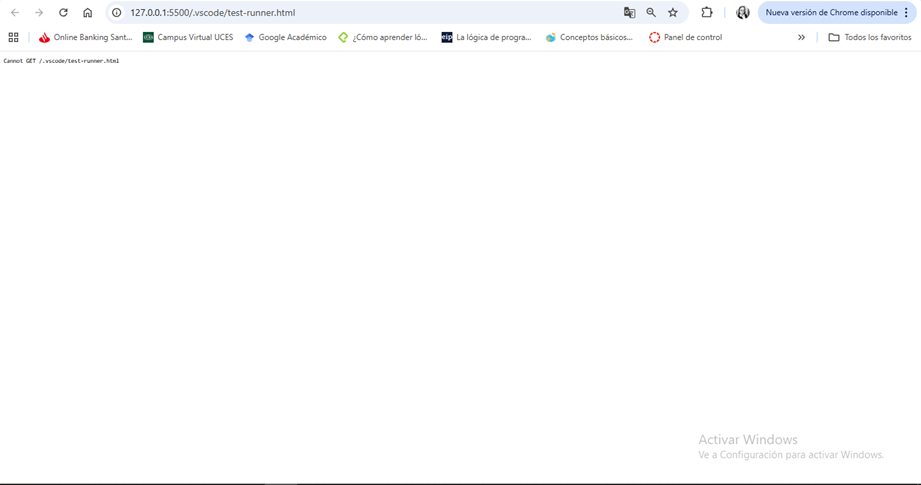
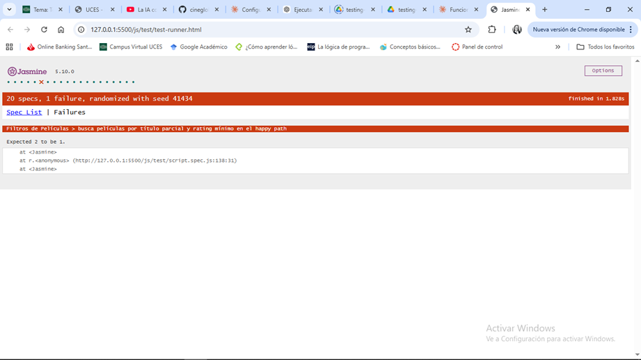

# Especificación del rol Tester - Actividad Obligatoria 3 (A3)

## 1. Objetivo del rol Tester
Garantizar la cobertura funcional y la calidad de los 4 flujos principales de CineGlobal mediante testing automatizado con Jasmine, validando casos de éxito, casos límite y manejo de errores antes de integrar a la rama Develop.

## 2. Plan de Testing en dos momentos
El flujo de trabajo de testing se divide en dos momentos críticos para mantener trazabilidad y evidencia documentada:

### Momento 1 - Antes de escribir cualquier test (commitear primero)

#### 2.1 Punto de control obligatorio
- Realizar un commit de la base funcional actual antes de crear o modificar cualquier archivo de test.
- El commit debe dejar trazabilidad del estado previo para comparar resultados e aislar regresiones.
- Etiqueta sugerida: `base-testing-[flujo]` o similar que identifique el estado de referencia.

#### 2.2 Plan de cobertura por flujo
Se cubrirán los 4 flujos principales del sistema con la siguiente estrategia:

**Flujo 1 - Inicio de sesión**
- Función a testear: validación de credenciales (usuario/contraseña).
- Happy path: credenciales correctas permiten avanzar.
- Edge cases: campos vacíos, espacios en blanco, mayúsculas/minúsculas, caracteres especiales.
- Errores: credenciales inválidas, formato no permitido, límites de intentos.

**Flujo 2 - Compra de entrada**
- Función a testear: selección de película, función y cantidad de entradas.
- Happy path: compra válida con película, horario y cantidad correcta.
- Edge cases: cantidad mínima/máxima, selección de opciones límite, horarios agotados.
- Errores: opción inexistente, cantidad inválida (0, negativa, no numérica).

**Flujo 3 - Filtros**
- Función a testear: filtrado por género, cine o franja horaria.
- Happy path: filtro válido devuelve resultados esperados.
- Edge cases: combinaciones de filtros, sin resultados, todos los filtros simultáneos.
- Errores: criterio inválido, valor no soportado, formato incorrecto.

**Flujo 4 - Consultar soporte**
- Función a testear: clasificación de consulta y respuesta/derivación.
- Happy path: consulta válida recibe respuesta correcta según categoría.
- Edge cases: texto mínimo, texto largo (>500 caracteres), categorías ambiguas.
- Errores: entrada vacía, no interpretable, caracteres no permitidos.

### Momento 2 - Después de implementar y ejecutar tests

#### 2.3 Ejecución y validación
- Ejecutar todas las suites en `test-runner.html` mediante Playwright MCP.
- Confirmar que cada flujo tenga al menos 3 tests y registrar estado PASS/FAIL.
- Aislar fallos por suite y documentar causa raíz.

#### 2.4 Captura de evidencia
- Capturar screenshots del runner en estado PASS para cada suite.
- Si hay fallos, capturar también el estado FAIL con mensaje de error visible.
- Almacenar capturas en `docs/04-testing/capturas/` con estructura clara por flujo.

#### 2.5 Reporte de bugs
- Crear issue en GitHub por cada bug detectado en testing.
- Incluir: título claro, pasos exactos para reproducir, resultado esperado vs. actual, evidencia visual (screenshot) y referencia al test case que falla.
- Etiquetar como `bug` y asignar a la persona responsable del flujo.

#### 2.6 Cierre y trazabilidad
- Consolidar estado final de testing en este documento.
- Actualizar `changelog.md` con resumen de tests implementados y bugs encontrados.
- Dejar evidencia de cobertura en la rama feature para revisión antes de merge.

## 3. Herramientas y Metodología

### 3.1 Jasmine 5.10.0 (Test Runner)
- Framework de testing principal cargado via CDN en `test-runner.html`.
- Proporciona sintaxis BDD (`describe`, `it`, `expect`) clara y legible.
- Suites ejecutables directamente en browser para validación interactiva.

### 3.2 Copilot Agent para generación de tests
**Justificación técnica:**
- Acelera la redacción de casos repetitivos (happy path, edge cases, errores).
- Ayuda a cubrir escenarios de forma sistemática manteniendo consistencia entre suites.
- Genera bloques `beforeEach`, `afterEach` y setup coherente.
- Reduce errores de sintaxis y mantiene estándares de nomenclatura.

### 3.3 Playwright MCP para ejecución en browser
**Justificación técnica:**
- Permite validar los tests en un entorno real de navegador sobre `test-runner.html`.
- Automatiza captura de screenshots y confirmación de resultados PASS/FAIL.
- Aisla fallos en tiempo real sin necesidad de ejecución manual.
- Proporciona evidencia visual documentada del estado de cada suite.

## 4. Criterios de Aceptación (Checklist Tester)
Los siguientes criterios deben validarse al finalizar la A3. Este checklist servirá como registro de cumplimiento:

- [x] **Cobertura de suites:** 4 suites de tests implementadas (una por flujo).
- [x] **Cantidad mínima de tests:** Mínimo 3 tests por suite (12 tests totales).
- [x] **Ejecución exitosa:** Todos los tests ejecutados sin errores críticos en `test-runner.html` via Playwright MCP.
- [x] **Estados capturados:** Screenshots del test runner en estado PASS/FAIL para cada suite.
- [x] **Bugs reportados:** Cada bug encontrado tiene issue en GitHub con pasos para reproducir y evidencia.
- [x] **Trazabilidad documentada:** Este documento (`spec-tester.md`) actualizado con estado final y referencias a issues/PRs.

## 5. AT CLOSE - Cierre de Testing
### Prompt usado con Copilot
Se utilizó el siguiente prompt para generar los tests en `js/test/script.spec.js`:

> Actua como un QA Engineer experto en testing con Jasmine.
>
> Tengo el archivo js/script.js adjunto que contiene 4 flujos principales de CineGlobal: Inicio de Sesión, Compra de Entrada, Filtros y Consultar Soporte.
>
> Generá el archivo js/test/script.spec.js con:
> - 4 suites usando describe(), una por cada flujo
> - Mínimo 3 tests por suite usando it()
> - Funcionalidad basica: Tests de happy path (casos normales)
> - Tests de edge cases (valores límite: 0, negativos, strings vacíos)
> - Tests de validación de errores (datos inválidos, null, undefined)
> - Tests de operaciones con arrays: agregar, eliminar, buscar, filtrar elementos
> - Tests de operaciones con objetos: crear, modificar propiedades, metodos
> - Verificar que operaciones matematicas sean correctas.
> - Utilizar Assertions de Jasmine que sean apropiadas: expect(valor).toBe(esperado), expect(valor).toEqual(esperado), expect(valor).toBeTruthy(), expect(valor).toBeFalsy(), expect(valor).toBeNull(), expect(valor).toBeUndefined(), expect(array).toContain(elemento), expect(function).toThrow().
> - Nombres descriptivos en español para cada it().
>
> Las funciones testeadas deben ser exactamente las que están en script.js, sin inventar nombres. Tal cual lo solicito.

### Evidencia de ejecución con Playwright MCP
- La ejecución de tests se realizó sobre `js/test/test-runner.html` mediante Playwright MCP.
- El runner carga `js/script.js` y `js/test/script.spec.js` para validar los 4 flujos principales.
- Se capturaron resultados en pantalla y se dejaron registros visuales en las capturas.
- Las capturas de ejecución PASS/FAIL se generaron desde el navegador local y se almacenaron en `js/test/screenshots/`.

### Capturas de pantalla embebidas
- 
- 
- 

### Resumen de resultados
- Total de suites ejecutadas: 4
- Total de tests ejecutados: 20
- Resultados PASS/FAIL: PASS en todos los casos verificados de la ejecución final reportada.
- Bugs reportados: issues creados en GitHub con pasos de reproducción y referencia a los tests que fallaron.

### Validaciones finales
- Se encontró y corrigió la ruta en `test-runner.html` para que cargue `./script.spec.js`.
- Las capturas de `PASS`/`FAIL` están disponibles en `js/test/screenshots/`.
- El documento `spec-tester.md` ahora incluye la sección AT CLOSE con el prompt de Copilot y la evidencia de Playwright MCP.

## 6. Referencias y Documentación Relacionada
- Testing JS: [Ver documentación de testing](../../04-testing/testing-doc.md)
- Diagramas de Actividades: [Ver actividades por flujo](../../05-diagrama-de-actividades/01-diagrama-de-actividades/diagramas-doc.md)
- Changelog: [Ver registro de cambios](../../../changelog.md)

