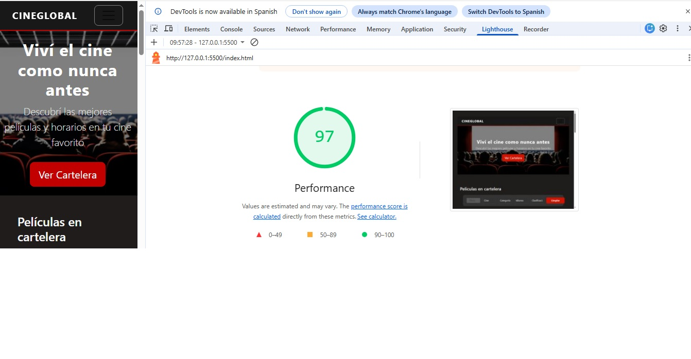
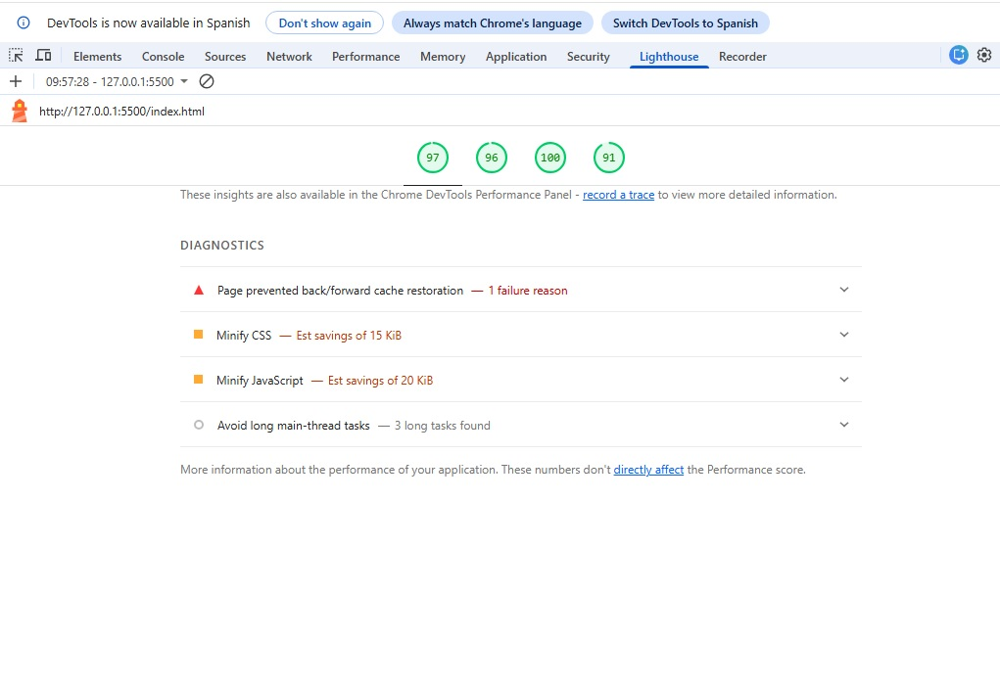
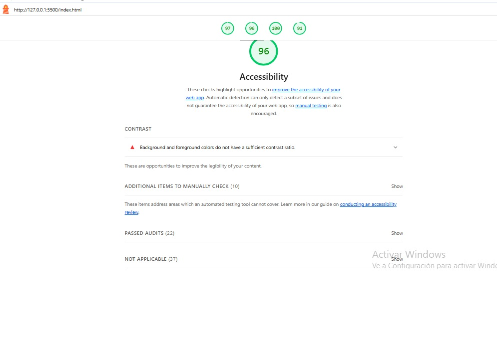
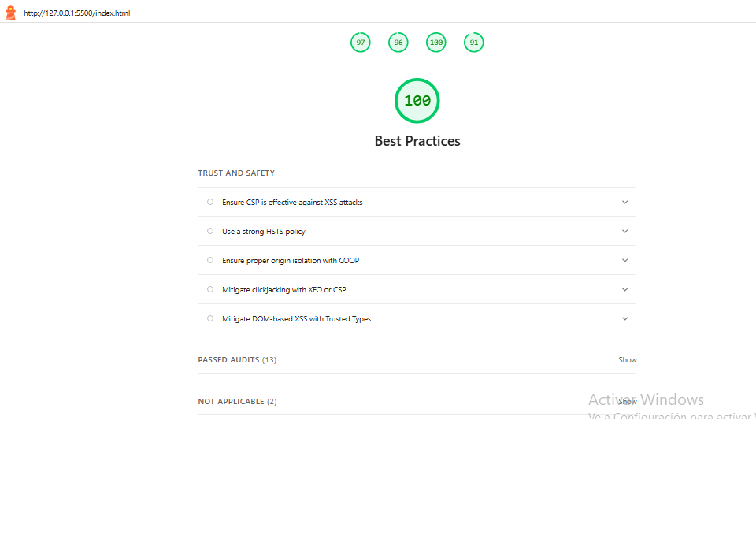
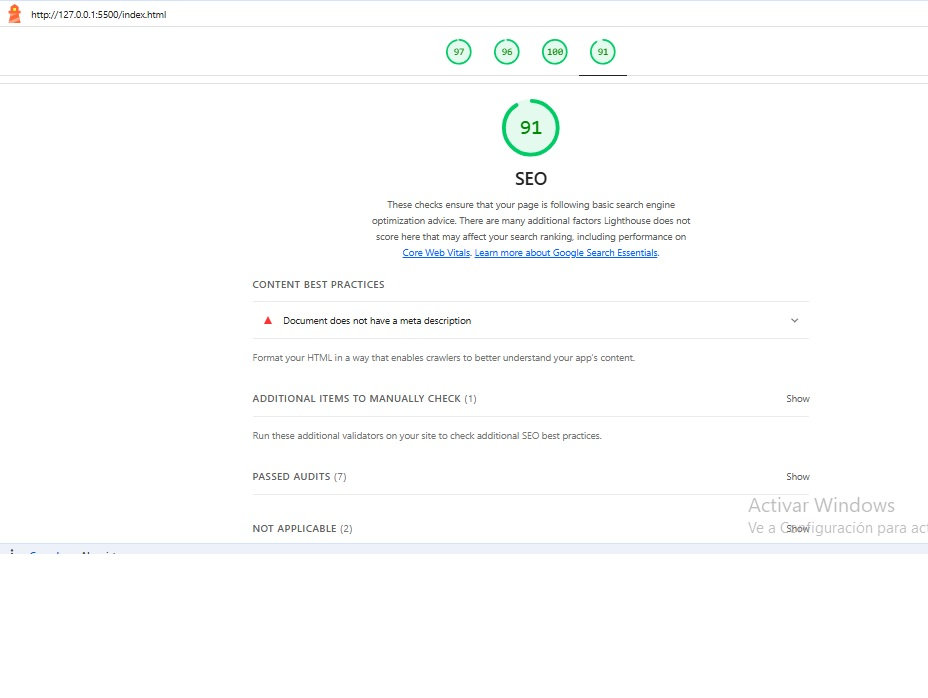

# Test Case 11: Auditoría Lighthouse - Baseline Inicial

## Información General

- **Fecha de ejecución:** 22/06/2026
- **URL testeada:** http://127.0.0.1:5500/index.html
- **Rama:** develop (antes de feature branches del Segundo Parcial)
- **Navegador:** Chrome [Versión 148.0.7778.218 (Compilación oficial) (64 bits)]
- **Modo:** Navigation, Desktop
- **Observación:** Lighthouse reportó un timeout al limpiar la caché del navegador durante la corrida ("Clearing the browser cache timed out").

## Umbrales Mínimos Definidos

- **Performance:** ≥ 80
- **Accessibility:** ≥ 90
- **Best Practices:** ≥ 85
- **SEO:** ≥ 80

## Resultados Obtenidos

### Performance: 97 ✅
- Diagnósticos relevantes detectados por Lighthouse (no bloqueantes, oportunidades de mejora):
- Improve image delivery — ahorro estimado de 580 KiB
- Minify JavaScript — ahorro estimado de 20 KiB
- Minify CSS — ahorro estimado de 15 KiB
- Document request latency — ahorro estimado de 22 KiB
- Render-blocking requests detectados
- Page prevented back/forward cache restoration (1 razón de falla)

### Accessibility: 96 ✅
- **Contraste insuficiente:** "Background and foreground colors do not have a sufficient contrast ratio" en al menos un elemento de la página.
- 22 auditorías pasadas correctamente; 10 ítems adicionales requieren revisión manual (no automatizable por Lighthouse).

### Best Practices: 100 ✅
- Sin observaciones; puntaje máximo. 13 auditorías pasadas, 2 no aplicables al proyecto (HSTS, COOP, CSP avanzado son checks de servidor que no aplican a un sitio estático en este entorno).

### SEO: 91 ✅
- **Falta meta description:** "Document does not have a meta description" en el `<head>` del HTML.
- 7 auditorías pasadas, 1 ítem adicional de revisión manual, 2 no aplicables.

## Issues Generadas

- [#209] - Agregar meta descripcion al index.html
- [#208] - Corregir contraste de color insuficiente (Accessibility)

## Conclusiones

El proyecto en su estado actual (rama `develop`, previo a la integración de fetch/API y de la librería externa) supera holgadamente los 4 umbrales mínimos definidos para el Segundo Parcial (Performance 97, Accessibility 96, Best Practices 100, SEO 91). Se detectaron dos hallazgos puntuales y de baja complejidad —falta de meta description y contraste de color insuficiente— que se documentan como issues para su corrección, sin que comprometan la aprobación del baseline. Esta base servirá como punto de comparación para medir el impacto real de las próximas integraciones de fetch y librería externa.