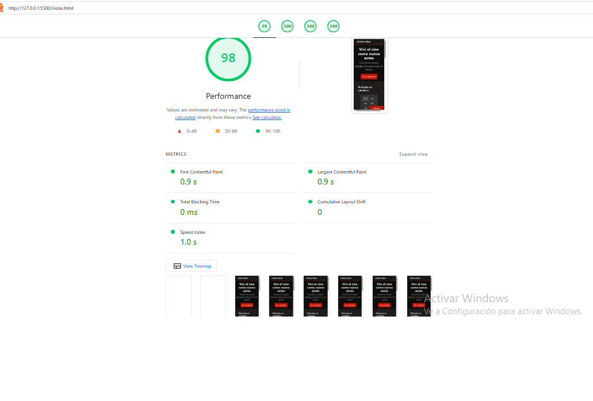
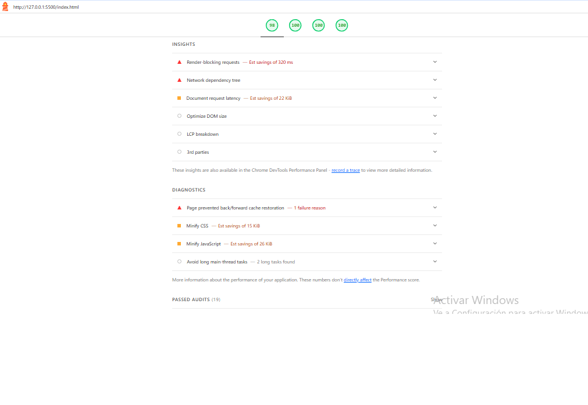
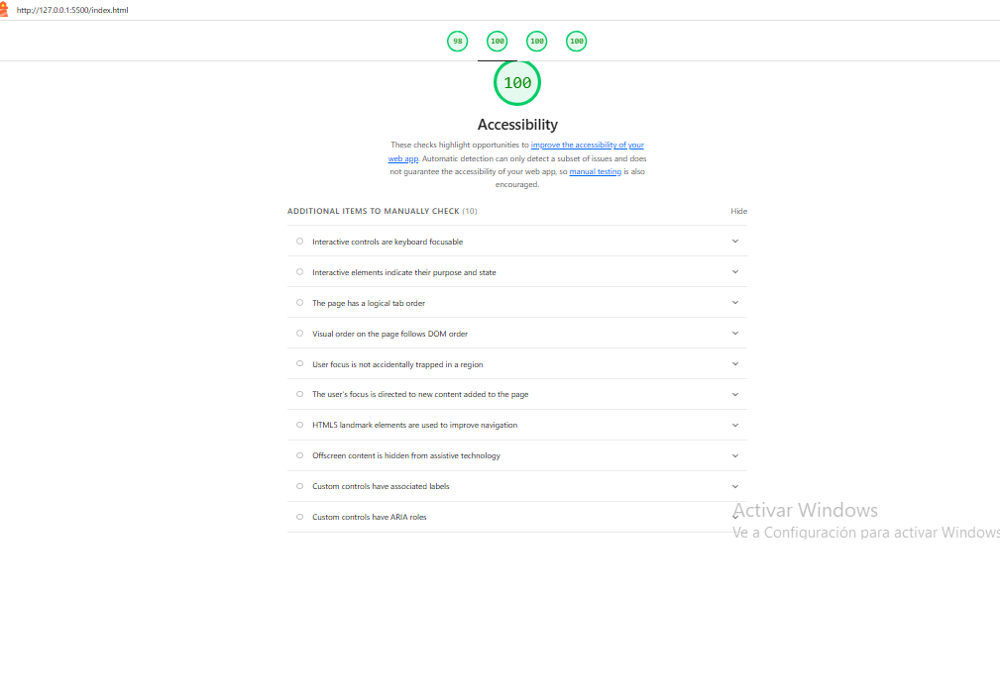
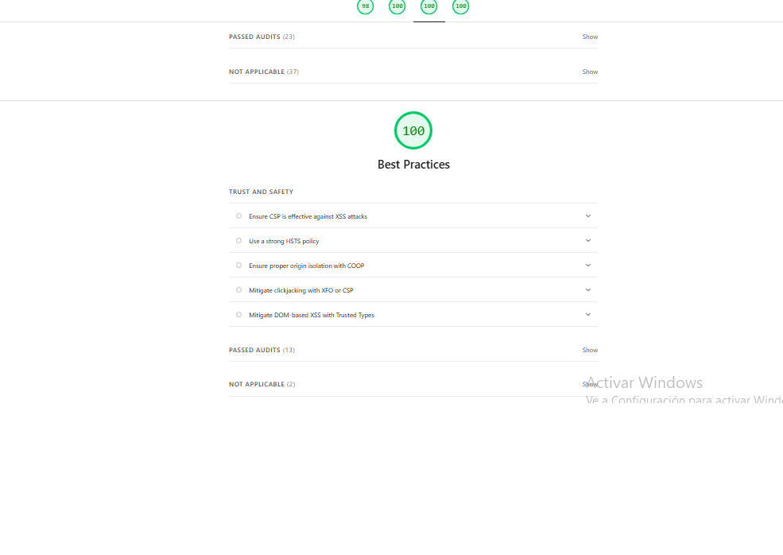
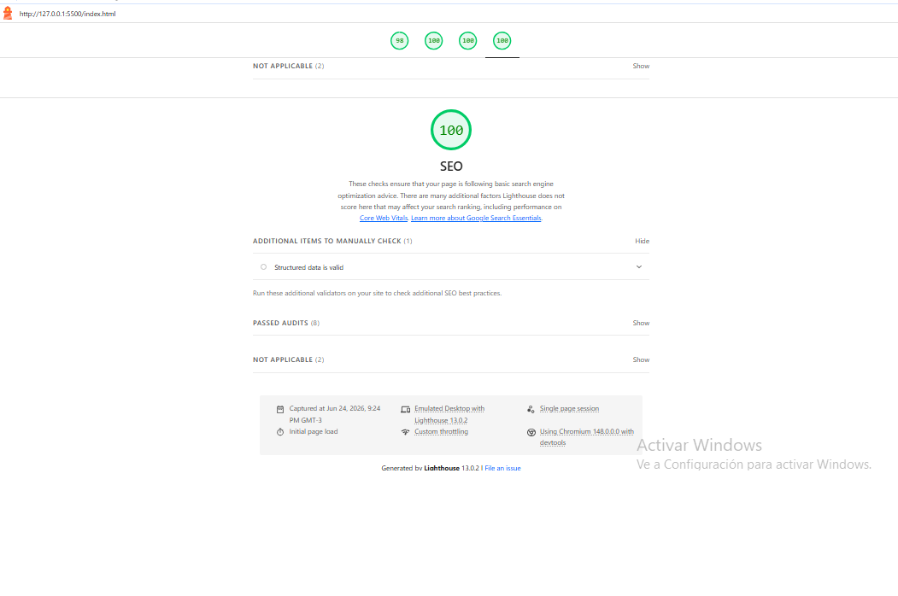

# Test Case 12: Auditoría Lighthouse - Post Fetch/API

## Información General

- **Fecha de ejecución:** 24/06/2026
- **URL testeada:** http://127.0.0.1:5500/index.html
- **Rama:** develop (con feature/dev-async-fetch-api integrada)
- **Navegador:** Chrome [Versión 148.0.7778.218 (Compilación oficial) (64 bits)]
- **Modo:** Navigation, Desktop (Lighthouse 13.0.2 / Chromium 148.0.0)
- **Cambios implementados:**
  - Consumo de API TMDB con fetch asíncrono (`ApiService.fetchData`)
  - Procesamiento asíncrono de datos con `map`, `filter` y `reduce` en `apiService.js`
  - Actualización dinámica del DOM con películas obtenidas desde la API

## Umbrales Mínimos Definidos

- **Performance:** ≥ 80
- **Accessibility:** ≥ 90
- **Best Practices:** ≥ 85
- **SEO:** ≥ 80

## Resultados Obtenidos

### Performance: 98 ✅
- **Métricas core:**
  - First Contentful Paint: 0.9 s
  - Largest Contentful Paint: 0.9 s
  - Total Blocking Time: 0 ms
  - Cumulative Layout Shift: 0
  - Speed Index: 1.0 s
- **Insights (no bloqueantes):**
  - Render-blocking requests — ahorro estimado de 320 ms
  - Network dependency tree detectado
  - Document request latency — ahorro estimado de 22 KiB
- **Diagnósticos:**
  - Page prevented back/forward cache restoration — 1 failure reason
  - Minify CSS — ahorro estimado de 15 KiB
  - Minify JavaScript — ahorro estimado de 26 KiB
  - Avoid long main-thread tasks — 2 long tasks found
- 19 auditorías pasadas correctamente

### Accessibility: 100 ✅
- Sin hallazgos automatizables: todas las auditorías de accesibilidad pasadas correctamente.
- 10 ítems adicionales requieren revisión manual (no automatizables por Lighthouse).

### Best Practices: 100 ✅
- 13 auditorías pasadas, 2 no aplicables al proyecto (HSTS, COOP, CSP avanzado son checks de servidor que no aplican a un sitio estático).
- Sin observaciones bloqueantes.

### SEO: 100 ✅
- 8 auditorías pasadas; 1 ítem de revisión manual (Structured data is valid), 2 no aplicables.
- Sin observaciones bloqueantes.

## Comparación con Baseline

| Métrica | Baseline | Post-Fetch | Diferencia |
|---------|:--------:|:----------:|:----------:|
| Performance | 97 | 98 | +1 ✅ |
| Accessibility | 96 | 100 | +4 ✅ |
| Best Practices | 100 | 100 | 0 ✅ |
| SEO | 91 | 100 | +9 ✅ |

### Análisis de Impacto

- **Performance:** La integración de fetch asíncrono no degradó el rendimiento; por el contrario, mejoró 1 punto (97→98). El fetch externo hacia TMDB no introduce latencia visible porque el sitio carga con datos estáticos del fallback local cuando la API no responde.
- **Accessibility:** Mejora de 4 puntos (96→100). El contraste insuficiente reportado en el baseline fue corregido (issue #208).
- **Best Practices:** Sin cambios. Puntaje máximo mantenido.
- **SEO:** Mejora de 9 puntos (91→100). La meta description fue agregada correctamente (issue #209), eliminando el único hallazgo del baseline.

### Recomendaciones

- Implementar caché de respuestas API para reducir latencia en recargas.
- Optimizar frecuencia de llamadas al endpoint externo.
- Considerar lazy loading para datos no críticos al primer render.
- Resolver render-blocking requests de Bootstrap CDN (oportunidad de 320 ms).

## Issues Generadas

- [#218] [Performance] Resolver render-blocking requests (CDN de Bootstrap).
- [#219] [Performance] Tareas largas detectadas en el hilo principal (long tasks).
- Issues del baseline ya resueltas: #208 (contraste) y #209 (meta description) confirmadas como cerradas por este resultado.

## Conclusiones

La integración de `feature/dev-async-fetch-api` no degradó ninguna métrica respecto del baseline. Los 4 umbrales mínimos se superan holgadamente (Performance 98, Accessibility 100, Best Practices 100, SEO 100). Las correcciones aplicadas previamente a partir de los hallazgos del baseline impactaron positivamente en Accessibility (+4) y SEO (+9). Persisten dos oportunidades de mejora de Performance documentadas en las issues #218 y #219, pero no comprometen la aprobación del post-fetch. El proyecto está en condiciones óptimas para avanzar con la integración de la librería externa.

---

### Resultado Final

- [x] ✅ PASS — Todas las métricas superan los umbrales mínimos
- [ ] ⚠️ FAIL CON OBSERVACIONES — Alguna métrica borderline con issues creadas
- [ ] ❌ FAIL — Una o más métricas por debajo del umbral mínimo