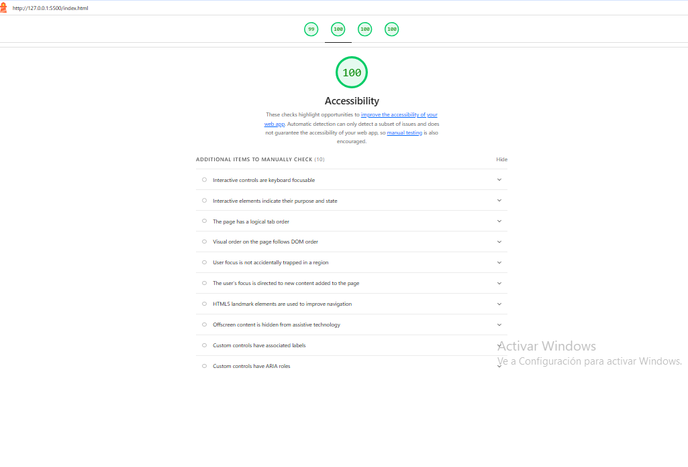
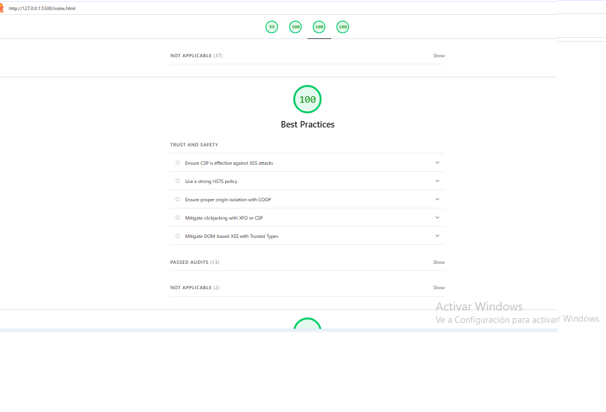

# Test Case 13: Auditoría Lighthouse - Post Librería Externa

## Información General

- **Fecha de ejecución:** 24/06/2026
- **URL testeada:** http://127.0.0.1:5500/index.html
- **Rama:** develop (con feature/dev-libreria-externa-toastify integrada)
- **Navegador:** Chrome [Versión 148.0.7778.218 (Compilación oficial) (64 bits)]
- **Modo:** Navigation, Desktop (Lighthouse 13.0.2 / Chromium 148.0.0)
- **Cambios implementados:**
  - Integración de librería externa mediante CDN o bundle local
  - Configuración e inicialización de la librería
  - Uso de la librería en interacción con el DOM / API / eventos

## Umbrales Mínimos Definidos

- **Performance:** >= 80
- **Accessibility:** >= 90
- **Best Practices:** >= 85
- **SEO:** >= 80

## Resultados Obtenidos

### Performance: 99 ✅
- **Métricas core:**
  - First Contentful Paint: 0.6 s
  - Largest Contentful Paint: 0.8 s
  - Total Blocking Time: 0 ms
  - Cumulative Layout Shift: 0
  - Speed Index: 0.7 s
- **Insights (no bloqueantes):**
  - Improve image delivery — ahorro estimado de 630 KiB
  - Render-blocking requests — ahorro estimado de 160 ms
  - LCP request discovery detectado
  - Network dependency tree detectado
  - Document request latency — ahorro estimado de 21 KiB
- **Diagnósticos:**
  - Page prevented back/forward cache restoration — 1 failure reason
  - Minify CSS — ahorro estimado de 15 KiB
  - Minify JavaScript — ahorro estimado de 26 KiB
  - Avoid long main-thread tasks — 2 long tasks found
- 19 auditorías pasadas correctamente.

### Accessibility: 100 ✅
- Sin hallazgos automatizables: todas las auditorías de accesibilidad pasadas correctamente.
- 10 ítems requieren revisión manual (no automatizables por Lighthouse).

### Best Practices: 100 ✅
- 13 auditorías pasadas, 2 no aplicables al proyecto (HSTS, COOP, CSP avanzado son checks de servidor que no aplican a un sitio estático).
- Sin observaciones bloqueantes.

### SEO: 100 ✅
- Sin observaciones bloqueantes.
- 8 auditorías pasadas; 1 ítem de revisión manual y 2 no aplicables.

## Comparación con Post-Fetch

| Métrica | Post-Fetch | Post-Librería | Diferencia |
|---------|:----------:|:-------------:|:----------:|
| Performance | 98 | 99 | +1 ✅ |
| Accessibility | 100 | 100 | 0 ✅ |
| Best Practices | 100 | 100 | 0 ✅ |
| SEO | 100 | 100 | 0 ✅ |

### Análisis de Impacto

- **Performance:** La integración de la librería externa no degradó el rendimiento; mejoró 1 punto respecto del estado post-fetch (98→99). Se mantienen algunas oportunidades no bloqueantes vinculadas a entrega de imágenes, requests bloqueantes y long tasks.
- **Accessibility:** Sin impacto negativo. La librería no introdujo problemas de foco, contraste ni semántica accesible; se conserva el puntaje máximo.
- **Best Practices:** Sin impacto negativo. No aparecieron advertencias nuevas bloqueantes relacionadas con terceros, CDN o seguridad del runtime.
- **SEO:** Sin impacto negativo. La librería externa no alteró metadatos, indexabilidad ni contenido relevante para SEO.

### Recomendaciones

- Minimizar el peso de la librería externa o cargarla bajo demanda si no es crítica.
- Validar si la librería genera listeners, DOM extra o estilos que impacten en long tasks.
- Verificar la política de integridad (SRI) y dependencias CDN si aplica.
- Mantener monitoreo de Lighthouse luego de cambios sobre la integración de la librería.

## Issues Generadas

- No se detectaron nuevos problemas críticos en Accessibility, Best Practices o SEO.
- Los hallazgos de Performance ya se encuentran documentados y vigentes en:
  - [#218] [Performance] Resolver render-blocking requests (CDN de Bootstrap).
  - [#219] [Performance] Tareas largas detectadas en el hilo principal (long tasks).
- No fue necesario crear nuevas issues adicionales para la integración de la librería externa, ya que las oportunidades observadas coinciden con issues abiertas existentes.

## Conclusiones

La integración de la librería externa no degradó ninguna métrica respecto del estado post-fetch. Los 4 umbrales mínimos continúan ampliamente superados (Performance 99, Accessibility 100, Best Practices 100, SEO 100). El sistema mantiene estabilidad en accesibilidad y SEO, y mejora levemente en Performance (+1). Las oportunidades de mejora observadas permanecen acotadas al área de rendimiento y ya están correctamente trazadas en las issues #218 y #219. El proyecto queda aprobado para continuar con el cierre del rol Tester QA/JS.

---