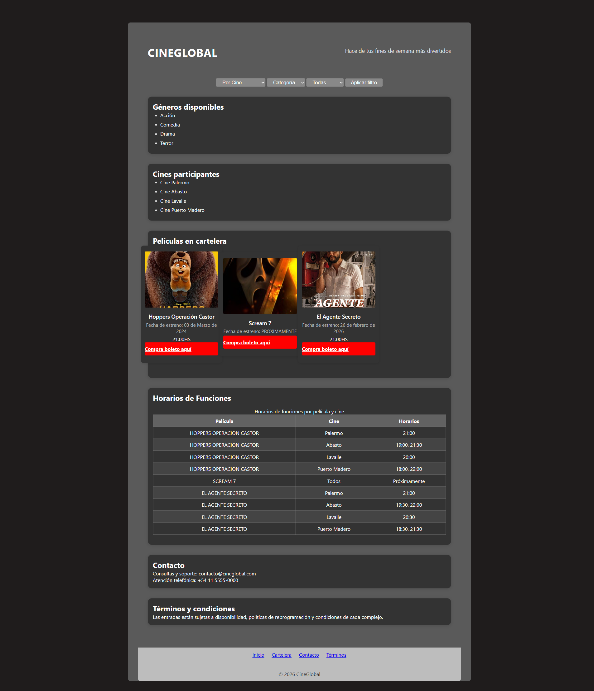
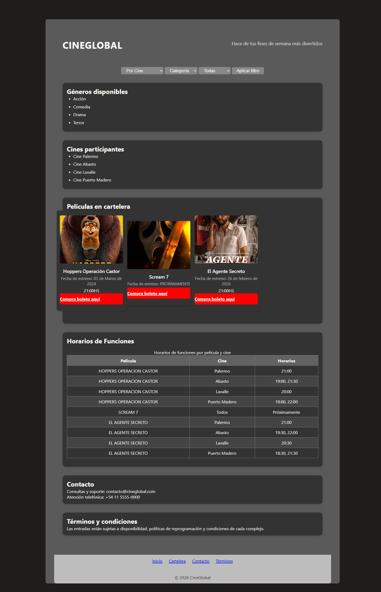
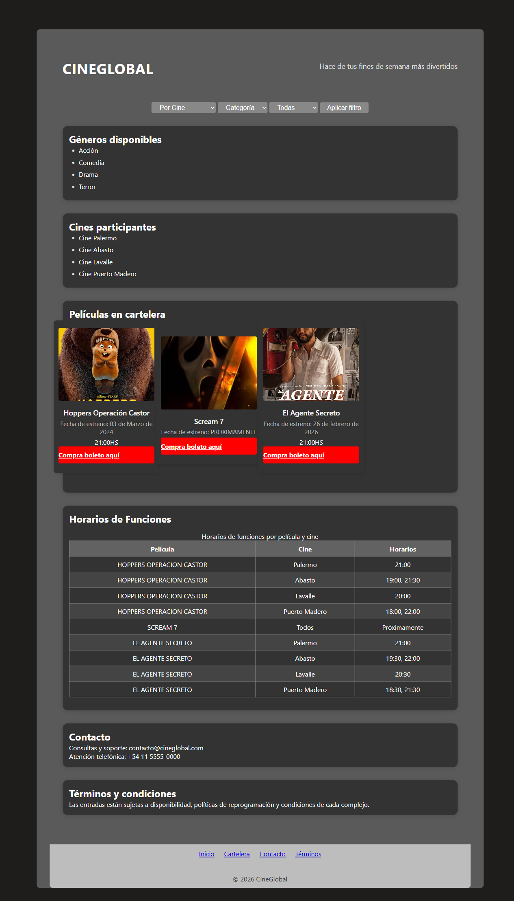

# Test Case 1 — Compatibilidad Visual en Navegadores Desktop

## Metadata
| Campo | Valor |
|-------|-------|
| Responsable | Marc Holste |
| Fecha Momento 1 (rama dev-frontend-css) | 12/04/2026 |
| Fecha Momento 1 (rama responsive-design) | 12/04/2026 |
| Fecha Momento 2 | 13/04/2026 |
| Rama Momento 1.1 | `feature/dev-frontend-css-add-styles` |
| Rama Momento 1.2 | `feature/responsive-design-add-responsive-styles` |
| Rama Momento 2 | `develop` |
| URL testeada | `http://localhost:3000` |

## Objetivo
Verificar que la página se visualiza correctamente en distintos viewports desktop
sin elementos cortados, desbordados o ilegibles.

## Herramientas utilizadas
- Playwright MCP (`@playwright/mcp`) con viewport emulation
- GitHub Copilot Agent Mode

---

## Prompt para Copilot Agent Mode

Copiá este prompt en Copilot Agent Mode con Playwright MCP activo:

```
Usando Playwright MCP, necesito testear la compatibilidad visual de mi página
en distintos viewports desktop. La URL es http://localhost:3000

Ejecutá estos pasos en orden:
1. Navegá a la URL y esperá que la página cargue completamente
2. Configurá el viewport en 1920x1080 y tomá una captura de pantalla completa
3. Verificá que en este viewport:
   - El header con la navegación sea visible y no se corte
   - Las secciones principales estén en fila horizontal donde corresponda
   - Las tablas sean legibles sin scroll horizontal
   - El footer muestre el texto y los links correctamente
4. Configurá el viewport en 1440x900 y tomá captura completa
5. Configurá el viewport en 1280x800 (simulando Firefox/Safari) y tomá captura completa
6. Configurá el viewport en 1280x800 (simulando Edge) y tomá captura completa
7. En cada viewport reportá si encontrás algún elemento que se corte,
   desborde o no se vea correctamente
8. Generá un resumen con el estado de cada viewport: OK o con problemas

Guardá las capturas en docs/04-testing/capturas/tc-1/momento-X/
(reemplazá X por 1 o 2 según el momento de ejecución)
```

---

## MOMENTO 1 — Pre-merge (rama `feature/dev-frontend-css-add-styles`)

### Viewports testeados
| Viewport | Navegador simulado | Navegación | Layout | Tabla | Footer | Estado |
|----------|--------------------|------------|--------|-------|--------|--------|
| 1920×1080 | Chrome | OK (visible, sin corte) | Con problemas (cards en columna) | OK (legible, sin scroll horizontal) | Con observaciones (texto OK, sin links en footer) | ⚠️ Con problemas |
| 1440×900 | Chrome | OK (visible, sin corte) | Con problemas (cards en columna) | OK (legible, sin scroll horizontal) | Con observaciones (texto OK, sin links en footer) | ⚠️ Con problemas |
| 1280×800 | Firefox / Safari (simulado por UA) | OK (visible, sin corte) | Con problemas (cards en columna) | OK (legible, sin scroll horizontal) | Con observaciones (texto OK, sin links en footer) | ⚠️ Con problemas |
| 1280×800 | Edge (simulado por UA) | OK (visible, sin corte) | Con problemas (cards en columna) | OK (legible, sin scroll horizontal) | Con observaciones (texto OK, sin links en footer) | ⚠️ Con problemas |

### Capturas de pantalla
| Viewport | Captura | Estado |
|----------|---------|--------|
| 1920×1080 | .png) | ⚠️ Con problemas |
| 1440×900 | .png) | ⚠️ Con problemas |
| 1280×800 Firefox/Safari | .png) | ⚠️ Con problemas |
| 1280×800 Edge | .png) | ⚠️ Con problemas |

### Hallazgos
| # | Elemento | Viewport afectado | Descripción | Severidad |
|---|----------|-------------------|-------------|-----------|
| 1 | Layout de cards en sección principal | 1920×1080, 1440×900, 1280×800 (Firefox/Safari simulado), 1280×800 (Edge simulado) | Las tarjetas de películas se muestran apiladas en columna en desktop; no se observa distribución horizontal esperada para este caso de prueba. | Media |
| 2 | Footer (links) | 1920×1080, 1440×900, 1280×800 (Firefox/Safari simulado), 1280×800 (Edge simulado) | El footer muestra correctamente el texto, pero no presenta enlaces visibles para validar su funcionamiento. | Baja |
| 3 | Consola en entorno Live Preview | Todos los viewports | Se detectaron errores no bloqueantes: handshake de WebSocket (Live Preview) y 404 de `favicon.ico`. | Baja |

### Resultado Momento 1
- [ ] ✅ PASS — Sin hallazgos
- [x] ⚠️ FAIL CON OBSERVACIONES
- [ ] ❌ FAIL

---

## MOMENTO 1 — Pre-merge (rama `feature/responsive-design-add-responsive-styles`)

### Viewports testeados
| Viewport | Navegador simulado | Navegación | Layout | Tabla | Footer | Estado |
|----------|--------------------|------------|--------|-------|--------|--------|
| 1920×1080 | Chrome | ✅ OK | ✅ OK (flex row, responsive) | ✅ OK (legible, sin scroll H) | ⚠️ Sin links (solo texto) | ✅ OK |
| 1440×900 | Chrome | ✅ OK | ✅ OK (flex row, responsive) | ✅ OK (legible, sin scroll H) | ⚠️ Sin links (solo texto) | ✅ OK |
| 1280×800 | Firefox / Safari | ✅ OK | ✅ OK (flex row, responsive) | ✅ OK (legible, sin scroll H) | ⚠️ Sin links (solo texto) | ✅ OK |
| 1280×800 | Edge | ✅ OK | ✅ OK (flex row, responsive) | ✅ OK (legible, sin scroll H) | ⚠️ Sin links (solo texto) | ✅ OK |

### Capturas de pantalla
| Viewport | Captura | Estado |
|----------|---------|--------|
| 1920×1080 | .png) | ✅ OK |
| 1440×900 | .png) | ✅ OK |
| 1280×800 Firefox/Safari | .png) | ✅ OK |
| 1280×800 Edge | .png) | ✅ OK |

### Hallazgos
| # | Elemento | Viewport afectado | Descripción | Severidad |
|---|----------|-------------------|-------------|-----------|
| 1 | Footer (links) | 1920×1080, 1440×900, 1280×800 (FF/Safari), 1280×800 (Edge) | El footer muestra correctamente el texto "© 2026 CineGlobal", pero no presenta enlaces visibles en la estructura. Requiere validación de diseño UX. | Baja |

### Resultado Momento 1
- [x] ✅ PASS — Compatibilidad visual verificada
- [ ] ⚠️ FAIL CON OBSERVACIONES
- [ ] ❌ FAIL

---

## MOMENTO 2 — Post-merge (`develop`)

### Viewports testeados
| Viewport | Navegador simulado | Navegación | Layout | Tabla | Footer | Estado |
|----------|--------------------|------------|--------|-------|--------|--------|
| 1920×1080 | Chrome | ✅ OK | ✅ OK (flex row, 3 cards) | ✅ OK (legible, sin scroll H) | ✅ OK (links + copyright) | ✅ OK |
| 1440×900 | Chrome | ✅ OK | ✅ OK (flex row, 3 cards) | ✅ OK (legible, sin scroll H) | ✅ OK (links + copyright) | ✅ OK |
| 1280×800 | Firefox / Safari | ✅ OK | ✅ OK (flex row, 3 cards) | ✅ OK (legible, sin scroll H) | ✅ OK (links + copyright) | ✅ OK |
| 1280×800 | Edge | ✅ OK | ✅ OK (flex row, 3 cards) | ✅ OK (legible, sin scroll H) | ✅ OK (links + copyright) | ✅ OK |

### Capturas de pantalla
| Viewport | Captura | Estado |
|----------|---------|--------|
| 1920×1080 |  | ✅ OK |
| 1440×900 |  | ✅ OK |
| 1280×800 Firefox/Safari |  | ✅ OK |
| 1280×800 Edge |  | ✅ OK |

### Hallazgos
| # | Elemento | Viewport afectado | Descripción | Severidad |
|---|----------|-------------------|-------------|-----------|
| — | Sin hallazgos | — | Todos los viewports renderizan correctamente sin cortes, desbordes ni ilegibilidad. | — |

### Resultado Momento 2
- [x] ✅ PASS — Sin hallazgos
- [ ] ⚠️ FAIL CON OBSERVACIONES
- [ ] ❌ FAIL

---

## Issues creados
| Issue | Momento | Elemento | Severidad | Estado |
|-------|---------|----------|-----------|--------|
| [#34](https://github.com/hmarc953/cineglobal/issues/34) | Momento 1 | Layout de cards en desktop | Media | Abierto |
| [#35](https://github.com/hmarc953/cineglobal/issues/35) | Momento 1 | Footer sin links verificables | Baja | Abierto |

## Decisiones tomadas
Se consolidan los resultados de ambas ramas en Momento 1: en `feature/dev-frontend-css-add-styles` se detectaron dos problemas (layout de cards en desktop y footer sin links), mientras que en `feature/responsive-design-add-responsive-styles` se mantiene solo la observacion del footer sin links. Se conserva abierto el issue de layout (#34) por trazabilidad historica y se prioriza como deuda vigente compartida el footer sin enlaces (#35).

## Conclusión general
**Resultado final:** PASS

En Momento 2 (rama `develop`), todos los viewports desktop superan la verificación visual sin hallazgos. El layout de cards se muestra en fila horizontal, las tablas son legibles sin scroll horizontal, el header no se corta y el footer presenta correctamente los enlaces de navegación y el copyright. Los issues previos de Momento 1 (#34 layout de cards, #35 footer sin links) quedan verificados como resueltos.