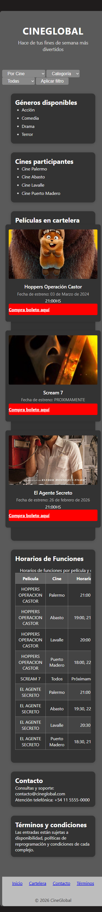

# Test Case 2 — Responsive en Dispositivos Móviles

## Metadata
| Campo | Valor |
|-------|-------|
| Responsable | Marc Holste |
| Fecha Momento 1 (rama dev-frontend-css) | 12/04/2026 |
| Fecha Momento 1 (rama responsive-design) | 12/04/2026 |
| Fecha Momento 2 | 13/04/2026 |
| Rama Momento 1.1 | `feature/dev-frontend-css-add-styles` |
| Rama Momento 1.2 | `feature/responsive-design-add-responsive-styles` |
| Rama Momento 2 | `develop` |
| URL testeada | `http://localhost:3000` |

## Objetivo
Verificar que el diseño responsive funciona correctamente en móviles y tablets,
sin desbordamientos ni scroll horizontal involuntario.

## Herramientas utilizadas
- Playwright MCP (`@playwright/mcp`) con viewport emulation
- GitHub Copilot Agent Mode

---

## Prompt para Copilot Agent Mode

Copiá este prompt en Copilot Agent Mode con Playwright MCP activo:

```
Usando Playwright MCP, necesito testear el diseño responsive de
http://localhost:3000 en distintos dispositivos móviles.

Ejecutá estos pasos en orden:

1. Configurá el viewport en 390x844 (iPhone 14 Pro)
   - Navegá a la página y tomá captura completa
   - Verificá si la navegación se adapta sin desbordarse
   - Verificá si los elementos se apilan verticalmente donde corresponde
   - Verificá si alguna tabla genera scroll horizontal
   - Verificá si el formulario ocupa el ancho completo
   - Verificá si hay scroll horizontal en la página

2. Configurá el viewport en 412x915 (Samsung Galaxy S23) y repetí los mismos pasos

3. Configurá el viewport en 820x1180 (iPad Air) y repetí los mismos pasos

4. Para cada dispositivo reportá qué elementos se ven correctamente
   y cuáles tienen problemas visuales

5. Generá un resumen indicando qué dispositivo presenta más problemas

Guardá las capturas en docs/04-testing/capturas/tc-2/momento-X/
(reemplazá X por 1 o 2 según el momento de ejecución)
```

---

## MOMENTO 1 — Pre-merge (rama `feature/dev-frontend-css-add-styles`)

### Dispositivos testeados
| Dispositivo | Viewport | Navegación | Layout móvil | Tabla | Formulario | Scroll horizontal | Estado |
|-------------|----------|------------|--------------|-------|------------|-------------------|--------|
| iPhone 14 Pro | 390×844 | OK | OK | OK | OK | OK | ✅ OK |
| Samsung Galaxy S23 | 412×915 | OK | OK | OK | OK | OK | ✅ OK |
| iPad Air | 820×1180 | OK | OK | OK | OK | OK | ✅ OK |

### Capturas de pantalla
| Dispositivo | Captura | Estado |
|-------------|---------|--------|
| iPhone 14 Pro |  | ✅ OK |
| Samsung Galaxy S23 |  | ✅ OK |
| iPad Air |  | ✅ OK |

### Hallazgos
| # | Elemento | Dispositivo afectado | Descripción | Desbordamiento | Severidad |
|---|----------|----------------------|-------------|----------------|-----------|
| 1 | Sin hallazgos visuales relevantes | iPhone 14 Pro, Samsung Galaxy S23, iPad Air | La navegación se adapta correctamente, los elementos principales se apilan verticalmente, la tabla no genera scroll horizontal, el bloque de filtros ocupa el ancho disponible y no se detecta scroll horizontal en la página. | No | Baja |
| 2 | Consola de Live Preview | Todos | Se detectaron errores no bloqueantes del entorno de prueba: handshake WebSocket de Live Preview y 404 de favicon.ico. No impactaron el comportamiento responsive observado. | No | Baja |

### Resultado Momento 1
- [x] ✅ PASS — Sin hallazgos
- [ ] ⚠️ FAIL CON OBSERVACIONES
- [ ] ❌ FAIL

---

## MOMENTO 1 — Pre-merge (rama `feature/responsive-design-add-responsive-styles`)

### Dispositivos testeados
| Dispositivo | Viewport | Navegación | Layout móvil | Tabla | Formulario | Scroll horizontal | Estado |
|-------------|----------|------------|--------------|-------|------------|-------------------|--------|
| iPhone 14 Pro | 390×844 | ✅ OK (1 item) | ✅ OK (vertical stacking) | ✅ OK (legible) | ✅ OK (ancho completo) | ❌ No | ✅ OK |
| Samsung Galaxy S23 | 412×915 | ✅ OK (1 item) | ✅ OK (vertical stacking) | ✅ OK (legible) | ✅ OK (ancho completo) | ❌ No | ✅ OK |
| iPad Air | 820×1180 | ✅ OK (1 item) | ✅ OK (vertical stacking) | ✅ OK (legible) | ✅ OK (ancho completo) | ❌ No | ✅ OK |

### Capturas de pantalla
| Dispositivo | Captura | Estado |
|----------|---------|--------|
| iPhone 14 Pro |  | ✅ OK |
| Samsung Galaxy S23 |  | ✅ OK |
| iPad Air |  | ✅ OK |

### Hallazgos
| # | Elemento | Dispositivo afectado | Descripción | Desbordamiento | Severidad |
|---|----------|----------------------|-------------|----------------|-----------|
| 1 | Sin hallazgos relevantes | iPhone 14 Pro, Galaxy S23, iPad Air | El diseño responsive funciona correctamente en todos los dispositivos móviles y tablets. Todos los elementos se adaptan sin problemas visuales. | No | - |

### Resultado Momento 1
- [x] ✅ PASS — Sin hallazgos
- [ ] ⚠️ FAIL CON OBSERVACIONES
- [ ] ❌ FAIL

---

## MOMENTO 2 — Post-merge (`develop`)

### Dispositivos testeados
| Dispositivo | Viewport | Navegación | Layout móvil | Tabla | Formulario | Scroll horizontal | Estado |
|-------------|----------|------------|--------------|-------|------------|-------------------|---------|
| iPhone 14 Pro | 390×844 | ✅ OK | ✅ OK (vertical stacking) | ⚠️ Overflow interno (322>279) | ✅ OK (ancho completo) | ❌ No | ⚠️ Con observaciones |
| Samsung Galaxy S23 | 412×915 | ✅ OK | ✅ OK (vertical stacking) | ⚠️ Overflow interno (322>300) | ✅ OK (ancho completo) | ❌ No | ⚠️ Con observaciones |
| iPad Air | 820×1180 | ✅ OK | ✅ OK (grid 2+1 columnas) | ✅ OK (sin overflow) | ✅ OK (en fila horizontal) | ❌ No | ✅ OK |

### Capturas de pantalla
| Dispositivo | Captura | Estado |
|-------------|---------|--------|
| iPhone 14 Pro |  | ⚠️ Con observaciones |
| Samsung Galaxy S23 |  | ⚠️ Con observaciones |
| iPad Air |  | ✅ OK |

### Hallazgos
| # | Elemento | Dispositivo afectado | Descripción | Desbordamiento | Severidad |
|---|----------|----------------------|-------------|----------------|-----------|
| 1 | Tabla "Horarios de Funciones" | iPhone 14 Pro, Samsung Galaxy S23 | La tabla tiene `scrollWidth` mayor a `clientWidth` (322 > 279 en iPhone; 322 > 300 en Samsung). El contenido de la tabla desborda su contenedor pero queda recortado sin scroll visible, lo que puede generar información no accesible en móviles pequeños. | Sí (interno, recortado) | Media |
| 2 | Grid de cards en iPad Air | iPad Air (820×1180) | Las 3 películas se muestran en layout 2+1: las primeras 2 en fila y la tercera sola. Sin hallazgo bloqueante; comportamiento esperado para tablet si el diseño no especifica 3 columnas. | No | Baja |

### Resultado Momento 2
- [ ] ✅ PASS — Sin hallazgos
- [x] ⚠️ FAIL CON OBSERVACIONES
- [ ] ❌ FAIL

---

## Issues creados
| Issue | Momento | Elemento | Dispositivo | Severidad | Estado |
|-------|---------|----------|-------------|-----------|--------|
| No aplica | Momento 1 | Sin issues creados | Todos | - | Cerrado |
| [#46](https://github.com/hmarc953/cineglobal/issues/46) | Momento 2 | `.tabla-cartelera` overflow horizontal | iPhone 14 Pro, Samsung S23 | Alta | Abierto |

## Decisiones tomadas
Se unifican los resultados de ambas ramas en Momento 1 (`feature/dev-frontend-css-add-styles` y `feature/responsive-design-add-responsive-styles`) porque en los tres dispositivos evaluados no se observaron diferencias funcionales ni visuales relevantes. No se crean issues para este caso por ausencia de defectos reproducibles.

## Conclusión general
**Resultado final:** FAIL CON OBSERVACIONES

En Momento 2 (rama `develop`), la navegación y el apilado vertical funcionan correctamente en los tres dispositivos y no se detecta scroll horizontal en la página. Sin embargo, la tabla "Horarios de Funciones" presenta overflow interno recortado en iPhone 14 Pro y Samsung Galaxy S23, lo que puede impedir que el usuario acceda a parte del contenido sin scroll. iPad Air muestra la tabla correctamente. Se recomienda añadir `overflow-x: auto` al contenedor de la tabla para móviles.