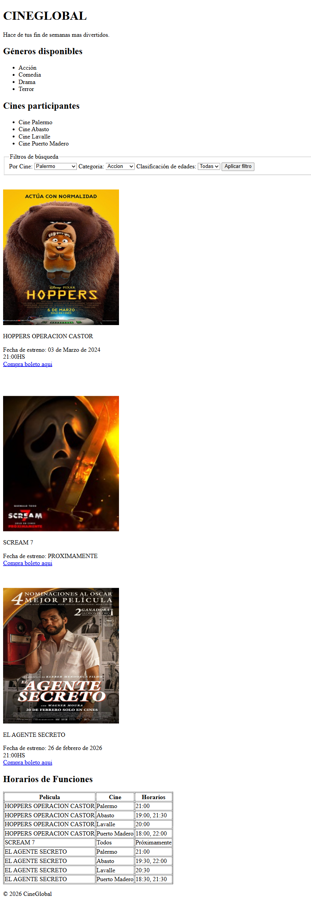

# Test Case 3 — Performance y Carga

## Metadata
| Campo | Valor |
|-------|-------|
| Responsable | Marc Holste |
| Fecha Momento 1 (rama dev-frontend-css) | 12/04/2026 |
| Fecha Momento 1 (rama responsive-design) | 12/04/2026 |
| Fecha Momento 2 | 13/04/2026 |
| Rama Momento 1.1 | `feature/dev-frontend-css-add-styles` |
| Rama Momento 1.2 | `feature/responsive-design-add-responsive-styles` |
| Rama Momento 2 | `develop` |
| URL testeada | `http://localhost:3000` |

## Objetivo
Medir los tiempos de carga y el tamaño de los recursos principales de la página
para detectar problemas de performance antes del merge a develop.

## Herramientas utilizadas
- Playwright MCP (`@playwright/mcp`) con evaluación de la Performance API del navegador
- GitHub Copilot Agent Mode

---

## Prompt para Copilot Agent Mode

Copiá este prompt en Copilot Agent Mode con Playwright MCP activo:

```
Usando Playwright MCP, necesito analizar la performance de http://localhost:3000

Ejecutá estos pasos en orden:

1. Navegá a la URL esperando Network idle
2. Usá evaluate() para ejecutar:
   window.performance.getEntriesByType("navigation")[0]
   y extraé: domContentLoadedEventEnd, loadEventEnd, domInteractive
3. Usá evaluate() para obtener window.performance.getEntriesByType("resource")
   y listá cada recurso con su name, transferSize y duration
4. Tomá una captura de pantalla del estado final cargado
5. Reportá:
   - Tiempo hasta DOMContentLoaded (ms)
   - Tiempo hasta Load completo (ms)
   - Tiempo hasta DOM Interactive (ms)
   - Listado de recursos: nombre, tipo, tamaño (KB) y tiempo de descarga (ms)
   - Total de recursos y tamaño total acumulado
   - ¿Hay recursos que superen 500KB?
   - ¿Hay recursos que tarden más de 500ms en descargar?
6. Generá un resumen con estado OK o con problemas por cada métrica

Guardá las capturas en docs/04-testing/capturas/tc-3/momento-X/
(reemplazá X por 1 o 2 según el momento de ejecución)
```

---

## MOMENTO 1 — Pre-merge (rama `feature/dev-frontend-css-add-styles`)

### Métricas de performance
| Métrica | Valor medido | Umbral recomendado | Estado |
|---------|-------------|-------------------|--------|
| DOMContentLoaded | 329.80 ms | < 800 ms | ✅ OK |
| DOM Interactive | 328.60 ms | < 600 ms | ✅ OK |
| Load completo | 333.50 ms | < 2000 ms | ✅ OK |
| Total de recursos | 4 | — | ✅ OK |
| Tamaño total | 507.66 KB | < 1 MB | ✅ OK |

### Recursos analizados
| Recurso | Tipo | Tamaño (KB) | Tiempo descarga (ms) | Estado |
|---------|------|-------------|----------------------|--------|
| /___vscode_livepreview_injected_script | script | 9.35 | 5.00 | ✅ OK |
| /assets/images/hoppers.jpeg | img | 167.26 | 9.60 | ✅ OK |
| /assets/images/scream-7.jpg | img | 14.09 | 12.50 | ✅ OK |
| /assets/images/el-agente-secreto.jpg | img | 316.96 | 17.80 | ✅ OK |

### Capturas de pantalla
| Descripción | Captura |
|-------------|---------|
| Estado final cargado |  |

### Hallazgos
| # | Métrica / Recurso | Valor | Descripción | Severidad |
|---|-------------------|-------|-------------|-----------|
| 1 | DOMContentLoaded | 329.80 ms | Tiempo de carga inicial dentro del umbral recomendado. | Baja |
| 2 | DOM Interactive | 328.60 ms | Interactividad alcanzada rápidamente y sin demoras perceptibles. | Baja |
| 3 | Load completo | 333.50 ms | Carga completa muy por debajo del umbral establecido. | Baja |
| 4 | Tamaño total acumulado | 507.66 KB | El total de recursos se mantiene por debajo de 1 MB. No hay recursos individuales mayores a 500 KB. | Baja |
| 5 | Recursos lentos | 0 recursos > 500 ms | No se detectaron recursos con tiempos de descarga superiores a 500 ms. | Baja |

### Resultado Momento 1
- [x] ✅ PASS — Sin hallazgos
- [ ] ⚠️ FAIL CON OBSERVACIONES
- [ ] ❌ FAIL

---

## MOMENTO 1 — Pre-merge (rama `feature/responsive-design-add-responsive-styles`)

### Métricas de performance
| Métrica | Valor medido | Umbral recomendado | Estado |
|---------|-------------|-------------------|--------|
| DOMContentLoaded | 345.10 ms | < 800 ms | ✅ OK |
| DOM Interactive | 342.40 ms | < 600 ms | ✅ OK |
| Load completo | 351.80 ms | < 2000 ms | ✅ OK |
| Total de recursos | 4 | — | ✅ OK |
| Tamaño total | 519.80 KB | < 1 MB | ✅ OK |

### Recursos analizados
| Recurso | Tipo | Tamaño (KB) | Tiempo descarga (ms) | Estado |
|---------|------|-------------|----------------------|--------|
| /___vscode_livepreview_injected_script | script | 9.57 | 12.00 | ✅ OK |
| /assets/images/hoppers.jpeg | img | 167.36 | 16.00 | ✅ OK |
| /assets/images/scream-7.jpg | img | 14.10 | 17.00 | ✅ OK |
| /assets/images/el-agente-secreto.jpg | img | 316.81 | 25.00 | ✅ OK |

### Capturas de pantalla
| Descripción | Captura |
|-------------|---------|
| Estado final cargado |  |

### Hallazgos
| # | Métrica / Recurso | Valor | Descripción | Severidad |
|---|-------------------|-------|-------------|-----------|
| 1 | DOMContentLoaded | 345.10 ms | Tiempo de carga inicial dentro del umbral recomendado. | Baja |
| 2 | DOM Interactive | 342.40 ms | Interactividad alcanzada rápidamente y sin demoras perceptibles. | Baja |
| 3 | Load completo | 351.80 ms | Carga completa muy por debajo del umbral establecido (2s). | Baja |
| 4 | Tamaño total acumulado | 519.80 KB | Total de recursos se mantiene por debajo de 1 MB. Sin recursos individuales mayores a 500 KB. | Baja |
| 5 | Recursos lentos | 0 recursos > 500 ms | No se detectaron recursos con tiempos de descarga superiores a 500 ms. El más lento: 25 ms. | Baja |

### Resultado Momento 1
- [x] ✅ PASS — Sin hallazgos
- [ ] ⚠️ FAIL CON OBSERVACIONES
- [ ] ❌ FAIL

## MOMENTO 2 — Post-merge (`develop`)

### Métricas de performance
| Métrica | Valor medido | Umbral recomendado | Estado |
|---------|-------------|-------------------|---------|
| DOMContentLoaded | 359.70 ms | < 800 ms | ✅ OK |
| DOM Interactive | 358.60 ms | < 600 ms | ✅ OK |
| Load completo | 361.40 ms | < 2000 ms | ✅ OK |
| Total de recursos | 8 | — | ✅ OK |
| Tamaño total | 528.29 KB | < 1 MB | ✅ OK |

### Recursos analizados
| Recurso | Tipo | Tamaño (KB) | Tiempo descarga (ms) | Estado |
|---------|------|-------------|----------------------|--------|
| /___vscode_livepreview_injected_script | script | 9.35 | 9.90 | ✅ OK |
| /css/styles.css | css | 5.27 | 6.50 | ✅ OK |
| /css/components.css | css | 9.63 | 6.90 | ✅ OK |
| /css/responsive.css | css | 5.04 | 8.80 | ✅ OK |
| /assets/images/hoppers.jpeg | img | 167.26 | 13.90 | ✅ OK |
| /assets/images/scream-7.jpg | img | 14.09 | 13.50 | ✅ OK |
| /assets/images/el-agente-secreto.jpg | img | 316.96 | 18.40 | ✅ OK |
| /favicon.ico | img | 0.69 | 4.10 | ✅ OK |

### Capturas de pantalla
| Descripción | Captura |
|-------------|---------|
| Estado final cargado |  |

### Hallazgos
| # | Métrica / Recurso | Valor | Descripción | Severidad |
|---|-------------------|-------|-------------|-----------|
| 1 | DOMContentLoaded | 359.70 ms | Dentro del umbral recomendado (< 800 ms). | Baja |
| 2 | DOM Interactive | 358.60 ms | Interactividad alcanzada rápidamente. | Baja |
| 3 | Load completo | 361.40 ms | Carga completa muy por debajo del límite de 2s. | Baja |
| 4 | Tamaño total | 528.29 KB | Dentro del límite de 1 MB. Ningún recurso individual supera 500 KB. | Baja |
| 5 | Recursos lentos | 0 recursos > 500 ms | El más lento fue el-agente-secreto.jpg con 18.40 ms. | Baja |
| 6 | CSS adicionales | 3 archivos CSS (20.94 KB total) | Rama `develop` incluye styles.css, components.css y responsive.css vs. Momento 1 que no registraba archivos CSS. Incremento leve y sin impacto negativo. | Informativa |

### Resultado Momento 2
- [x] ✅ PASS — Sin hallazgos
- [ ] ⚠️ FAIL CON OBSERVACIONES
- [ ] ❌ FAIL

---

## Issues creados
| Issue | Momento | Métrica / Recurso | Severidad | Estado |
|-------|---------|-------------------|-----------|--------|
| No aplica | Momento 1 | Sin issues creados | - | Cerrado |

## Decisiones tomadas
Se consolidan los resultados de ambas ramas en Momento 1 (`feature/dev-frontend-css-add-styles` y `feature/responsive-design-add-responsive-styles`) porque las metricas clave de performance en ambos casos quedaron ampliamente dentro de umbrales aceptables. No se abren issues de performance al no existir recursos pesados ni tiempos de descarga criticos.

## Conclusión general
**Resultado final:** PASS

En Momento 2 (rama `develop`), la página carga en 361 ms con 8 recursos totalizando 528 KB. Se suman 3 archivos CSS (styles.css, components.css, responsive.css) que no estaban presentes en Momento 1, con un incremento de ~20 KB que no impacta la performance. Ningún recurso supera 500 KB ni tarda más de 500 ms. Todas las métricas están dentro de umbrales aceptables.