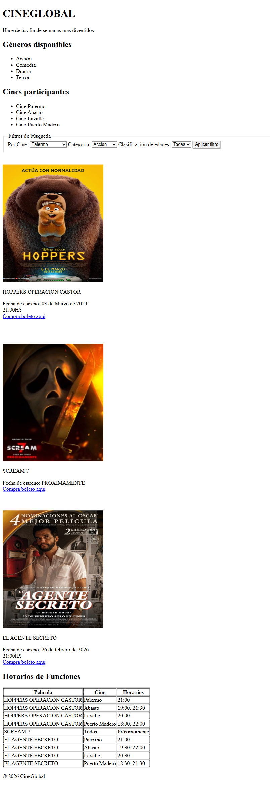
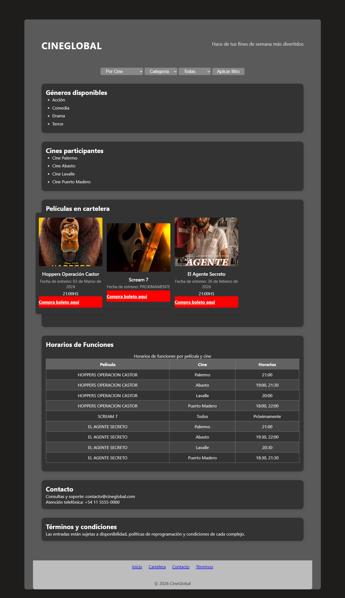

# Test Case 4 — Accesibilidad Web (axe-core)

## Metadata
| Campo | Valor |
|-------|-------|
| Responsable | Marc Holste |
| Fecha Momento 1 (rama dev-frontend-css) | 12/04/2026 |
| Fecha Momento 1 (rama responsive-design) | 12/04/2026 |
| Fecha Momento 2 | |
| Rama Momento 1.1 | `feature/dev-frontend-css-add-styles` |
| Rama Momento 1.2 | `feature/responsive-design-add-responsive-styles` |
| Rama Momento 2 | `develop` |
| URL testeada | `http://localhost:3000` |

## Objetivo
Detectar violaciones de accesibilidad WCAG 2.1 mediante análisis automatizado
con axe-core, identificando elementos que impidan el acceso a usuarios con discapacidades.

## Herramientas utilizadas
- Playwright MCP (`@playwright/mcp`) con inyección de axe-core
- GitHub Copilot Agent Mode

---

## Prompt para Copilot Agent Mode

Copiá este prompt en Copilot Agent Mode con Playwright MCP activo:

```
Usando Playwright MCP, necesito hacer un análisis de accesibilidad de
http://localhost:3000 usando axe-core.

Ejecutá estos pasos en orden:

1. Navegá a la URL y esperá que cargue completamente
2. Inyectá axe-core desde CDN:
   await page.addScriptTag({
     url: 'https://cdnjs.cloudflare.com/ajax/libs/axe-core/4.7.2/axe.min.js'
   })
3. Ejecutá el análisis completo:
   const results = await page.evaluate(() => axe.run())
4. Tomá una captura de pantalla de la página
5. Reportá TODAS las violaciones encontradas con:
   - ID de la regla violada
   - Descripción del problema
   - Impacto (critical / serious / moderate / minor)
   - Selector del elemento HTML afectado
   - Sugerencia de corrección
6. Reportá también los incomplete (necesitan revisión manual)
7. Generá un resumen: total de violaciones agrupadas por nivel de impacto

Guardá las capturas en docs/04-testing/capturas/tc-4/momento-X/
(reemplazá X por 1 o 2 según el momento de ejecución)
```

---

## MOMENTO 1 — Pre-merge (rama `feature/dev-frontend-css-add-styles`)

### Violaciones encontradas
| # | Regla axe | Impacto | Elemento afectado | Descripción |
|---|-----------|---------|-------------------|-------------|
| 1 | region | moderate | `body > section:nth-child(2)` | El contenido de la sección "Géneros disponibles" no está contenido dentro de landmarks semánticos. Sugerencia: mover esta sección dentro de `main` o asociarla a una región landmark válida. |
| 2 | region | moderate | `section:nth-child(3)` | El contenido de la sección "Cines participantes" no está contenido dentro de landmarks semánticos. Sugerencia: mover esta sección dentro de `main` o asociarla a una región landmark válida. |

### Needs Review (incomplete)
| # | Regla axe | Elemento | Descripción |
|---|-----------|----------|-------------|
| No aplica | - | - | axe-core no reportó hallazgos en `incomplete`. |

### Capturas de pantalla
| Descripción | Captura |
|-------------|---------|
| Estado general de la página |  |

### Resumen por nivel de impacto
| Nivel | Cantidad | Reglas |
|-------|----------|--------|
| 🔴 critical | 0 | - |
| 🟠 serious | 0 | - |
| 🟡 moderate | 1 | region |
| 🔵 minor | 0 | - |
| **Total** | 1 | region |

### Resultado Momento 1
- [ ] ✅ PASS — Sin violaciones
- [x] ⚠️ FAIL CON OBSERVACIONES — Solo violaciones moderate/minor
- [ ] ❌ FAIL — Violaciones critical o serious presentes

---

## MOMENTO 1 — Pre-merge (rama `feature/responsive-design-add-responsive-styles`)

### Violaciones encontradas
| # | Regla axe | Impacto | Elemento afectado | Descripción |
|---|-----------|---------|-------------------|-------------|
| 1 | region | moderate | `body > section:nth-child(2)` | El contenido de la sección "Géneros disponibles" no está contenido dentro de landmarks semánticos. Sugerencia: mover esta sección dentro de `main` o asociarla a una región landmark válida. |
| 2 | region | moderate | `section:nth-child(3)` | El contenido de la sección "Cines participantes" no está contenido dentro de landmarks semánticos. Sugerencia: mover esta sección dentro de `main` o asociarla a una región landmark válida. |

### Needs Review (incomplete)
| # | Regla axe | Elemento | Descripción |
|---|-----------|----------|-------------|
| No aplica | - | - | axe-core no reportó hallazgos en `incomplete`. |

### Capturas de pantalla
| Descripción | Captura |
|-------------|---------|
| Estado general de la página |  |

### Resumen por nivel de impacto
| Nivel | Cantidad | Reglas |
|-------|----------|--------|
| 🔴 critical | 0 | - |
| 🟠 serious | 0 | - |
| 🟡 moderate | 1 | region |
| 🔵 minor | 0 | - |
| **Total** | 1 | region |

### Resultado Momento 1
- [ ] ✅ PASS — Sin violaciones
- [x] ⚠️ FAIL CON OBSERVACIONES — Solo violaciones moderate/minor
- [ ] ❌ FAIL — Violaciones critical o serious presentes

---

## MOMENTO 2 — Post-merge (`develop`)

### Violaciones encontradas
| # | Regla axe | Impacto | Elemento afectado | Descripción |
|---|-----------|---------|-------------------|-------------|
| | | | | |
| | | | | |
| | | | | |

### Needs Review (incomplete)
| # | Regla axe | Elemento | Descripción |
|---|-----------|----------|-------------|
| | | | |

### Capturas de pantalla
| Descripción | Captura |
|-------------|---------|
| Estado general de la página |  |

### Resumen por nivel de impacto
| Nivel | Cantidad | Reglas |
|-------|----------|--------|
| 🔴 critical | | |
| 🟠 serious | | |
| 🟡 moderate | | |
| 🔵 minor | | |
| **Total** | | |

### Resultado Momento 2
- [ ] ✅ PASS — Sin violaciones
- [ ] ⚠️ FAIL CON OBSERVACIONES — Solo violaciones moderate/minor
- [ ] ❌ FAIL — Violaciones critical o serious presentes

---

## Issues creados
| Issue | Momento | Regla axe | Elemento | Impacto | Estado |
|-------|---------|-----------|----------|---------|--------|
| [#36](https://github.com/hmarc953/cineglobal/issues/36) | Momento 1 | region | `body > section:nth-child(2)`, `section:nth-child(3)` | moderate | Abierto |

## Decisiones tomadas
Se consolidan los resultados de ambas ramas (`feature/dev-frontend-css-add-styles` y `feature/responsive-design-add-responsive-styles`) porque en ambas se repite la misma violacion `region` de impacto `moderate`, asociada a contenido fuera de landmarks semanticos. Se mantiene abierto el issue #36 como defecto comun hasta que las secciones afectadas queden dentro de `main` u otra landmark valida. No hubo hallazgos `incomplete` en ninguna ejecucion.

## Conclusión general
**Resultado final:** FAIL CON OBSERVACIONES

La comparativa entre `feature/dev-frontend-css-add-styles` y `feature/responsive-design-add-responsive-styles` no muestra mejoras en accesibilidad para este caso: ambas ramas presentan la misma violacion `region` (moderate) sobre secciones fuera de landmarks. Aunque no hay violaciones `critical` ni `serious`, el defecto impacta navegacion asistiva y mantiene el estado consolidado en FAIL CON OBSERVACIONES hasta su correccion.