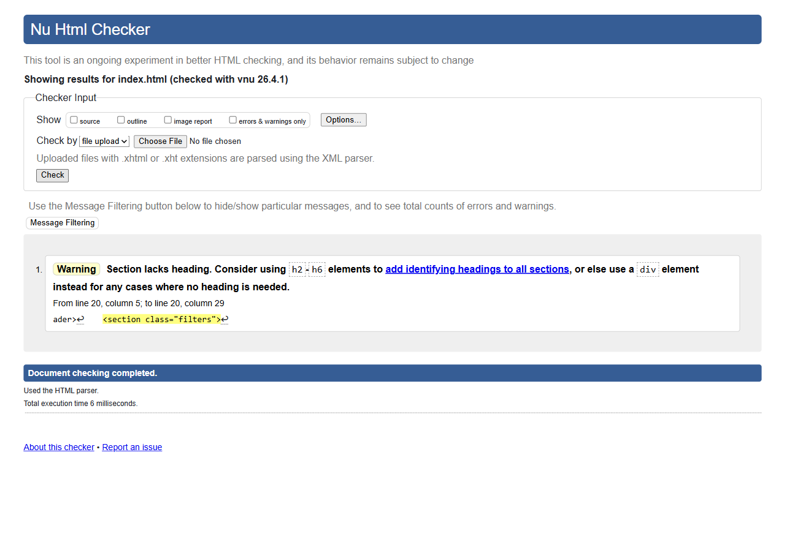
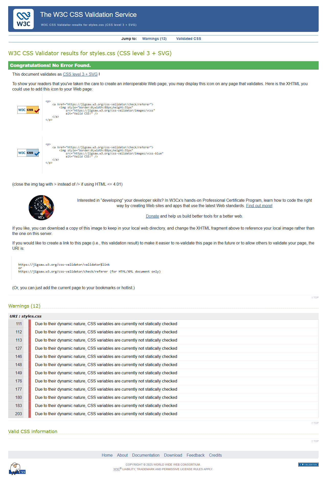
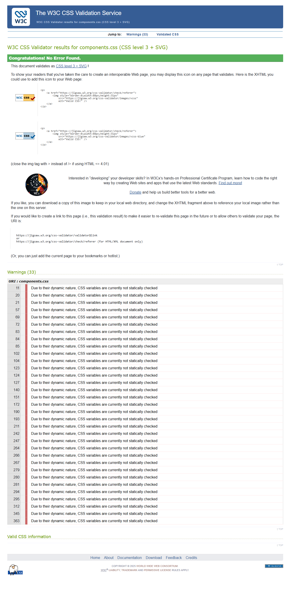
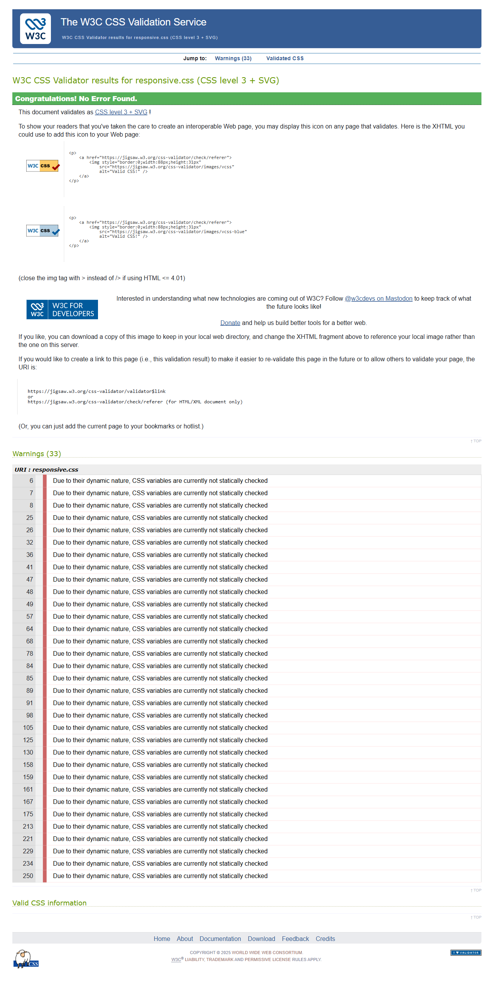

# Test Case 5 — Estructura HTML Semántica y Validación CSS/HTML

## Metadata
| Campo | Valor |
|-------|-------|
| Responsable | Marc Holste |
| Fecha Momento 1 (rama dev-frontend-css) | 12/04/2026 |
| Fecha Momento 1 (rama responsive-design) | 12/04/2026 |
| Fecha Momento 2 | 13/04/2026 |
| Rama Momento 1.1 | `feature/dev-frontend-css-add-styles` |
| Rama Momento 1.2 | `feature/responsive-design-add-responsive-styles` |
| Rama Momento 2 | `develop` |
| URL testeada | `http://localhost:3000` |

## Objetivo
Verificar que la página utilice HTML5 semántico correctamente y que el código
HTML y CSS sea válido según los estándares del W3C.

## Herramientas utilizadas
- Playwright MCP (`@playwright/mcp`) con snapshot de accesibilidad
- W3C HTML Validator API (`validator.w3.org`) vía curl
- W3C CSS Validator API (`jigsaw.w3.org/css-validator`) vía curl
- GitHub Copilot Agent Mode

---

## Prompt para Copilot Agent Mode

Copiá este prompt en Copilot Agent Mode con Playwright MCP activo:

```
Usando Playwright MCP y herramientas disponibles, necesito analizar la
estructura semántica y validar el código de http://localhost:3000

PARTE 1 — Estructura HTML semántica

1. Navegá a http://localhost:3000 con Playwright MCP y tomá un snapshot
   de accesibilidad completo
2. Del snapshot extraé y listá:
   - Todos los headings (h1-h6) con nivel y texto
   - Todos los landmarks (header, nav, main, footer, section, article)
   - Cualquier <div> donde debería ir un elemento semántico
3. Verificá:
   - ¿Hay un solo h1?
   - ¿La jerarquía de headings no tiene saltos (h1→h2→h3)?
   - ¿Todos los campos del formulario tienen <label> asociado?
   - ¿Las tablas tienen <caption>?
4. Tomá captura de pantalla de la página

PARTE 2 — Validación HTML con W3C

Usá este comando para validar el archivo index.html:

cat index.html | curl -s -F 'uploaded_file=@-' -F 'output=json' \
  https://validator.w3.org/check | jq '.'

Reportá:
- Total de errores y warnings
- Por cada error: número de línea, descripción y fragmento de código afectado

PARTE 3 — Validación CSS con W3C

Para cada archivo CSS ejecutá:

cat css/styles.css | curl -s \
  -F 'file=@-;type=text/css' \
  -F 'output=json' \
  'https://jigsaw.w3.org/css-validator/validator' | jq '.'

Repetí para css/components.css y css/responsive.css

Reportá por cada archivo:
- Total de errores y warnings
- Por cada error: número de línea, propiedad afectada y descripción

RESUMEN FINAL

Generá una tabla consolidada con:
- Estado de estructura semántica
- Total errores HTML
- Total errores CSS por archivo
- Lista de issues a crear

Guardá las capturas en docs/04-testing/capturas/tc-5/momento-X/
(reemplazá X por 1 o 2 según el momento de ejecución)
```

---

## MOMENTO 1 — Pre-merge (rama `feature/dev-frontend-css-add-styles`)

### Estructura de headings
| Nivel | Texto | ¿Correcto? | Observación |
|-------|-------|-----------|-------------|
| H1 | CINEGLOBAL | Sí | Hay un único H1 en la página. |
| H2 | Géneros disponibles | Sí | Jerarquía correcta respecto al H1. |
| H2 | Cines participantes | Sí | Jerarquía correcta respecto al H1. |
| H2 | Horarios de Funciones | Sí | Jerarquía correcta respecto al H1. |

### Landmarks detectados
| Landmark | Elemento HTML | ¿Correcto? | Observación |
|----------|---------------|-----------|-------------|
| Header | `<header>` | Sí | Presente y correctamente identificado en snapshot. |
| Nav | `<nav>` | Sí | Presente para filtros de búsqueda. |
| Main | `<main>` | Sí | Contiene contenido principal de cartelera y horarios. |
| Footer | `<footer>` | Sí | Presente con texto de copyright. |
| Section | `<section>` (4 instancias) | Parcial | Una sección interna no tiene heading (warning W3C). |
| Article | `<article>` (3 instancias) | Parcial | Los artículos no incluyen heading semántico propio (warning W3C). |
| Div no semántico relevante | `<div class="GALERIA-IMAGENES">` | Parcial | Contiene bloque de contenido que podría modelarse con `section` o `figure` según intención semántica. |

### Verificaciones semánticas
| Verificación | Estado | Detalle |
|--------------|--------|---------|
| Un solo H1 | ✅ OK | Se detectó exactamente 1 H1. |
| Jerarquía de headings sin saltos | ✅ OK | Secuencia observada: H1 → H2 → H2 → H2. |
| Secciones con elementos semánticos | ⚠️ Observación | Existen secciones y artículos con warnings semánticos en W3C (faltan headings en algunos bloques). |
| Campos de formulario con label | ✅ OK | Los 3 `select` detectados tienen label asociado. |
| Tabla/s con caption | ❌ No cumple | La tabla detectada no incluye elemento `caption`. |

### Validación W3C HTML
| Tipo | Cantidad | Detalle |
|------|----------|---------|
| Errores | 0 | El documento valida sin errores fatales. |
| Warnings | 5 | 3 advertencias por `article` sin heading, 1 por `section` sin heading, 1 por atributo `border` obsoleto en `table`. |

### Validación W3C CSS
| Archivo | Errores | Warnings |
|---------|---------|----------|
| styles.css | 0 | 11 |
| components.css | 0 | 25 |
| responsive.css | N/A | N/A |

### Capturas de pantalla
| Descripción | Captura |
|-------------|---------|
| Snapshot accesibilidad | .png) |
| W3C HTML Validator | .png) |
| W3C CSS — styles.css | .png) |
| W3C CSS — components.css  | .png) |
| W3C CSS — responsive.css | .png) |

### Hallazgos
| # | Tipo | Elemento / Archivo | Descripción | Severidad |
|---|------|--------------------|-------------|-----------|
| 1 | HTML warning | `article` (líneas 79, 94 y 104) | Faltan headings en artículos; agregar `h2`/`h3` dentro de cada `article` para identificación semántica. | Media |
| 2 | HTML warning | `section` (línea 77) | Sección sin heading; agregar título semántico o convertir a `div` si no representa una sección temática. | Media |
| 3 | HTML warning | `table` (línea 118) | Uso de atributo `border` obsoleto en HTML; mover estilo de borde a CSS. | Baja |
| 4 | Semántica | `table` principal | Tabla sin `caption`; incorporar `caption` descriptivo para accesibilidad y contexto. | Media |
| 5 | Estructura de proyecto | `css/responsive.css` | El archivo esperado por el caso de prueba no existe en el repositorio, por lo que no fue validado por W3C. | Baja |

### Resultado Momento 1
- [ ] ✅ PASS — Sin hallazgos
- [x] ⚠️ FAIL CON OBSERVACIONES
- [ ] ❌ FAIL

---

## MOMENTO 1 — Pre-merge (rama `feature/responsive-design-add-responsive-styles`)

### Estructura de headings
| Nivel | Texto | ¿Correcto? | Observación |
|-------|-------|-----------|-------------|
| H1 | CINEGLOBAL | Sí | Hay un único H1 en la página. |
| H2 | Géneros disponibles | Sí | Jerarquía correcta respecto al H1. |
| H2 | Cines participantes | Sí | Jerarquía correcta respecto al H1. |
| H2 | Horarios de Funciones | Sí | Jerarquía correcta respecto al H1. |

### Landmarks detectados
| Landmark | Elemento HTML | ¿Correcto? | Observación |
|----------|---------------|-----------|-------------|
| Header | `<header>` (1) | Sí | Presente y correctamente identificado. |
| Nav | `<nav>` (1) | Sí | Presente para filtros de búsqueda. |
| Main | `<main>` (1) | Sí | Contiene el contenido principal de cartelera y horarios. |
| Footer | `<footer>` (1) | Sí | Presente con texto de copyright. |
| Section | `<section>` (4) | Parcial | Una sección interna sin heading (warning W3C). |
| Article | `<article>` (3) | Parcial | Los 3 artículos no incluyen heading semántico propio (warning W3C). |
| Div no semántico relevante | `<div class="GALERIA-IMAGENES">` | Parcial | Contiene bloque de contenido que podría modelarse con `section` o `figure` según intención semántica. |

### Verificaciones semánticas
| Verificación | Estado | Detalle |
|--------------|--------|---------|
| Un solo H1 | ✅ OK | Se detectó exactamente 1 H1. |
| Jerarquía de headings sin saltos | ✅ OK | Secuencia observada: H1 → H2 → H2 → H2. |
| Secciones con elementos semánticos | ⚠️ Observación | Se detectaron artículos y una sección sin heading (warnings W3C). |
| Campos de formulario con label | ✅ OK | 3 de 3 campos (`select`) con label asociado. |
| Tabla/s con caption | ❌ No cumple | La tabla detectada no incluye elemento `caption`. |

### Validación W3C HTML
| Tipo | Cantidad | Detalle |
|------|----------|---------|
| Errores | 0 | No se detectaron errores fatales. |
| Warnings | 5 | 3 warnings por `article` sin heading (líneas 79, 94, 104), 1 warning por `section` sin heading (línea 77), 1 warning por `table border` obsoleto (línea 118). |

### Validación W3C CSS
| Archivo | Errores | Warnings |
|---------|---------|----------|
| styles.css | N/A | N/A |
| components.css | N/A | N/A |
| responsive.css | 0 | 33 |

### Capturas de pantalla
| Descripción | Captura |
|-------------|---------|
| Snapshot accesibilidad | .png) |
| W3C HTML Validator | .png) |
| W3C CSS — styles.css | .png) |
| W3C CSS — components.css  | .png) |
| W3C CSS — responsive.css | .png) |

### Hallazgos
| # | Tipo | Elemento / Archivo | Descripción | Severidad |
|---|------|--------------------|-------------|-----------|
| 1 | HTML warning | `article` (líneas 79, 94 y 104) | Faltan headings en artículos; agregar `h2`/`h3` dentro de cada `article` para identificación semántica. | Media |
| 2 | HTML warning | `section` (línea 77) | Sección sin heading; agregar título semántico o convertir a `div` si no representa una sección temática. | Media |
| 3 | HTML warning | `table` (línea 118) | Uso de atributo `border` obsoleto en HTML; mover estilo de borde a CSS. | Baja |
| 4 | Semántica / Accesibilidad | `table` principal | Tabla sin `caption`; incorporar `caption` descriptivo para contexto y accesibilidad. | Media |
| 5 | Estructura CSS | `styles.css` | Archivo solicitado en el caso de prueba no existe en el repositorio. | Baja |
| 6 | Estructura CSS | `components.css` | Archivo solicitado en el caso de prueba no existe en el repositorio. | Baja |
| 7 | CSS warning | `responsive.css` | 33 warnings de tipo `css-variable` (limitación conocida del validador para variables CSS dinámicas). No se detectaron errores. | Baja |

### Resultado Momento 1
- [ ] ✅ PASS — Sin hallazgos
- [x] ⚠️ FAIL CON OBSERVACIONES
- [ ] ❌ FAIL

---

## MOMENTO 2 — Post-merge (`develop`)

### Estructura de headings
| Nivel | Texto | ¿Correcto? | Observación |
|-------|-------|-----------|-------------|
| H1 | CINEGLOBAL | Sí | Único H1 en la página. |
| H2 | Géneros disponibles | Sí | Jerarquía correcta. |
| H2 | Cines participantes | Sí | Jerarquía correcta. |
| H2 | Películas en cartelera | Sí | Jerarquía correcta. |
| H3 | Hoppers Operación Castor | Sí | Subnivel correcto dentro de `<article>`. |
| H3 | Scream 7 | Sí | Subnivel correcto dentro de `<article>`. |
| H3 | El Agente Secreto | Sí | Subnivel correcto dentro de `<article>`. |
| H2 | Horarios de Funciones | Sí | Jerarquía correcta. |
| H2 | Contacto | Sí | Jerarquía correcta. |
| H2 | Términos y condiciones | Sí | Jerarquía correcta. |

### Landmarks detectados
| Landmark | Elemento HTML | ¿Correcto? | Observación |
|----------|---------------|-----------|-------------|
| Header | `<header>` (1) | Sí | Presente y correctamente identificado. |
| Nav | `<nav>` (1) | Sí | Presente para el footer (enlaces de navegación). |
| Main | `<main>` (1) | Sí | Contiene el contenido principal. |
| Footer | `<footer>` (1) | Sí | Presente con links y copyright. |
| Section | `<section>` (7) | Parcial | Una sección sin heading en L20 (warning W3C). |
| Article | `<article>` (3) | Sí | Cada artículo tiene H3 en `develop` — mejora vs. Momento 1. |
| Div | `<div>` (2) | Sí | Solo 2 divs, uso apropiado como contenedores de layout. |

### Verificaciones semánticas
| Verificación | Estado | Detalle |
|--------------|--------|---------|
| Un solo H1 | ✅ OK | Se detectó exactamente 1 H1: "CINEGLOBAL". |
| Jerarquía de headings sin saltos | ✅ OK | Secuencia: H1 → H2 → H2 → H2 → H3 → H3 → H3 → H2 → H2 → H2. Sin saltos. |
| Secciones con elementos semánticos | ⚠️ Observación | 1 sección sin heading (barra de filtros en L20). |
| Campos de formulario con label | ❌ No cumple | Los 3 `<select>` (`#cine`, `#cat`, `#clasificacion`) no tienen `<label>` ni `aria-label`. |
| Tabla/s con caption | ✅ OK | La tabla tiene `<caption>`: "Horarios de funciones por película y cine". |

### Validación W3C HTML
| Tipo | Cantidad | Detalle |
|------|----------|---------|
| Errores | 0 | El documento valida sin errores. |
| Warnings | 1 | L20: `<section>` sin heading (barra de filtros). |

### Validación W3C CSS
| Archivo | Errores | Warnings |
|---------|---------|----------|
| styles.css | 0 | 12 |
| components.css | 0 | 33 |
| responsive.css | 0 | 33 |

### Capturas de pantalla
| Descripción | Captura |
|-------------|---------|
| Snapshot accesibilidad |  |
| W3C HTML Validator |  |
| W3C CSS — styles.css |  |
| W3C CSS — components.css |  |
| W3C CSS — responsive.css |  |

### Hallazgos
| # | Tipo | Elemento / Archivo | Descripción | Severidad |
|---|------|--------------------|-------------|-----------|
| 1 | Semántica / Accesibilidad | `#cine`, `#cat`, `#clasificacion` | Los 3 `<select>` no tienen `<label>` asociado ni `aria-label`. Corroborado por axe-core (regla `select-name`, critical). | Alta |
| 2 | HTML warning | `<section>` L20 (barra de filtros) | Sección sin heading. Agregar heading oculto o reemplazar por `<div>` si no es una sección temática. | Baja |
| 3 | CSS warnings | styles.css (12), components.css (33), responsive.css (33) | Todos los warnings son de tipo `css-variable` (— limitación conocida del validador W3C con variables CSS dinámicas). Sin errores reales. | Informativa |

### Resultado Momento 2
- [ ] ✅ PASS — Sin hallazgos
- [x] ⚠️ FAIL CON OBSERVACIONES
- [ ] ❌ FAIL

---

## Issues creados
| Issue | Momento | Tipo | Elemento / Archivo | Severidad | Estado |
|-------|---------|------|--------------------|-----------|--------|
| [#37](https://github.com/hmarc953/cineglobal/issues/37) | Momento 1 | HTML semántico | `article` sin heading (líneas 79, 94, 104) | Media | Abierto |
| [#38](https://github.com/hmarc953/cineglobal/issues/38) | Momento 1 | HTML semántico | `section` sin heading (línea 77) | Media | Abierto |
| [#39](https://github.com/hmarc953/cineglobal/issues/39) | Momento 1 | Estándar HTML | `table border="1"` obsoleto (línea 118) | Baja | Abierto |
| [#40](https://github.com/hmarc953/cineglobal/issues/40) | Momento 1 | Accesibilidad semántica | Tabla sin `caption` | Media | Abierto |
| [#41](https://github.com/hmarc953/cineglobal/issues/41) | Momento 1 | Estructura CSS | Falta `responsive.css` para validar | Baja | Abierto |
| [#42](https://github.com/hmarc953/cineglobal/issues/42) | Momento 1 | Estructura CSS | Falta `components.css` para validar | Baja | Abierto |
| [#43](https://github.com/hmarc953/cineglobal/issues/43) | Momento 1 | Estructura CSS | Falta `styles.css` para validar | Baja | Abierto |
| [#48](https://github.com/hmarc953/cineglobal/issues/48) | Momento 2 | Semántica / Accesibilidad | `#cine`, `#cat`, `#clasificacion` sin `<label>` | Alta | Abierto |
| [#51](https://github.com/hmarc953/cineglobal/issues/51) | Momento 2 | HTML semántico | `<section class="filters">` sin heading (línea 20) | Baja | Abierto |

## Decisiones tomadas
Se consolidan los hallazgos de ambas ramas: en `feature/dev-frontend-css-add-styles` y en `feature/responsive-design-add-responsive-styles` persisten los warnings semanticos HTML (articles/section sin heading, atributo `table border` obsoleto y tabla sin `caption`), por lo que se mantienen como bugs de accesibilidad y estructura. En CSS hay diferencias de estructura entre ramas (`css/responsive.css` faltante en una rama, y `styles.css`/`components.css` faltantes en la otra), por lo que esos puntos se documentan como issues de alcance/organizacion y no como errores de renderizado; ademas, los warnings de `css-variable` se consideran limitacion conocida del validador.

## Conclusión general
**Resultado final:** FAIL CON OBSERVACIONES

La comparativa entre `feature/dev-frontend-css-add-styles` y `feature/responsive-design-add-responsive-styles` confirma que la base semantica general es utilizable, pero ambas ramas comparten observaciones relevantes de HTML/accesibilidad: articles y section sin heading, uso de atributo obsoleto en table y falta de `caption`. En CSS no se observan errores fatales en archivos existentes, aunque la cobertura de validacion difiere por estructura de archivos entre ramas (faltantes distintos en cada una). Por la persistencia de hallazgos semanticos en ambas variantes, el cierre consolidado del caso permanece en FAIL CON OBSERVACIONES.

En Momento 2 (rama `develop`), la estructura semántica mejoró respecto a Momento 1: los `<article>` ahora tienen H3, la tabla tiene `<caption>`, y la jerarquía de headings es correcta sin saltos. Sin embargo, persiste el hallazgo crítico de los 3 `<select>` sin `<label>` (confirmado también por axe-core como `select-name` critical), y una sección sin heading en la barra de filtros. HTML y CSS validan sin errores formales; los warnings CSS son limitaciones del validador con variables CSS. Se requiere correción de los `<label>` antes del merge a producción.