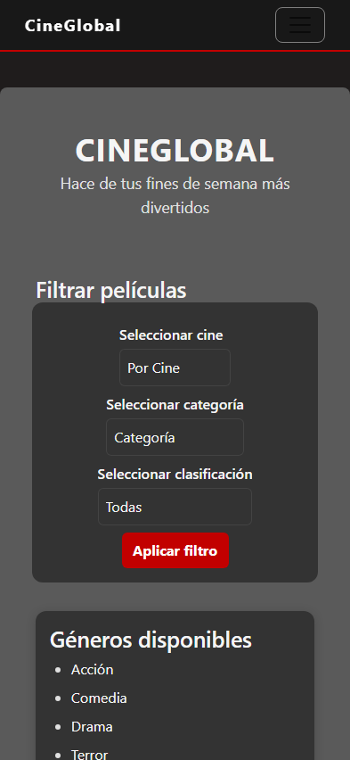
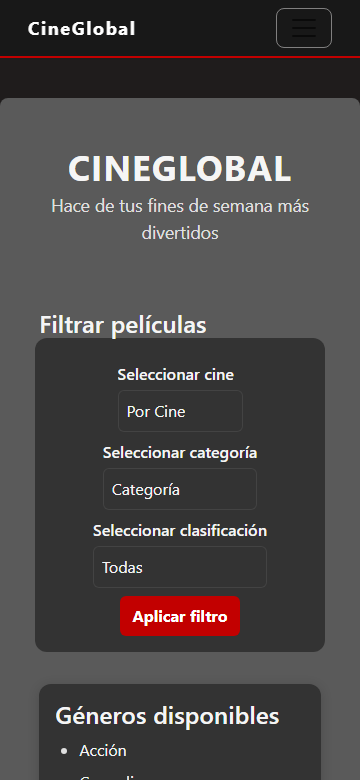
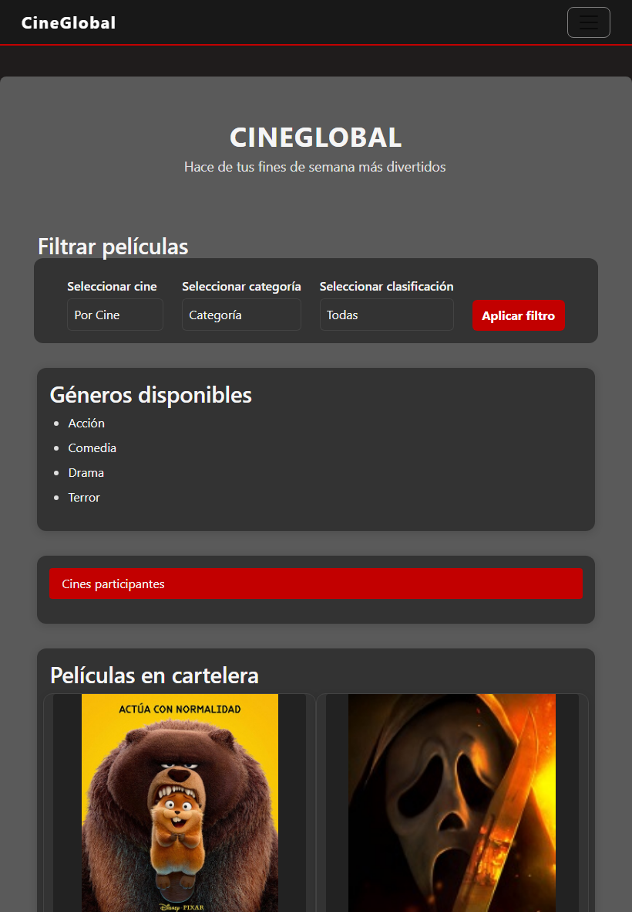
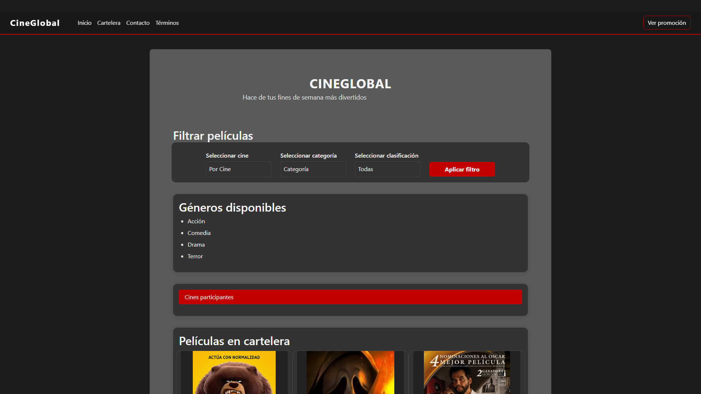

# Test Case 6 — Migración a Bootstrap 5 y Layout Responsive

## Metadata
| Campo | Valor |
|-------|-------|
| Responsable | Marc Holste |
| Fecha | 22/04/2026 |
| URL testeada | `http://localhost:3000` |

## 8. Casos / escenarios de prueba

| TC-ID | Descripción | Precondición | Pasos | Resultado esperado | Resultado actual | Estado | Herramienta |
|---|---|---|---|---|---|---|---|
| TC-06.1 | Verificar adaptación del layout en pantalla pequeña (iPhone 14 Pro). | Proyecto ejecutándose en local. | 1. `playwright_navigate('http://localhost:3000')`   2. `playwright_set_viewport(393, 852)`   3. `playwright_screenshot('capturas/tc-6/iphone-14-pro.png')` | Filtros apilados, cartelera en una columna, sin scroll horizontal. | ✅ Correcto. La distribución en una sola columna permite una lectura clara de las tarjetas. | ✅ PASS | Playwright MCP |
| TC-06.2 | Validar comportamiento responsive en móvil (Samsung Galaxy S23). | Proyecto ejecutándose en local. | 1. `playwright_navigate('http://localhost:3000')`   2. `playwright_set_viewport(360, 780)`   3. `playwright_screenshot('capturas/tc-6/samsung-galaxy-s23.png')` | Filtros correctamente apilados y tarjetas visibles sin cortes laterales. | ✅ Correcto. La cartelera mantiene la estructura responsive prevista. | ✅ PASS | Playwright MCP |
| TC-06.3 | Verificar redistribución de cartelera en breakpoint intermedio (iPad Air). | Proyecto ejecutándose en `http://localhost:3000` con Bootstrap cargado y estilos en orden. | 1. `playwright_navigate('http://localhost:3000')`   2. `playwright_set_viewport(820, 1180)`   3. `playwright_screenshot('capturas/tc-6/ipad-air.png')` | - Cartelera en dos columnas (`col-md-6`).   - Filtros alineados y visibles.   - Tabla correctamente contenida.   - Separación visual correcta mediante `g-*`.   - Layout equilibrado respecto al mockup. | ✅ Correcto. La visualización en tablet resulta estable y coherente. La cartelera se organiza correctamente en dos columnas. | ✅ PASS | Playwright MCP |
| TC-06.4 | Comprobar estructura de escritorio tras migración a Bootstrap. | Proyecto ejecutándose en `http://localhost:3000` con Bootstrap cargado y estilos en orden. | 1. `playwright_navigate('http://localhost:3000')`   2. `playwright_set_viewport(1920, 1080)`   3. `playwright_screenshot('capturas/tc-6/desktop.png')` | - Cartelera en tres columnas (`col-lg-4`).   - Layout centrado y equilibrado.   - Tabla sin overflow.   - Correcta convivencia entre Bootstrap y estilos propios.   - Consistencia visual general. | ✅ Correcto. La versión desktop mantiene la estética del proyecto y aprovecha correctamente el sistema de columnas. | ✅ PASS | Playwright MCP |

## 9. Pasos de ejecución

1.  Abrir VS Code sobre la carpeta del proyecto.
2.  Levantar el entorno local del sitio en `http://localhost:3000`.
3.  Abrir GitHub Copilot Chat en modo Agent.
4.  Ejecutar el prompt definido para Playwright MCP (ver sección 6).
5.  **Documentar las tool calls de Playwright MCP y sus outputs.**
    *   `playwright_navigate('http://localhost:3000')`
    *   `playwright_set_viewport(W, H)`
    *   `playwright_screenshot('docs/04-testing/capturas/tc-6/nombre.png')`
6.  **Revisar las capturas de pantalla generadas en `docs/04-testing/capturas/tc-6/`**.
7.  Verificar filtros, cartelera, tabla y scroll horizontal según las validaciones esperadas de cada caso de prueba.
8.  Documentar resultados y hallazgos en la tabla de escenarios de prueba.
9.  Registrar issues en GitHub en caso de detectar errores relevantes.

---

## 10. Criterios de validación

Se considera correcta la migración si el layout responde a breakpoints, no hay scroll horizontal innecesario y se mantiene la identidad visual de CineGlobal tras integrar Bootstrap 5.

---

## 11. Resultados generales

| Componente | Estado | Observación |
|---|---|---|
| Filtros | ✅ OK | Se adaptan sin desbordes |
| Cartelera | ✅ OK | Distribución correcta (Bootstrap Grid) |
| Tabla | ✅ OK | Encapsulada en `.table-responsive` |
| General | ✅ OK | Sin overflow horizontal detectado |

---

## 12. Hallazgos detectados

No se detectaron errores críticos. La migración a `row` y `col-*` mejora la estabilidad responsive del sitio.

---

## 13. Issues generadas

No se generaron issues.

---

## 14. Ajustes realizados a partir de la validación

Se eliminaron reglas de layout antiguas para evitar conflictos con el Grid de Bootstrap 5.

---

## 15. Evidencia de prueba

**Tool Calls ejecutadas y Outputs:**
- `playwright_navigate("http://localhost:3000")` -> Output: `Navigated to http://localhost:3000`
- `playwright_set_viewport(393, 852)` -> Output: `Viewport set to 393x852`
- `playwright_screenshot("capturas/tc-6/iphone-14-pro.png")` -> Output: `Screenshot saved to docs/04-testing/capturas/tc-6/iphone-14-pro.png`
- `playwright_set_viewport(360, 780)` -> Output: `Viewport set to 360x780`
- `playwright_screenshot("capturas/tc-6/samsung-galaxy-s23.png")` -> Output: `Screenshot saved to docs/04-testing/capturas/tc-6/samsung-galaxy-s23.png`
- `playwright_set_viewport(820, 1180)` -> Output: `Viewport set to 820x1180`
- `playwright_screenshot("capturas/tc-6/ipad-air.png")` -> Output: `Screenshot saved to docs/04-testing/capturas/tc-6/ipad-air.png`
- `playwright_set_viewport(1920, 1080)` -> Output: `Viewport set to 1920x1080`
- `playwright_screenshot("capturas/tc-6/desktop.png")` -> Output: `Screenshot saved to docs/04-testing/capturas/tc-6/desktop.png`

**Evidencia visual:**
Las capturas reales generadas mediante la herramienta se encuentran en el directorio `docs/04-testing/capturas/tc-6/`, confirmando la correcta adaptación del layout Bootstrap 5 en todos los breakpoints.
### Evidencia visual (Capturas reales)

| Dispositivo | Captura de Pantalla |
|-------------|---------------------|
| **iPhone 14 Pro** |  |
| **Samsung Galaxy S23** |  |
| **iPad Air** |  |
| **Desktop** |  |

---
## 17. Conclusión
La migración a Bootstrap 5 es exitosa y cumple con los requerimientos de responsividad en todos los dispositivos evaluados.
