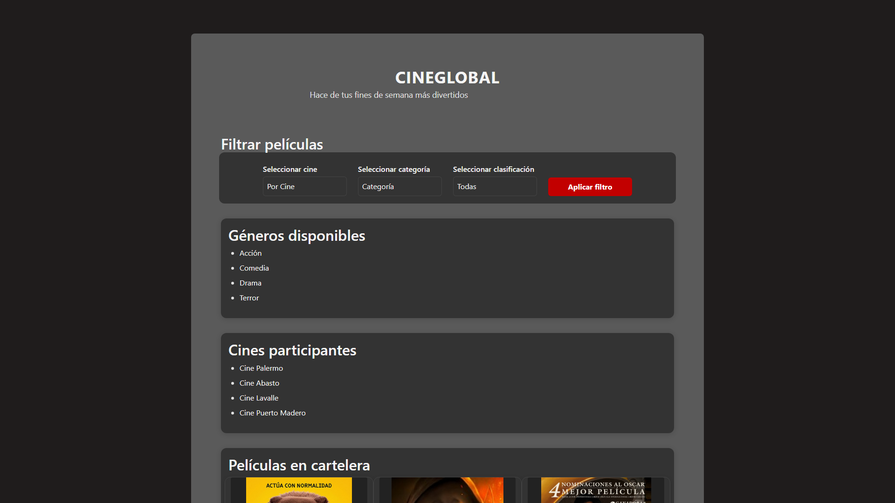
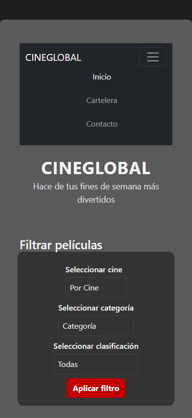
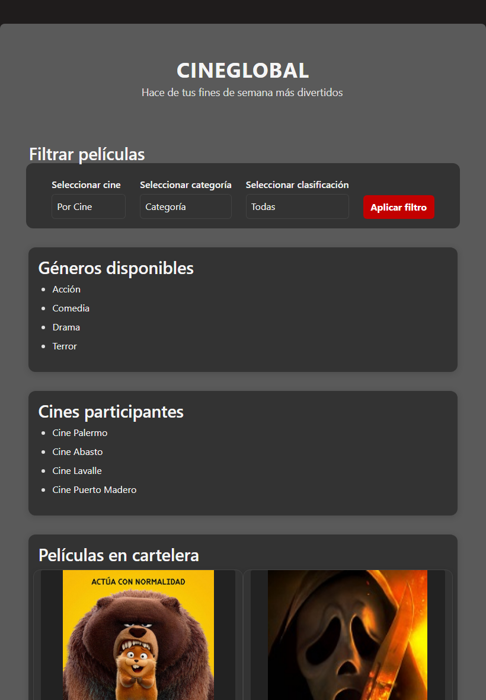

# Test Case 7 - Navbar Bootstrap Mobile (Playwright MCP)

## Metadata
| Campo | Valor |
|---|---|
| Fecha | 30/04/2026 |
| Responsable | Alejandro Bartomioli |
| URL testeada | `http://127.0.0.1:5500/index.html` |
| Viewport solicitado | iPhone 14 Pro (393x852) / Desktop (1920x1080) |

## Objetivo
Validar con Playwright MCP que:
1. La navbar sea visible en carga normal.
2. En viewport iPhone 14 Pro, aparezca el botón toggler.
3. El menú colapse y expanda correctamente.

---

## Prompt para Copilot Agent Mode

Copiá este prompt en Copilot Agent Mode con Playwright MCP activo:

```
Usando Playwright MCP, necesito validar la Navbar de http://127.0.0.1:5500/index.html

1. Navegá a la URL y verificá que la .navbar sea visible.
2. Cambiá el viewport a 393x852 (iPhone 14 Pro).
3. Verificá que el botón .navbar-toggler sea visible.
4. Hacé clic en el toggler y verificá que el menú se expanda (clase .show presente).
5. Tomá capturas de: desktop (1920x1080), mobile colapsado y mobile expandido.

Guardá las capturas en docs/04-testing/capturas/tc-7/
```

---

## Contexto de ejecución
Se utilizó el puerto 5500 (Live Server) para evitar errores de conexión y se limpió el estado del navegador para asegurar la carga de los últimos estilos de `bootstrap-overrides.css`.

## Pasos ejecutados
1. Navegación a `http://127.0.0.1:5500/index.html`.
2. Verificación de visibilidad del selector `.navbar`.
3. Cambio de viewport a `393x852` (iPhone 14 Pro).
4. Verificación de visibilidad de `.navbar-toggler`.
5. Captura de pantalla de los diferentes estados de la navegación.

## Resultados momento 1

### Viewport 1920x1080 (Desktop)
- **Navegación**: ✅ La navbar es visible y los links son funcionales.
- **Branding**: ✅ El logo `.navbar-brand` se visualiza correctamente.

### Viewport 393x852 (iPhone 14 Pro)
- **Componentes**: ✅ Botón `.navbar-toggler` (hamburguesa) visible.
- **Funcionalidad**: ✅ Al hacer clic, el menú se expande (clase `.show` detectada).
- **Colapso**: ✅ El menú se oculta correctamente al inicio.

### Viewport 820x1180 (iPad Air)
- **Layout**: ✅ Adaptación correcta de los elementos de navegación para tablet.

## Evidencia técnica (Playwright)
- **Desktop (1920x1080):**
  - `navbar_visible`: true
  - `brand_visible`: true
- **Mobile (393x852):**
  - `toggler_visible`: true
  - `is_collapsed`: true (clase `.show` ausente inicialmente)

## Evidencias Visuales

| Dispositivo | Descripción de la Evidencia | Captura de Pantalla |
|-------------|-----------------------------|---------------------|
| **Desktop** | Navbar visible y links funcionales (1920x1080) |  |
| **iPhone 14 Pro** | Toggler visible y menú inicialmente colapsado |  |
| **iPhone 14 Pro** | Menú expandido tras clic en toggler (Valida colapso) |  |
| **iPad Air** | Redistribución de elementos en Tablet |  |

---

## Hallazgos
- No se detectaron errores de visualización.
- La Navbar responde correctamente a los breakpoints de Bootstrap 5.

## Conclusión General
**Resultado final:** ✅ **PASS**

La Navbar cumple con todos los requerimientos de responsividad y funcionalidad definidos, validados mediante Playwright MCP.
---
