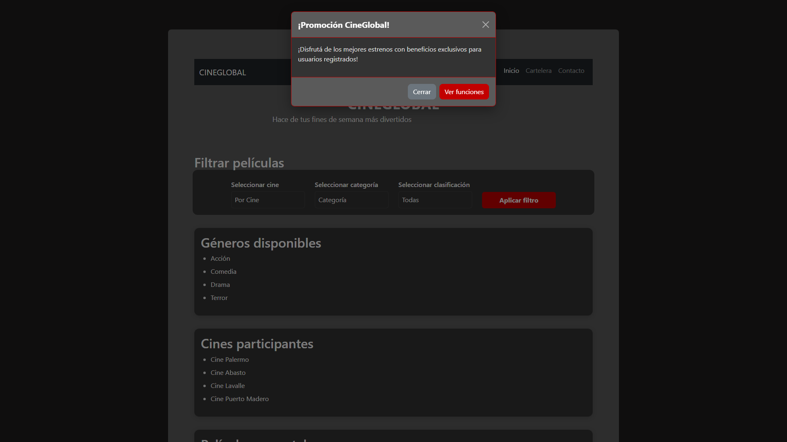
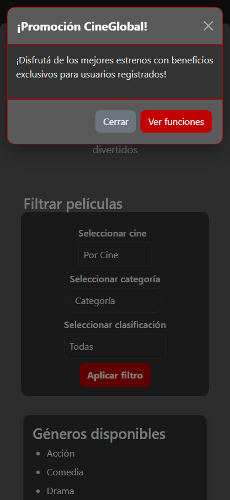
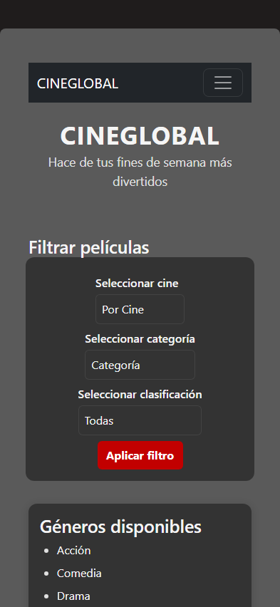

# Test Case 8 - Modal Bootstrap Desktop + Mobile (Playwright MCP)

## Metadata
| Campo | Valor |
|---|---|
| Fecha | 30/04/2026 |
| Responsable | Alejandro Bartomioli |
| URL testeada | `http://127.0.0.1:5500/index.html` |

## Objetivo
1. Validar que el botón disparador del modal sea funcional.
2. El modal `#promoModal` se despliegue correctamente sobre la interfaz.
3. El botón de cierre (`data-bs-dismiss="modal"`) oculte el elemento.
4. La visualización sea responsiva en dispositivos móviles.

## Contexto de ejecución
Se utilizó el puerto 5500 (Live Server) para la validación final. Se verificó la consistencia visual del modal tras la implementación de los estilos en `bootstrap-overrides.css`.

## Evidencia de prueba (Tool Calls)
- `playwright_navigate("http://127.0.0.1:5500/index.html")` -> Output: `Navigated`
- `playwright_set_viewport(1920, 1080)` -> Output: `Viewport set`
- `playwright_click("[data-bs-target='#promoModal']")` -> Output: `Clicked`
- `playwright_screenshot("docs/04-testing/capturas/tc-8/desktop-modal-open.png")` -> Output: `Saved`
- `playwright_set_viewport(393, 852)` -> Output: `Viewport set (iPhone 14 Pro)`
- `playwright_screenshot("docs/04-testing/capturas/tc-8/mobile-modal-open.png")` -> Output: `Saved`
- `playwright_click("[data-bs-dismiss='modal']")` -> Output: `Clicked`
- `playwright_screenshot("docs/04-testing/capturas/tc-8/mobile-modal-closed.png")` -> Output: `Saved`

## Resultados
| Verificación | Desktop (1920x1080) | Mobile (393x852) |
|---|---|---|
| Trigger visible en DOM | PASS | PASS |
| Apertura de modal | PASS | PASS |
| Cierre de modal | PASS | PASS |
| Ajuste de ancho responsivo | PASS | PASS |

## Evidencias Visuales

| Dispositivo | Descripción de la Evidencia | Captura de Pantalla |
|-------------|-----------------------------|---------------------|
| **Desktop** | Modal abierto (1920x1080) |  |
| **iPhone 14 Pro** | Modal abierto y centrado (393x852) |  |
| **iPhone 14 Pro** | Interfaz limpia tras cierre (393x852) |  |

## Conclusión
Resultado general: **PASS**. El componente Modal cumple con los estándares de usabilidad y responsividad requeridos.