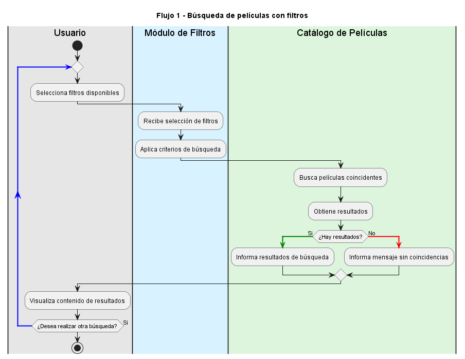
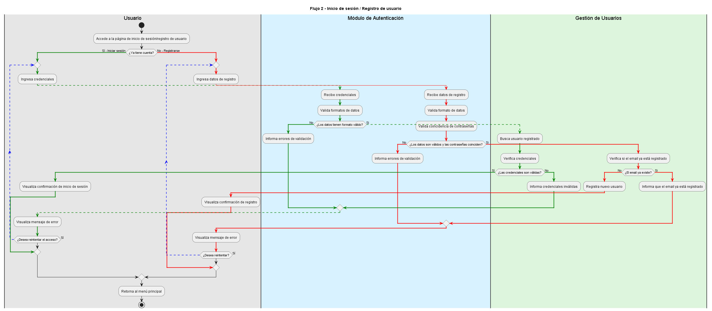
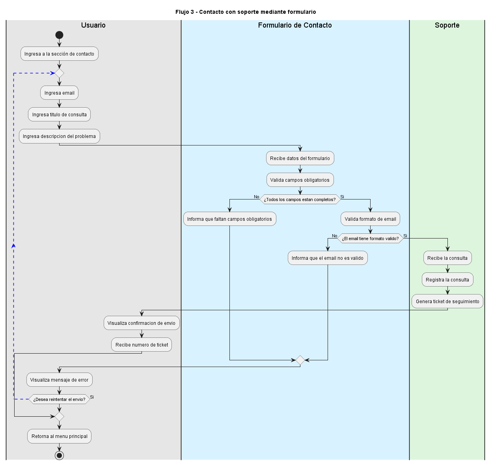
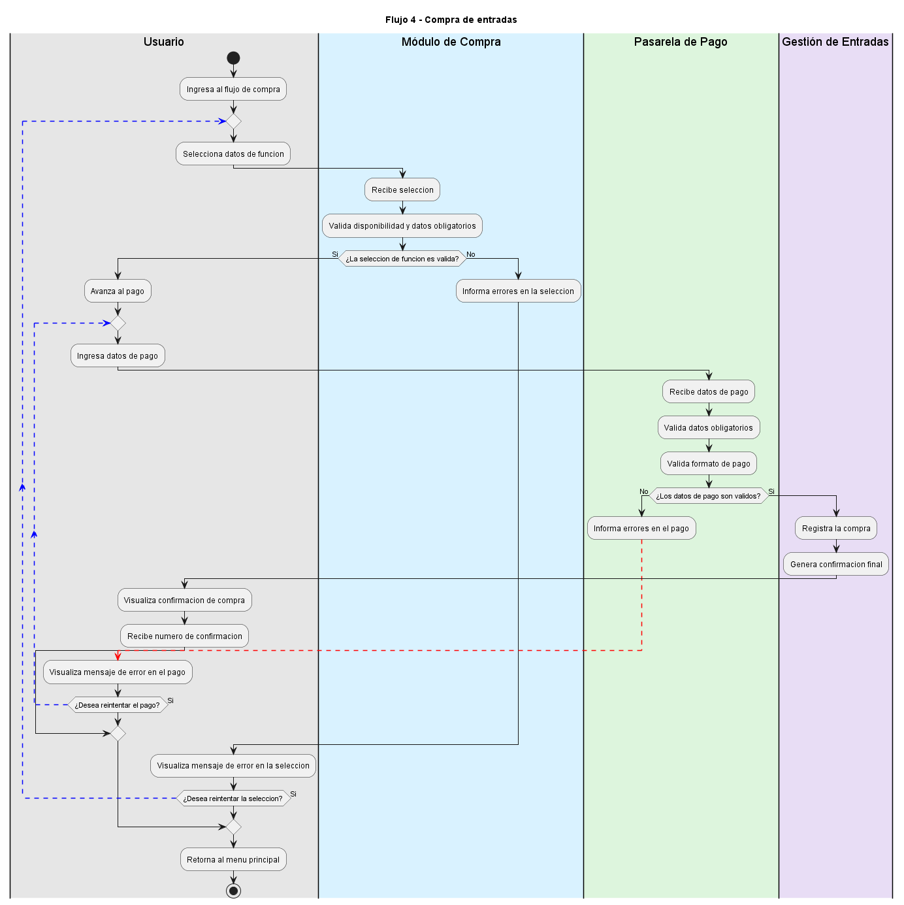

# Diagramas de Actividades - CineGlobal

Documentación completa de los cuatro flujos principales del sistema CineGlobal, modelados mediante diagramas de actividades en PlantUML.

## Índice

1. [Flujo 1: Búsqueda de películas con filtros](#flujo-1-búsqueda-de-películas-con-filtros)
2. [Flujo 2: Inicio de sesión / Registro de usuario](#flujo-2-inicio-de-sesión--registro-de-usuario)
3. [Flujo 3: Contacto con soporte mediante formulario](#flujo-3-contacto-con-soporte-mediante-formulario)
4. [Flujo 4: Compra de entradas](#flujo-4-compra-de-entradas)
5. [Instrucciones para editar diagramas](#instrucciones-para-editar-diagramas)

---

## Flujo 1: Búsqueda de películas con filtros

### Descripción

Este flujo implementa el proceso de búsqueda de películas con un ciclo iterativo que permite al usuario refinar sus búsquedas hasta encontrar el contenido deseado.


### Archivo editable

**PlantUML:** [actividad-flujo-1-busqueda-peliculas.puml](./actividad-flujo-1-busqueda-peliculas.puml)

### Diagrama



---

## Flujo 2: Inicio de sesión / Registro de usuario

### Descripción

Este flujo proporciona dos caminos distintos: acceso de usuarios existentes e incorporación de nuevos usuarios. El diagrama utiliza líneas de color verde para el flujo de login y rojo para el flujo de registro, facilitando la visualización de ambos caminos.

### Archivo editable

**PlantUML:** [actividad-flujo-2-login-registro.puml](./actividad-flujo-2-login-registro.puml)

### Diagrama



---

## Flujo 3: Contacto con soporte mediante formulario

### Descripción

Este flujo implementa un proceso de contacto con soporte mediante validaciones en cascada, asegurando que se envíen consultas completas y con datos válidos.

### Archivo editable

**PlantUML:** [actividad-flujo-3-contacto-soporte.puml](./actividad-flujo-3-contacto-soporte.puml)

### Diagrama



---

## Flujo 4: Compra de entradas

### Descripción

Este es el flujo más complejo del sistema, dividido en dos fases principales: selección de función y procesamiento de pago. Implementa múltiples validaciones y ciclos de reintento para asegurar una compra exitosa.

### Archivo editable

**PlantUML:** [actividad-flujo-4-compra-entradas.puml](./actividad-flujo-4-compra-entradas.puml)

### Diagrama



---

## Instrucciones para editar diagramas

### Opción 1: PlantUML Editor en línea (Recomendado para visualización rápida)

#### Pasos:

1. Abre [plantumleditor.com](https://www.plantumleditor.com/) en tu navegador.
2. Copia el contenido del archivo `.puml` que deseas editar.
3. Pega el código en el panel izquierdo del editor.
4. El diagrama se renderizará automáticamente en el panel derecho.
5. Realiza los cambios necesarios en el código PlantUML.
6. Guarda o exporta tu diagrama:
   - **PNG:** Usa el botón "Export" → "PNG"
   - **SVG:** Usa el botón "Export" → "SVG"
   - **Clipboard:** Copia directamente el código actualizado

#### Ventajas:
- No requiere instalación
- Visualización en tiempo real
- Exportación directa a múltiples formatos

---

### Opción 2: Extensión de VSCode PlantUML

#### Instalación:

1. Abre VSCode.
2. Ve a **Extensiones** (Ctrl+Shift+X / Cmd+Shift+X).
3. Busca **"PlantUML"** (por jgraph o equivalente).
4. Instala la extensión más popular.

#### Uso:

1. Abre el archivo `.puml` en VSCode.
2. Presiona **Ctrl+Shift+P** (o Cmd+Shift+P en Mac) para abrir la paleta de comandos.
3. Escribe **"PlantUML: Preview Current Diagram"** y presiona Enter.
4. Se abrirá una ventana de vista previa con el diagrama.
5. Edita el código directamente en el editor y el preview se actualizará automáticamente.

#### Exportación desde VSCode:

1. Con el archivo `.puml` abierto, presiona **Ctrl+Shift+P**.
2. Escribe **"PlantUML: Export Current Diagram"** y presiona Enter.
3. Selecciona el formato deseado (PNG, SVG, etc.).
4. Elige la ubicación para guardar el archivo.

#### Ventajas:
- Integración nativa en VSCode
- Sin salir del editor
- Control de versiones con Git

---

### Convenciones PlantUML para estos diagramas

#### Estructura general:

```plantuml
@startuml
title Nombre del Diagrama

start

|Swimlane 1|
:Actividad;

|Swimlane 2|
if (Decisión?) then (Sí)
  :Actividad si true;
else (No)
  :Actividad si false;
endif

repeat
  :Actividad que se repite;
repeat while (¿Condición?) is (Sí)

stop
@enduml
```

#### Elementos clave:

- **`start` / `stop`:** Inicio y fin del diagrama
- **`|Nombre|`:** Define un swimlane (carril)
- **`:Actividad;`:** Representa una actividad
- **`if/then/else`:** Decisión condicional
- **`repeat/repeat while`:** Ciclo controlado

#### Reglas de formato:

1. Las actividades deben ser breves y claras
2. Evita actividades redundantes o excesivamente detalladas
3. Mantén la lógica de flujo legible
4. Usa swimlanes para separar responsabilidades

---

### Generación de imágenes PNG para documentación

#### Paso 1: Generar PNG desde PlantUML

```bash
# Desde línea de comandos (opción 3)
plantuml -o ./docs/05-diagramas/01-diagrama-de-actividades/ *.puml
```

#### Paso 2: Verificar nombres de archivos

Los archivos PNG se generarán automáticamente con el mismo nombre que los `.puml`:
- `actividad-flujo-1-busqueda-peliculas.puml` → `actividad-flujo-1-busqueda-peliculas.png`
- `actividad-flujo-2-login-registro.puml` → `actividad-flujo-2-login-registro.png`
- `actividad-flujo-3-contacto-soporte.puml` → `actividad-flujo-3-contacto-soporte.png`
- `actividad-flujo-4-compra-entradas.puml` → `actividad-flujo-4-compra-entradas.png`

#### Paso 3: Verificar en el repositorio

Asegúrate de que los archivos PNG estén en el mismo directorio que los `.puml` para que los enlaces en este documento funcionen correctamente.

---

### Referencias

- **PlantUML Official:** https://plantuml.com/
- **PlantUML Activity Diagram:** https://plantuml.com/activity-diagram-beta
- **PlantUML Editor Online:** https://www.plantumleditor.com/

---

**Última actualización:** Mayo 2026  
**Proyecto:** CineGlobal - Actividad Obligatoria 3 (A3)
