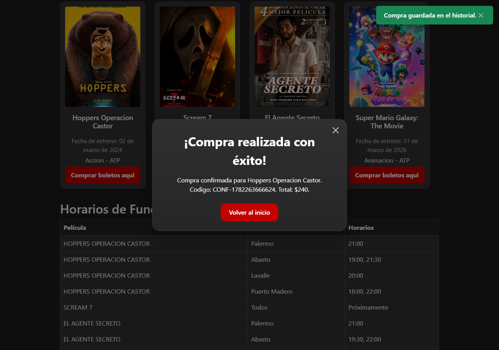
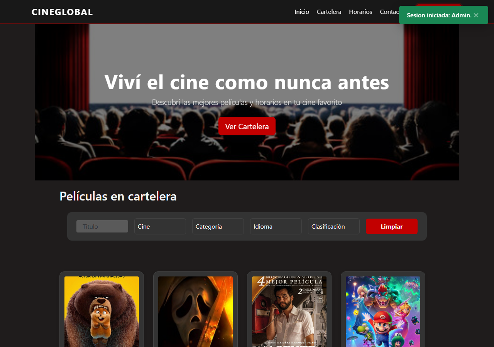

# Documentacion de Libreria Externa - Toastify

## Informacion General

- **Nombre:** Toastify
- **Version:** 1.12.0 via CDN
- **Repositorio:** https://github.com/apvarun/toastify-js
- **Documentacion oficial:** https://apvarun.github.io/toastify-js/
- **Metodo de integracion:** CDN
- **Rol:** Desarrollador JS Librerias Externas
- **Rama:** `feature/dev-libreria-externa-toastify`

## Proposito y Justificacion

Toastify se eligio para CineGlobal porque permite mostrar notificaciones breves, no bloqueantes y visualmente consistentes sin reemplazar logica de negocio, validaciones ni confirmaciones criticas ya existentes del proyecto.

El sitio ya cuenta con mensajes inline, validaciones propias y modales Bootstrap para confirmaciones importantes. Por eso, Toastify se utiliza para acciones exitosas o estados informativos, y tambien para evitar feedback duplicado cuando el aviso existente era redundante o no critico.

La libreria aporta valor en situaciones donde un toast mejora la experiencia sin interrumpir el flujo del usuario, por ejemplo: resultados de filtros, login exitoso, registro exitoso, seleccion de funcion, compra guardada y errores no bloqueantes de persistencia.

## Instalacion e Integracion

### Metodo utilizado: CDN

Toastify se integra en `index.html` mediante su hoja de estilos y su script JavaScript:

```html
<link rel="stylesheet" href="https://cdn.jsdelivr.net/npm/toastify-js@1.12.0/src/toastify.min.css">
<script src="https://cdn.jsdelivr.net/npm/toastify-js@1.12.0"></script>
```

El CSS se carga en el `head` y el script se carga antes de `js/script.js`, para que el wrapper del proyecto pueda acceder a `window.Toastify`.

## Arquitectura de Integracion

La integracion se centraliza en el archivo:

```text
js/utils/toast.js
```

El wrapper evita llamadas directas a `Toastify()` desde los controladores principales y mantiene una configuracion comun de duracion, posicion con offset para no tapar el encabezado, colores, fallback y manejo defensivo de errores.

Funciones previstas:

```javascript
showSuccessToast(message);
showInfoToast(message);
showWarningToast(message);
showErrorToast(message);
```

## Uso en el Proyecto

### Caso de Uso 1: Filtros de cartelera

Toastify se utiliza para informar rapidamente el resultado de una busqueda en cartelera, reemplazando el mensaje inline informativo `estadoFiltros` para evitar feedback duplicado. No reemplaza validaciones ni errores de formulario.

```javascript
if (debeNotificarFiltro(event)) {
  if (resultados.length) {
    showInfoToast(mensajeFiltros);
  } else {
    showWarningToast(mensajeFiltros);
  }
}
```

### Caso de Uso 2: Login y registro exitosos

Cuando el usuario inicia sesion correctamente, Toastify muestra el feedback de exito sin abrir un modal adicional. En registro, se usa como confirmacion liviana y reemplaza el modal redundante de exito, conservando las validaciones existentes.

```javascript
showSuccessToast(`Sesion iniciada: ${usuario.nombre}.`);
```

```javascript
showSuccessToast('Cuenta creada correctamente.');
```

### Caso de Uso 3: Seleccion de funcion

Al seleccionar correctamente cine, idioma, horario y cantidad de entradas, Toastify informa que el usuario puede continuar con el pago.

```javascript
showInfoToast('Funcion seleccionada. Continua con el pago.');
```

### Caso de Uso 4: Persistencia de compra

Luego de confirmar una compra, Toastify informa el resultado real de la persistencia en historial. El modal Bootstrap final se mantiene como confirmacion principal.

```javascript
const compraGuardada = guardarEnListaStorage(STORAGE_KEYS.compras, compra.toJSON(), 'local');
if (compraGuardada) {
  showSuccessToast('Compra guardada en el historial.');
} else {
  showErrorToast('No se pudo guardar la compra en el historial.');
}
```

### Caso de Uso 5: Error de persistencia de ticket

Cuando el usuario envia una consulta, el modal Bootstrap muestra el numero de ticket como confirmacion principal. Toastify solo se usa si el ticket no pudo guardarse en storage.

```javascript
const ticketGuardado = guardarEnListaStorage(STORAGE_KEYS.tickets, consulta.toJSON(), 'local');
if (!ticketGuardado) {
  showErrorToast(`Consulta enviada, pero no se pudo guardar el ticket: ${ticket}.`);
}
```

## Capturas de Pantalla






## Consideraciones Tecnicas

- Toastify no reemplaza modales Bootstrap criticos ni con contenido estructurado.
- Toastify no reemplaza mensajes inline de validacion o error.
- Toastify reemplaza avisos redundantes o informativos, como login exitoso y estado de filtros.
- Toastify no modifica logica de negocio.
- Toastify no modifica modelos POO, Storage ni Fetch/API.
- El wrapper valida si `window.Toastify` existe antes de intentar mostrar una notificacion.
- El wrapper captura errores al ejecutar la libreria para que una falla externa no interrumpa el flujo principal.
- Si la libreria no carga, el flujo principal sigue funcionando.

## Testing Sugerido para Tester QA/JS

Se recomienda validar:

- carga de Toastify por CDN;
- existencia del wrapper `js/utils/toast.js`;
- fallback si `window.Toastify` no existe;
- notificacion en filtros;
- notificacion en login exitoso;
- notificacion en registro exitoso sin modal redundante;
- notificacion al seleccionar funcion;
- notificacion al guardar compra;
- modal de consulta enviada con ticket y toast de error solo si falla la persistencia;
- que no se hayan reemplazado modales Bootstrap ni mensajes inline.
