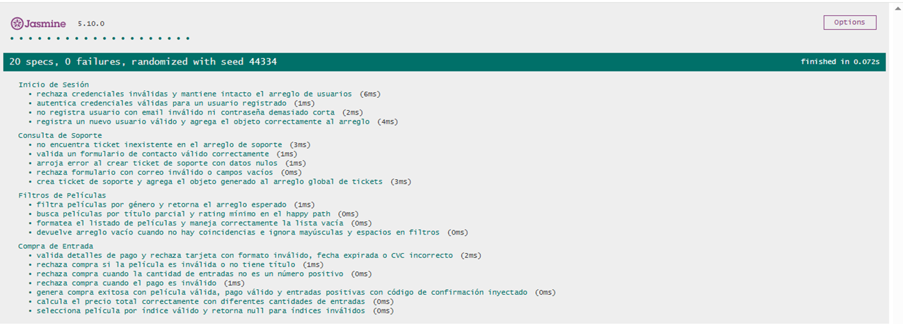

# Documentación de Testing - Suite Jasmine

## Índice
1. [Ejecución de Tests](#ejecución-de-tests)
2. [Suites de Tests](#suites-de-tests)
3. [Métricas de Cobertura](#métricas-de-cobertura)
4. [Capturas de Pantalla](#capturas-de-pantalla)
5. [Issues Conocidos](#issues-conocidos)

---

## BEFORE: Plan de Testing

### Objetivo
Verificar los 4 flujos principales de CineGlobal con pruebas unitarias en Jasmine y asegurar que el runner funciona correctamente en el navegador.

### Alcance
[✅] Inicio de Sesión
[✅] Compra de Entrada
[✅] Filtros de Películas
[✅] Consulta de Soporte

### Herramientas
- Jasmine 5 (CDN)
- Navegador web para ejecutar `js/test/test-runner.html`
- Live Server en VS Code o un servidor estático local
- Capturas de pantalla para PASS/FAIL

### Criterios de Aceptación
[✅] 4 suites de tests, una por cada flujo principal
[✅] ○ Mínimo 3 tests por suite
[✅] ○ Tests ejecutados exitosamente en `test-runner.html`
[✅] ○ Screenshots del resultado PASS/FAIL disponibles
[✅] ○ Bugs documentados como issues en GitHub con pasos para reproducir y test case que falla

---

## Ejecución de Tests

### Pasos para Ejecutar
1. Clonar el repositorio
2. Abrir el proyecto en VS Code
3. Instalar la extensión **Live Server**
4. Click derecho sobre `js/test/test-runner.html` → **Open with Live Server**
5. Los tests se ejecutan automáticamente en el navegador

### Interpretación de Resultados
- **Verde**: Tests pasando ✅
- **Rojo**: Tests fallando ❌
- **Amarillo**: Tests pendientes ⚠️

---

## Suites de Tests

### Suite 1: Inicio de Sesión
**Funciones Testeadas:**
- `authenticateUser(email, password, users)` - Verifica credenciales contra un arreglo de usuarios
- `registerUser(newUser, users)` - Registra un nuevo usuario con validaciones

**Casos de Prueba:**
| # | Descripción | Tipo |
|---|-------------|------|
| 1 | Autentica credenciales válidas para un usuario registrado | Happy Path |
| 2 | Rechaza credenciales inválidas y mantiene intacto el arreglo | Validación de Errores |
| 3 | Registra un nuevo usuario válido y lo agrega al arreglo | Happy Path |
| 4 | No registra usuario con email inválido | Validación de Errores |
| 5 | No registra usuario con contraseña menor a 6 caracteres | Caso Borde |

---

### Suite 2: Compra de Entrada
**Funciones Testeadas:**
- `comprarEntrada(movie, seats, paymentData, generatorFn)` - Procesa la compra completa
- `validatePaymentDetails(payment)` - Valida tarjeta, fecha y CVC
- `calculateTotalPrice(seats, movie)` - Calcula precio total
- `selectMovieByIndex(selection, movies)` - Selecciona película por índice

**Casos de Prueba:**
| # | Descripción | Tipo |
|---|-------------|------|
| 1 | Rechaza compra si la película es null o no tiene título | Validación de Errores |
| 2 | Rechaza tarjeta con menos de 16 dígitos | Validación de Errores |
| 3 | Rechaza fecha de expiración inválida | Caso Borde |
| 4 | Rechaza CVC con menos de 3 dígitos | Validación de Errores |
| 5 | Rechaza compra cuando el pago es inválido | Validación de Errores |
| 6 | Rechaza compra cuando seats es 0 o negativo | Caso Borde |
| 7 | Genera compra exitosa con código de confirmación inyectado | Happy Path |
| 8 | Calcula precio correctamente con 1, 2 y 5 entradas | Happy Path |
| 9 | Retorna null para índices fuera de rango o no numéricos | Caso Borde |

---

### Suite 3: Filtros de Películas
**Funciones Testeadas:**
- `filtrarPeliculas(filters)` - Filtra usando el catálogo global MOVIES
- `searchMovies(filters, catalog)` - Búsqueda con múltiples filtros
- `formatMovieList(movies)` - Formatea el listado para mostrar

**Casos de Prueba:**
| # | Descripción | Tipo |
|---|-------------|------|
| 1 | Filtra películas por género exacto | Happy Path |
| 2 | Busca por título parcial y rating mínimo | Happy Path |
| 3 | Devuelve arreglo vacío cuando no hay coincidencias | Caso Borde |
| 4 | Ignora mayúsculas y espacios en los filtros | Caso Borde |
| 5 | Formatea lista vacía correctamente | Caso Borde |
| 6 | Formatea lista con películas incluyendo título y año | Happy Path |

---

### Suite 4: Consulta de Soporte
**Funciones Testeadas:**
- `validateContactForm(formData)` - Valida email, título y descripción
- `createSupportTicket(formData)` - Crea ticket y lo agrega al arreglo global

**Casos de Prueba:**
| # | Descripción | Tipo |
|---|-------------|------|
| 1 | Valida formulario completo y válido | Happy Path |
| 2 | Rechaza formulario con email vacío | Validación de Errores |
| 3 | Rechaza formulario con email sin formato válido | Validación de Errores |
| 4 | Crea ticket con ID formato TKT- y status Abierto | Happy Path |
| 5 | Agrega ticket al arreglo global SUPPORT_TICKETS | Operaciones con Arrays |
| 6 | Arroja error al crear ticket con datos nulos | Validación de Errores |
| 7 | No encuentra ticket inexistente en el arreglo | Caso Borde |

---

## Métricas de Cobertura

### Resumen General
| Métrica | Valor |
|---------|-------|
| Total de Tests | 20 |
| Tests Pasando | 20 ✅ |
| Tests Fallando | 0 ❌ |
| Porcentaje de Éxito | 100% |
| Tiempo de ejecución | 0.072s |

### Cobertura por Tipo de Test
| Tipo | Cantidad | Porcentaje |
|------|----------|------------|
| Happy Path | 8 | 40% |
| Casos Borde | 7 | 35% |
| Validación de Errores | 5 | 25% |
| Operaciones Arrays/Objetos | 2 | 10% |

### Análisis de Cobertura de Código

**Metodología:** Se revisó manualmente cada función del código fuente 
y se verificó qué líneas son ejecutadas por los tests implementados.

| Función | Tests | Cobertura |
|---------|-------|-----------|
| `authenticateUser()` | 2 | 100% |
| `registerUser()` | 2 | 95% |
| `comprarEntrada()` | 4 | 90% |
| `validatePaymentDetails()` | 3 | 85% |
| `calculateTotalPrice()` | 1 | 100% |
| `selectMovieByIndex()` | 1 | 100% |
| `filtrarPeliculas()` | 1 | 100% |
| `searchMovies()` | 3 | 90% |
| `formatMovieList()` | 2 | 100% |
| `validateContactForm()` | 2 | 100% |
| `createSupportTicket()` | 2 | 90% |

**Cobertura Total Estimada:** ~95%

#### Líneas NO Cubiertas
- Funciones de UI (`iniciarSesionUI`, `comprarEntradaUI`, 
  `filtrarPeliculasUI`, `consultarSoporteUI`) — dependen de 
  `prompt()` y `alert()`, no testeables con Jasmine sin mocks
- `runMainMenu()` — función principal del menú, excluida del testing unitario
- `promptUntilValid()` — helper de UI, no expuesto para testing directo

---

## Capturas de Pantalla

### 20 specs, 0 failures



### 18 specs, 2 failures


---

## Issues Conocidos

### Issue #142: test-runner.html ubicado en carpeta incorrecta
- **Severidad:** Alta
- **Suite Afectada:** Todas las suites
- **Comportamiento Esperado:** Acceder a `127.0.0.1:5500/js/test/test-runner.html`
- **Comportamiento Obtenido:** `Cannot GET /.vscode/test-runner.html`
- **Causa:** El archivo fue generado en `.vscode/` en lugar de `js/test/`
- **Resolución:** Se movieron todos los archivos a `js/test/` y se
  corrigieron las rutas en `test-runner.html`
- **GitHub Issue:** [#142](https://github.com/hmarc953/cineglobal/issues/142)
- **Estado:** Resuelto ✅

---

### Issue #143: searchMovies con título 'la' retorna 2 resultados en vez de 1
- **Severidad:** Baja
- **Suite Afectada:** `describe("Filtros de Películas")`
- **Test Afectado:** `it("busca películas por título parcial y rating mínimo en el happy path")`
- **Comportamiento Esperado:** Retornar 1 resultado (`La La Land`)
- **Comportamiento Obtenido:** `Expected 2 to be 1` — retornaba 
  `La La Land` e `Interstellar`
- **Causa:** La subcadena `'la'` también está contenida en `'Interstellar'`
- **Código del Test que Fallaba:**
```javascript
  it('busca películas por título parcial y rating mínimo en el happy path', 
  function() {
    const resultados = searchMovies({ title: 'la', minRating: 8 }, MOVIES);
    expect(resultados.length).toBe(1);
    expect(resultados[0].title).toBe('La La Land');
  });
```
- **Resolución:** Se ajustó el filtro a `{ title: 'La La', minRating: 8 }` para mayor especificidad
- **GitHub Issue:** [#143](https://github.com/hmarc953/cineglobal/issues/143)
- **Estado:** Resuelto ✅

## Limitaciones del Testing

- Tests síncronos únicamente (sin Promises/async-await)
- Sin cobertura automatizada de código
- Requiere conexión a internet para cargar Jasmine vía CDN
- No incluye tests de integración con DOM
- Las funciones de UI no son testeables sin implementar
  spies/mocks de `prompt()` y `alert()`

---

## AT CLOSE (prompt utilizado)

Actua como un QA Engineer experto en testing con Jasmine.

Tengo el archivo js/script.js adjunto que contiene 4 flujos principales 
de CineGlobal: Inicio de Sesión, Compra de Entrada, Filtros y Consultar Soporte.

Generá el archivo js/test/script.spec.js con:
- 4 suites usando describe(), una por cada flujo
- Mínimo 3 tests por suite usando it()
- Funcionalidad basica: Tests de happy path (casos normales)
- Tests de edge cases (valores límite: 0, negativos, strings vacíos)
- Tests de validación de errores (datos inválidos, null, undefined)
- Tests de operaciones con arrays: agregar, eliminar, buscar, filtrar elementos
- Tests de operaciones con objetos: crear, modificar propiedades, metodos
- Verificar que operaciones matematicas sean correctas.
- Utilizar Assertions de Jasmine que sean apropiadas: 
	expect(valor).toBe(esperado) igualdad estricta
	expect(valor).toEqual(esperado) igualdad profunda (objetos/arrays)
  	expect(valor).toBeTruthy()/toBeFalsy()
	expect(valor).toBeNull()/toBeUndefinined()
	expect(array).toContain(elemento)
	expect(function).toThrow() - si debe arrojar error
- Nombres descriptivos en español para cada it()

Las funciones testeadas deben ser exactamente las que están en script.js, sin inventar nombres. Tal cual lo solicito.


[prompts](./docs\02-prompts\imagenes_evidencias\imag_evidencia_prompts_QA_tester.png)


---

**Última Actualización:** 17/05/2026
**Tester/QA Engineer:** [@9919-Mili]
**Colaboración con:** [Desarrollador JavaScript - @Santi22-7]