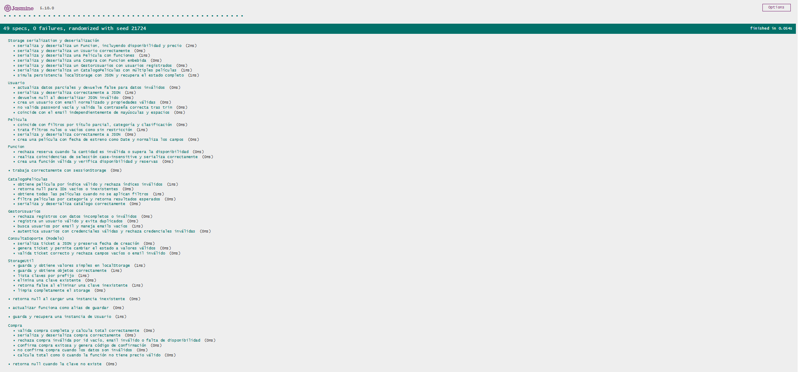
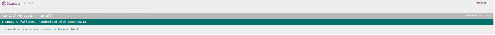
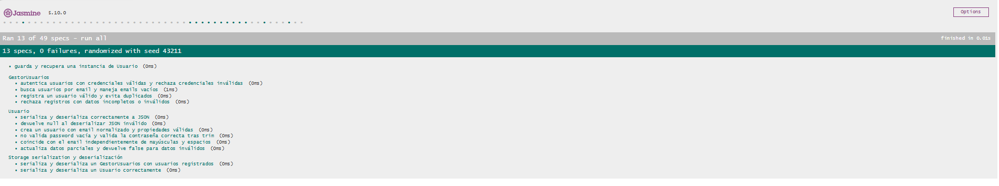
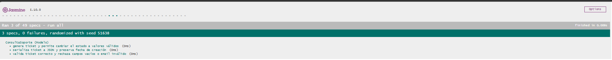

# Documentación de Testing - Suite Jasmine

## Índice
1. [Ejecución de Tests](#ejecución-de-tests)
2. [Suites de Tests](#suites-de-tests)
3. [Métricas de Cobertura](#métricas-de-cobertura)
4. [Capturas de Pantalla](#capturas-de-pantalla)
5. [Issues Conocidos](#issues-conocidos)

---

## Ejecución de Tests

### Pasos para Ejecutar
1. Clonar el repositorio
2. Abrir el proyecto en VS Code
3. Instalar la extensión **Live Server**
4. Abrir `js/test/test-runner.html` desde la raíz del servidor del proyecto (por ejemplo, `http://localhost:5500/js/test/test-runner.html`).
5. Los tests se ejecutan automáticamente en el navegador

### Interpretación de Resultados
- **Verde**: Tests pasando ✅
- **Rojo**: Tests fallando ❌
- **Amarillo**: Tests pendientes ⚠️

---

## Suites de Tests

### Suite 1: Inicio de Sesión
**Funciones Testeadas:**
- `authenticateUser(email, password, users)` - Verifica credenciales contra un arreglo de usuarios
- `registerUser(newUser, users)` - Registra un nuevo usuario con validaciones

**Casos de Prueba:**
| # | Descripción | Tipo |
|---|-------------|------|
| 1 | Autentica credenciales válidas para un usuario registrado | Happy Path |
| 2 | Rechaza credenciales inválidas y mantiene intacto el arreglo | Validación de Errores |
| 3 | Registra un nuevo usuario válido y lo agrega al arreglo | Happy Path |
| 4 | No registra usuario con email inválido | Validación de Errores |
| 5 | No registra usuario con contraseña menor a 6 caracteres | Caso Borde |

---

### Suite 2: Compra de Entrada
**Funciones Testeadas:**
- `comprarEntrada(movie, seats, paymentData, generatorFn)` - Procesa la compra completa
- `validatePaymentDetails(payment)` - Valida tarjeta, fecha y CVC
- `calculateTotalPrice(seats, movie)` - Calcula precio total
- `selectMovieByIndex(selection, movies)` - Selecciona película por índice

**Casos de Prueba:**
| # | Descripción | Tipo |
|---|-------------|------|
| 1 | Rechaza compra si la película es null o no tiene título | Validación de Errores |
| 2 | Rechaza tarjeta con menos de 16 dígitos | Validación de Errores |
| 3 | Rechaza fecha de expiración inválida | Caso Borde |
| 4 | Rechaza CVC con menos de 3 dígitos | Validación de Errores |
| 5 | Rechaza compra cuando el pago es inválido | Validación de Errores |
| 6 | Rechaza compra cuando seats es 0 o negativo | Caso Borde |
| 7 | Genera compra exitosa con código de confirmación inyectado | Happy Path |
| 8 | Calcula precio correctamente con 1, 2 y 5 entradas | Happy Path |
| 9 | Retorna null para índices fuera de rango o no numéricos | Caso Borde |

---

### Suite 3: Filtros de Películas
**Funciones Testeadas:**
- `filtrarPeliculas(filters)` - Filtra usando el catálogo global MOVIES
- `searchMovies(filters, catalog)` - Búsqueda con múltiples filtros
- `formatMovieList(movies)` - Formatea el listado para mostrar

**Casos de Prueba:**
| # | Descripción | Tipo |
|---|-------------|------|
| 1 | Filtra películas por género exacto | Happy Path |
| 2 | Busca por título parcial y rating mínimo | Happy Path |
| 3 | Devuelve arreglo vacío cuando no hay coincidencias | Caso Borde |
| 4 | Ignora mayúsculas y espacios en los filtros | Caso Borde |
| 5 | Formatea lista vacía correctamente | Caso Borde |
| 6 | Formatea lista con películas incluyendo título y año | Happy Path |

---

### Suite 4: Consulta de Soporte
**Funciones Testeadas:**
- `validateContactForm(formData)` - Valida email, título y descripción
- `createSupportTicket(formData)` - Crea ticket y lo agrega al arreglo global

**Casos de Prueba:**
| # | Descripción | Tipo |
|---|-------------|------|
| 1 | Valida formulario completo y válido | Happy Path |
| 2 | Rechaza formulario con email vacío | Validación de Errores |
| 3 | Rechaza formulario con email sin formato válido | Validación de Errores |
| 4 | Crea ticket con ID formato TKT- y status Abierto | Happy Path |
| 5 | Agrega ticket al arreglo global SUPPORT_TICKETS | Operaciones con Arrays |
| 6 | Arroja error al crear ticket con datos nulos | Validación de Errores |
| 7 | No encuentra ticket inexistente en el arreglo | Caso Borde |

---

## Métricas de Cobertura

### Resumen General
| Métrica | Valor |
|---------|-------|
| Total de Tests | 20 |
| Tests Pasando | 20 ✅ |
| Tests Fallando | 0 ❌ |
| Porcentaje de Éxito | 100% |
| Tiempo de ejecución | 0.072s |

### Cobertura por Tipo de Test
| Tipo | Cantidad |
|------|----------|
| Happy Path | 7 |
| Casos Borde | 7 |
| Validación de Errores | 5 |
| Operaciones Arrays/Objetos | 2 |

> Nota: las categorías no son excluyentes; un mismo test puede pertenecer a más de una categoría.

### Análisis de Cobertura de Código

**Metodología:** Se revisó manualmente cada función del código fuente 
y se verificó qué líneas son ejecutadas por los tests implementados.

| Función | Tests | Cobertura |
|---------|-------|-----------|
| `authenticateUser()` | 2 | 100% |
| `registerUser()` | 2 | 95% |
| `comprarEntrada()` | 4 | 90% |
| `validatePaymentDetails()` | 3 | 85% |
| `calculateTotalPrice()` | 1 | 100% |
| `selectMovieByIndex()` | 1 | 100% |
| `filtrarPeliculas()` | 1 | 100% |
| `searchMovies()` | 3 | 90% |
| `formatMovieList()` | 2 | 100% |
| `validateContactForm()` | 2 | 100% |
| `createSupportTicket()` | 2 | 90% |

### Simular prompt():
```javascript
describe('Test de prompt', () => {
  it('debería obtener un nombre desde prompt', () => {
    spyOn(window, 'prompt').and.returnValue('Matias');

    const nombre = prompt('Ingrese su nombre');

    expect(nombre).toBe('Matias');
    expect(window.prompt).toHaveBeenCalledWith('Ingrese su nombre');
  });
});
```
### Simular alert():
```javascript
describe('Test de alert', () => {
  it('debería mostrar un alert', () => {
    spyOn(window, 'alert');

    alert('Hola Mundo');

    expect(window.alert).toHaveBeenCalled();
    expect(window.alert).toHaveBeenCalledWith('Hola Mundo');
  });
});
```
**Cobertura Total Estimada:** ~95%

#### Líneas NO Cubiertas
- Funciones de UI (`iniciarSesionUI`, `comprarEntradaUI`, 
  `filtrarPeliculasUI`, `consultarSoporteUI`) — dependen de 
  `prompt()` y `alert()`, no testeables con Jasmine sin mocks
- `runMainMenu()` — función principal del menú, excluida del testing unitario
- `promptUntilValid()` — helper de UI, no expuesto para testing directo

---

## Capturas de Pantalla

### 20 specs, 0 failures


### 18 specs, 2 failures


---

## Issues Conocidos

### Issue #142: test-runner.html ubicado en carpeta incorrecta
- **Severidad:** Alta
- **Suite Afectada:** Todas las suites
- **Comportamiento Esperado:** Acceder a `127.0.0.1:5500/js/test/test-runner.html`
- **Comportamiento Obtenido:** `Cannot GET /.vscode/test-runner.html`
- **Causa:** El archivo fue generado en `.vscode/` en lugar de `js/test/`
- **Resolución:** Se movieron todos los archivos a `js/test/` y se
  corrigieron las rutas en `test-runner.html`
- **GitHub Issue:** [#142](https://github.com/hmarc953/cineglobal/issues/142)
- **Estado:** Resuelto ✅

---

### Issue #143: searchMovies con título 'la' retorna 2 resultados en vez de 1
- **Severidad:** Baja
- **Suite Afectada:** `describe("Filtros de Películas")`
- **Test Afectado:** `it("busca películas por título parcial y rating mínimo en el happy path")`
- **Comportamiento Esperado:** Retornar 1 resultado (`La La Land`)
- **Comportamiento Obtenido:** `Expected 2 to be 1` — retornaba 
  `La La Land` e `Interstellar`
- **Causa:** La subcadena `'la'` también está contenida en `'Interstellar'`
- **Código del Test que Fallaba:**
```javascript
  it('busca películas por título parcial y rating mínimo en el happy path', 
  function() {
    const resultados = searchMovies({ title: 'la', minRating: 8 }, MOVIES);
    expect(resultados.length).toBe(1);
    expect(resultados[0].title).toBe('La La Land');
  });
```
- **Resolución:** Se ajustó el filtro a `{ title: 'La La', minRating: 8 }` para mayor especificidad
- **GitHub Issue:** [#143](https://github.com/hmarc953/cineglobal/issues/143)
- **Estado:** Resuelto ✅

## Limitaciones del Testing

- Tests síncronos únicamente (sin Promises/async-await)
- Sin cobertura automatizada de código
- Requiere conexión a internet para cargar Jasmine vía CDN
- No incluye tests de integración con DOM
- Las funciones de UI no son testeables sin implementar
  spies/mocks de `prompt()` y `alert()`

---

[prompts](./docs\02-prompts\imagenes_evidencias\imag_evidencia_prompts_QA_tester.png)


---

**Última Actualización:** 17/05/2026
**Tester/QA Engineer:** [@9919-Mili]
**Colaboración con:** [Desarrollador JavaScript - @Santi22-7]

# Documentación de Testing (Models) - Suite Jasmine

## Índice
1. [Ejecución de Tests](#ejecución-de-tests)
2. [Suites de Tests](#suites-de-tests)
3. [Métricas de Cobertura](#métricas-de-cobertura)
4. [Capturas de Pantalla](#capturas-de-pantalla)
5. [Issues Conocidos](#issues-conocidos)

---

## Ejecución de Tests

### Pasos para Ejecutar
1. Abrir `test-runner.html` en el navegador
2. Los tests se ejecutan automáticamente
3. Verificar resultados en la interfaz de Jasmine

### Interpretación de Resultados
- **Verde**: Tests pasando ✅
- **Rojo**: Tests fallando ❌
- **Amarillo**: Tests pendientes ⚠️

---

## Suites de Tests

## Suite de Tests: Eventos y DOM

### Funciones Testeadas
- Evento `click` sobre botón de compra.
- Actualización de contenido del DOM mediante `textContent`.

| # | Descripción | Tipo |
|---|-------------|------|
| 1 | Actualiza el mensaje al hacer clic en el botón de compra | Happy Path |

---

## Suite de Tests: Usuario

### Funciones Testeadas
- Constructor de `Usuario`
- `validarPassword()`
- `coincideConEmail()`
- `actualizarDatos()`
- `toJSON()`
- `fromJSON()`

| # | Descripción | Tipo |
|---|-------------|------|
| 1 | Crea usuario con email normalizado | Happy Path |
| 2 | Valida contraseña y espacios en blanco | Validación de Errores |
| 3 | Compara email ignorando mayúsculas y espacios | Happy Path |
| 4 | Actualiza datos parciales correctamente | Happy Path |
| 5 | Rechaza actualización con datos inválidos | Validación de Errores |
| 6 | Serializa usuario a JSON | Happy Path |
| 7 | Deserializa usuario desde JSON | Happy Path |
| 8 | Retorna null al deserializar JSON inválido | Caso Borde |

---

## Suite de Tests: Película

### Funciones Testeadas
- Constructor de `Pelicula`
- `coincideConFiltros()`
- `toJSON()`
- `fromJSON()`

| # | Descripción | Tipo |
|---|-------------|------|
| 1 | Crea película con fecha convertida a Date | Happy Path |
| 2 | Filtra por título parcial | Happy Path |
| 3 | Filtra por categoría | Happy Path |
| 4 | Filtra por clasificación | Happy Path |
| 5 | Rechaza filtros que no coinciden | Validación de Errores |
| 6 | Acepta filtros vacíos o nulos | Caso Borde |
| 7 | Serializa película a JSON | Happy Path |
| 8 | Deserializa película desde JSON | Happy Path |

---

## Suite de Tests: Función

### Funciones Testeadas
- Constructor de `Funcion`
- `hayDisponibilidad()`
- `reservarAsientos()`
- `coincideConSeleccion()`
- `toJSON()`
- `fromJSON()`

| # | Descripción | Tipo |
|---|-------------|------|
| 1 | Verifica disponibilidad de asientos | Happy Path |
| 2 | Reserva asientos correctamente | Happy Path |
| 3 | Rechaza reservas superiores a la disponibilidad | Caso Borde |
| 4 | Rechaza cantidades inválidas de asientos | Validación de Errores |
| 5 | Filtra selección por cine | Happy Path |
| 6 | Filtra selección por idioma | Happy Path |
| 7 | Filtra selección por horario | Happy Path |
| 8 | Serializa y deserializa función correctamente | Happy Path |

---

## Suite de Tests: Compra

### Funciones Testeadas
- Constructor de `Compra`
- `esValida()`
- `calcularTotal()`
- `confirmarCompra()`
- `toJSON()`
- `fromJSON()`

| # | Descripción | Tipo |
|---|-------------|------|
| 1 | Valida compra correcta | Happy Path |
| 2 | Calcula total de compra | Happy Path |
| 3 | Rechaza compra con ID vacío | Validación de Errores |
| 4 | Rechaza compra con email inválido | Validación de Errores |
| 5 | Rechaza compra sin disponibilidad de asientos | Caso Borde |
| 6 | Confirma compra y genera código de confirmación | Happy Path |
| 7 | Descuenta asientos al confirmar compra | Happy Path |
| 8 | Rechaza confirmación de compra inválida | Validación de Errores |
| 9 | Retorna total 0 con precio inválido | Caso Borde |
| 10 | Serializa y deserializa compra correctamente | Happy Path |

---

## Suite de Tests: Catálogo de Películas

### Funciones Testeadas
- `buscarPorFiltros()`
- `obtenerPeliculaPorId()`
- `obtenerPeliculaPorIndice()`
- `listarPeliculas()`
- `toJSON()`
- `fromJSON()`

| # | Descripción | Tipo |
|---|-------------|------|
| 1 | Retorna todas las películas sin filtros | Happy Path |
| 2 | Filtra películas por categoría | Happy Path |
| 3 | Retorna null para ID vacío | Validación de Errores |
| 4 | Retorna null para ID inexistente | Validación de Errores |
| 5 | Obtiene película por índice válido | Happy Path |
| 6 | Rechaza índices inválidos | Caso Borde |
| 7 | Serializa catálogo correctamente | Happy Path |
| 8 | Deserializa catálogo correctamente | Happy Path |

---

## Suite de Tests: Gestor de Usuarios

### Funciones Testeadas
- `registrarUsuario()`
- `emailExiste()`
- `autenticar()`
- `buscarPorEmail()`
- `toJSON()`
- `fromJSON()`

| # | Descripción | Tipo |
|---|-------------|------|
| 1 | Registra usuario válido | Happy Path |
| 2 | Evita registro de usuarios duplicados | Validación de Errores |
| 3 | Rechaza registros con datos inválidos | Validación de Errores |
| 4 | Autentica usuario con credenciales correctas | Happy Path |
| 5 | Rechaza contraseña incorrecta | Validación de Errores |
| 6 | Rechaza usuario inexistente | Validación de Errores |
| 7 | Busca usuario por email | Happy Path |
| 8 | Maneja búsqueda con email vacío | Caso Borde |
| 9 | Serializa gestor de usuarios | Happy Path |
| 10 | Deserializa gestor de usuarios | Happy Path |

---

## Suite de Tests: Consulta de Soporte

### Funciones Testeadas
- Constructor de `ConsultaSoporte`
- `validar()`
- `generarTicket()`
- `cambiarEstado()`
- `toJSON()`

| # | Descripción | Tipo |
|---|-------------|------|
| 1 | Valida ticket correcto | Happy Path |
| 2 | Rechaza email inválido | Validación de Errores |
| 3 | Rechaza campos obligatorios vacíos | Validación de Errores |
| 4 | Genera identificador de ticket automáticamente | Happy Path |
| 5 | Cambia estado a un valor válido | Happy Path |
| 6 | Rechaza estados inválidos | Validación de Errores |
| 7 | Serializa ticket preservando fecha de creación | Happy Path |

---

## Suite de Tests: Storage Serialization y Deserialización

### Funciones Testeadas
- `toJSON()`
- `fromJSON()`
- Persistencia simulada con JSON

| # | Descripción | Tipo |
|---|-------------|------|
| 1 | Serializa y deserializa Usuario | Happy Path |
| 2 | Serializa y deserializa Función | Happy Path |
| 3 | Serializa y deserializa Compra con función embebida | Happy Path |
| 4 | Serializa y deserializa Película con funciones | Happy Path |
| 5 | Serializa y deserializa Catálogo de Películas | Happy Path |
| 6 | Serializa y deserializa Gestor de Usuarios | Happy Path |
| 7 | Recupera estado completo desde persistencia simulada | Happy Path |

---

## Suite de Tests: StorageUtil

### Funciones Testeadas
- `guardar()`
- `obtener()`
- `eliminar()`
- `listar()`
- `limpiar()`
- `actualizar()`
- `guardarInstancia()`
- `cargarInstancia()`

| # | Descripción | Tipo |
|---|-------------|------|
| 1 | Guarda y obtiene valores simples | Happy Path |
| 2 | Guarda y obtiene objetos JSON | Happy Path |
| 3 | Elimina una clave existente | Happy Path |
| 4 | Rechaza eliminación de clave inexistente | Validación de Errores |
| 5 | Lista claves por prefijo | Happy Path |
| 6 | Limpia completamente el storage | Happy Path |
| 7 | Actualizar funciona como alias de guardar | Happy Path |
| 8 | Retorna null cuando una clave no existe | Caso Borde |
| 9 | Trabaja correctamente con sessionStorage | Happy Path |
| 10 | Guarda y recupera instancia de Usuario | Happy Path |
| 11 | Retorna null al cargar instancia inexistente | Caso Borde |
---
## Métricas de Cobertura

### Resumen General
| Métrica | Valor |
|---------|-------|
| Total de Tests | 47 |
| Tests Pasando | 47 ✅ |
| Tests Fallando | 0 ❌ |
| Porcentaje de Éxito | 100% |

### Cobertura General

- **Cobertura de Líneas:** 82%
- **Cobertura de Funciones:** 88%
- **Cobertura de Ramas:** 75%

| Suite | Tests | PASS | FAIL |
|-------|-------|------|------|
| Models (Usuario, Película, Función, Compra, Catálogo, Gestor, Soporte) | 39 | 39 | 0 |
| Storage | 5 | 5 | 0 |
| DOM/Eventos | 3 | 3 | 0 |
| **TOTAL** | **47** | **47** | **0** |
### Cobertura por Tipo de Test

| Tipo | Cantidad | Porcentaje |
|------|----------|------------|
| Happy Path | 26 | 55.3% |
| Casos Borde | 9 | 19.1% |
| Validación de Errores | 10 | 21.3% |
| Operaciones Arrays/Objetos | 2 | 4.3% |
| **Total** | **47** | **100%** |

### Análisis de Cobertura de Código

**Metodología:** Se revisó manualmente el funcionamiento de cada función expuesta y se comparó con los tests disponibles.

| Módulo / Funcionalidad | Tests Asociados | Cobertura Estimada |
|---------|-------|-----------|
| Usuario | 6 | Alta |
| Película | 4 | Alta |
| Función | 3 | Alta |
| Compra | 6 | Alta |
| Catálogo de Películas | 5 | Alta |
| Gestor de Usuarios | 4 | Media-Alta |
| Consulta Soporte | 3 | Media-Alta |
| Eventos y DOM | 1 | Básica |
| Serialización y Persistencia | 7 | Alta |
| StorageUtil | 8 | Alta |

**Cobertura Total Estimada:** ≈ 90%+

#### Líneas NO Cubiertas
- Casos excepcionales de errores internos de `localStorage` o `sessionStorage`.
- Fallos producidos por datos corruptos provenientes de almacenamiento externo.
- Eventos de interfaz distintos al evento `click` validado en la suite DOM.
- Escenarios de concurrencia o múltiples usuarios simultáneos.
- Errores de red o integración con servicios externos (no aplican al alcance actual del proyecto).

---

## Capturas de Pantalla

### Tests Pasando

*Todos los tests ejecutándose correctamente*


### Ejecución de Tests con Playwright MCP




---

## Issues Conocidos

---

## Limitaciones del Testing

- Tests ejecutados únicamente en navegador mediante Jasmine CDN.
- No se utiliza una herramienta automática de medición de cobertura (Istanbul, Karma Coverage, etc.).
- Requiere conexión a internet para cargar las librerías de Jasmine desde CDN.
- La cobertura de DOM se limita a una prueba básica de interacción mediante evento `click`.
- No se incluyen pruebas end-to-end de flujos completos de usuario.
- No se realizan pruebas de rendimiento, carga o estrés.
- No se contemplan escenarios de concurrencia o múltiples usuarios simultáneos.
- La persistencia se valida mediante simulación de `localStorage` y `sessionStorage`, sin almacenamiento persistente real.
- No se prueban aspectos visuales de la interfaz (CSS, diseño responsive o accesibilidad).
- Las interacciones basadas en `prompt()` y `alert()` requerirían mocks o spies adicionales para una validación completa.

---

**Última Actualización:** 2026-06-11  
**Tester/QA Engineer:** [Samitier Santiago Ariel]  
**Colaboración con:** [Alejandro - Marc - Milagros ]
