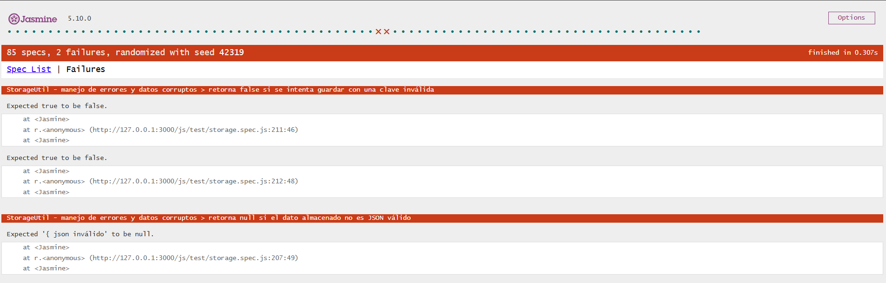
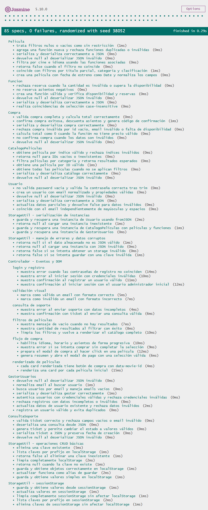

# Documentación de Testing - Suite Jasmine

# Actividad Obligatoria 3
- **Fecha:** 17/05/2026
- **Tester/QA Engineer:** @9919-Mili
- **Colaboración con:** Desarrollador JavaScript - @Santi22-7

## Índice
1. [Ejecución de Tests](#ejecución-de-tests)
2. [Suites de Tests](#suites-de-tests)
3. [Métricas de Cobertura](#métricas-de-cobertura)
4. [Capturas de Pantalla](#capturas-de-pantalla)
5. [Issues Conocidos](#issues-conocidos)

---

## Ejecución de Tests

### Pasos para Ejecutar
1. Clonar el repositorio
2. Abrir el proyecto en VS Code
3. Instalar la extensión **Live Server**
4. Abrir `js/test/test-runner.html` desde la raíz del servidor del proyecto (por ejemplo, `http://localhost:5500/js/test/test-runner.html`).
5. Los tests se ejecutan automáticamente en el navegador

### Interpretación de Resultados
- **Verde**: Tests pasando ✅
- **Rojo**: Tests fallando ❌
- **Amarillo**: Tests pendientes ⚠️

---

## Suites de Tests

### Suite 1: Inicio de Sesión
**Funciones Testeadas:**
- `authenticateUser(email, password, users)` - Verifica credenciales contra un arreglo de usuarios
- `registerUser(newUser, users)` - Registra un nuevo usuario con validaciones

**Casos de Prueba:**
| # | Descripción | Tipo |
|---|-------------|------|
| 1 | Autentica credenciales válidas para un usuario registrado | Happy Path |
| 2 | Rechaza credenciales inválidas y mantiene intacto el arreglo | Validación de Errores |
| 3 | Registra un nuevo usuario válido y lo agrega al arreglo | Happy Path |
| 4 | No registra usuario con email inválido | Validación de Errores |
| 5 | No registra usuario con contraseña menor a 6 caracteres | Caso Borde |

---

### Suite 2: Compra de Entrada
**Funciones Testeadas:**
- `comprarEntrada(movie, seats, paymentData, generatorFn)` - Procesa la compra completa
- `validatePaymentDetails(payment)` - Valida tarjeta, fecha y CVC
- `calculateTotalPrice(seats, movie)` - Calcula precio total
- `selectMovieByIndex(selection, movies)` - Selecciona película por índice

**Casos de Prueba:**
| # | Descripción | Tipo |
|---|-------------|------|
| 1 | Rechaza compra si la película es null o no tiene título | Validación de Errores |
| 2 | Rechaza tarjeta con menos de 16 dígitos | Validación de Errores |
| 3 | Rechaza fecha de expiración inválida | Caso Borde |
| 4 | Rechaza CVC con menos de 3 dígitos | Validación de Errores |
| 5 | Rechaza compra cuando el pago es inválido | Validación de Errores |
| 6 | Rechaza compra cuando seats es 0 o negativo | Caso Borde |
| 7 | Genera compra exitosa con código de confirmación inyectado | Happy Path |
| 8 | Calcula precio correctamente con 1, 2 y 5 entradas | Happy Path |
| 9 | Retorna null para índices fuera de rango o no numéricos | Caso Borde |

---

### Suite 3: Filtros de Películas
**Funciones Testeadas:**
- `filtrarPeliculas(filters)` - Filtra usando el catálogo global MOVIES
- `searchMovies(filters, catalog)` - Búsqueda con múltiples filtros
- `formatMovieList(movies)` - Formatea el listado para mostrar

**Casos de Prueba:**
| # | Descripción | Tipo |
|---|-------------|------|
| 1 | Filtra películas por género exacto | Happy Path |
| 2 | Busca por título parcial y rating mínimo | Happy Path |
| 3 | Devuelve arreglo vacío cuando no hay coincidencias | Caso Borde |
| 4 | Ignora mayúsculas y espacios en los filtros | Caso Borde |
| 5 | Formatea lista vacía correctamente | Caso Borde |
| 6 | Formatea lista con películas incluyendo título y año | Happy Path |

---

### Suite 4: Consulta de Soporte
**Funciones Testeadas:**
- `validateContactForm(formData)` - Valida email, título y descripción
- `createSupportTicket(formData)` - Crea ticket y lo agrega al arreglo global

**Casos de Prueba:**
| # | Descripción | Tipo |
|---|-------------|------|
| 1 | Valida formulario completo y válido | Happy Path |
| 2 | Rechaza formulario con email vacío | Validación de Errores |
| 3 | Rechaza formulario con email sin formato válido | Validación de Errores |
| 4 | Crea ticket con ID formato TKT- y status Abierto | Happy Path |
| 5 | Agrega ticket al arreglo global SUPPORT_TICKETS | Operaciones con Arrays |
| 6 | Arroja error al crear ticket con datos nulos | Validación de Errores |
| 7 | No encuentra ticket inexistente en el arreglo | Caso Borde |

---

## Métricas de Cobertura

### Resumen General
| Métrica | Valor |
|---------|-------|
| Total de Tests | 20 |
| Tests Pasando | 20 ✅ |
| Tests Fallando | 0 ❌ |
| Porcentaje de Éxito | 100% |
| Tiempo de ejecución | 0.072s |

### Cobertura por Tipo de Test
| Tipo | Cantidad |
|------|----------|
| Happy Path | 7 |
| Casos Borde | 7 |
| Validación de Errores | 5 |
| Operaciones Arrays/Objetos | 2 |

> Nota: las categorías no son excluyentes; un mismo test puede pertenecer a más de una categoría.

### Análisis de Cobertura de Código

**Metodología:** Se revisó manualmente cada función del código fuente 
y se verificó qué líneas son ejecutadas por los tests implementados.

| Función | Tests | Cobertura |
|---------|-------|-----------|
| `authenticateUser()` | 2 | 100% |
| `registerUser()` | 2 | 95% |
| `comprarEntrada()` | 4 | 90% |
| `validatePaymentDetails()` | 3 | 85% |
| `calculateTotalPrice()` | 1 | 100% |
| `selectMovieByIndex()` | 1 | 100% |
| `filtrarPeliculas()` | 1 | 100% |
| `searchMovies()` | 3 | 90% |
| `formatMovieList()` | 2 | 100% |
| `validateContactForm()` | 2 | 100% |
| `createSupportTicket()` | 2 | 90% |

### Simular prompt():
```javascript
describe('Test de prompt', () => {
  it('debería obtener un nombre desde prompt', () => {
    spyOn(window, 'prompt').and.returnValue('Matias');

    const nombre = prompt('Ingrese su nombre');

    expect(nombre).toBe('Matias');
    expect(window.prompt).toHaveBeenCalledWith('Ingrese su nombre');
  });
});
```
### Simular alert():
```javascript
describe('Test de alert', () => {
  it('debería mostrar un alert', () => {
    spyOn(window, 'alert');

    alert('Hola Mundo');

    expect(window.alert).toHaveBeenCalled();
    expect(window.alert).toHaveBeenCalledWith('Hola Mundo');
  });
});
```
**Cobertura Total Estimada:** ~95%

#### Líneas NO Cubiertas
- Funciones de UI (`iniciarSesionUI`, `comprarEntradaUI`, 
  `filtrarPeliculasUI`, `consultarSoporteUI`) — dependen de 
  `prompt()` y `alert()`, no testeables con Jasmine sin mocks
- `runMainMenu()` — función principal del menú, excluida del testing unitario
- `promptUntilValid()` — helper de UI, no expuesto para testing directo

---

## Capturas de Pantalla

### 20 specs, 0 failures


### 18 specs, 2 failures


---

## Issues Conocidos

### Issue #142: test-runner.html ubicado en carpeta incorrecta
- **Severidad:** Alta
- **Suite Afectada:** Todas las suites
- **Comportamiento Esperado:** Acceder a `127.0.0.1:5500/js/test/test-runner.html`
- **Comportamiento Obtenido:** `Cannot GET /.vscode/test-runner.html`
- **Causa:** El archivo fue generado en `.vscode/` en lugar de `js/test/`
- **Resolución:** Se movieron todos los archivos a `js/test/` y se
  corrigieron las rutas en `test-runner.html`
- **GitHub Issue:** [#142](https://github.com/hmarc953/cineglobal/issues/142)
- **Estado:** Resuelto ✅

---

### Issue #143: searchMovies con título 'la' retorna 2 resultados en vez de 1
- **Severidad:** Baja
- **Suite Afectada:** `describe("Filtros de Películas")`
- **Test Afectado:** `it("busca películas por título parcial y rating mínimo en el happy path")`
- **Comportamiento Esperado:** Retornar 1 resultado (`La La Land`)
- **Comportamiento Obtenido:** `Expected 2 to be 1` — retornaba 
  `La La Land` e `Interstellar`
- **Causa:** La subcadena `'la'` también está contenida en `'Interstellar'`
- **Código del Test que Fallaba:**
```javascript
  it('busca películas por título parcial y rating mínimo en el happy path', 
  function() {
    const resultados = searchMovies({ title: 'la', minRating: 8 }, MOVIES);
    expect(resultados.length).toBe(1);
    expect(resultados[0].title).toBe('La La Land');
  });
```
- **Resolución:** Se ajustó el filtro a `{ title: 'La La', minRating: 8 }` para mayor especificidad
- **GitHub Issue:** [#143](https://github.com/hmarc953/cineglobal/issues/143)
- **Estado:** Resuelto ✅

## Limitaciones del Testing

- Tests síncronos únicamente (sin Promises/async-await)
- Sin cobertura automatizada de código
- Requiere conexión a internet para cargar Jasmine vía CDN
- No incluye tests de integración con DOM
- Las funciones de UI no son testeables sin implementar
  spies/mocks de `prompt()` y `alert()`

---

[prompts](./docs\02-prompts\imagenes_evidencias\imag_evidencia_prompts_QA_tester.png)


---

# Actividad Obligatoria 4

* **Fecha:** 21/06/2026
* **Tester/QA Engineer:** @Santi22-7
* **Colaboración con:** [ @abartomioli - @9919-Mili - @hmarc953 ]
* **Correcciones por:** @hmarc953

## Índice

1. [Ejecución de Tests](#ejecución-de-tests)
2. [Suites de Tests](#suites-de-tests)
3. [Métricas de Cobertura](#métricas-de-cobertura)
4. [Bugs Detectados Durante QA](#bugs-detectados-durante-qa)
5. [Capturas de Pantalla](#capturas-de-pantalla)
6. [Ajustes Realizados en los Specs](#ajustes-realizados-en-los-specs)
7. [Limitaciones del Testing](#limitaciones-del-testing)

---

## Ejecución de Tests

Para la Actividad Obligatoria N°4 se refactorizó la suite de testing automatizado del proyecto CineGlobal, incorporando pruebas orientadas a la nueva arquitectura basada en:

* Programación Orientada a Objetos.
* Manipulación del DOM.
* Eventos del usuario.
* Validación visual.
* Persistencia con `localStorage` y `sessionStorage`.
* Capa de abstracción `StorageUtil`.

La ejecución de los tests se realizó desde:

```txt
js/test/test-runner.html
```

El runner utiliza Jasmine en navegador y carga las siguientes suites:

```txt
js/test/models.spec.js
js/test/storage.spec.js
js/test/script.spec.js
```

### Pasos para Ejecutar

1. Abrir el proyecto en Visual Studio Code.
2. Ejecutar el proyecto con Live Server.
3. Abrir la siguiente ruta en el navegador:

```txt
http://127.0.0.1:3000/js/test/test-runner.html
```

4. Verificar que Jasmine cargue correctamente.
5. Confirmar que se ejecuten las suites `models.spec.js`, `storage.spec.js` y `script.spec.js`.
6. Revisar el resultado general del runner.

### Interpretación de Resultados

* **Verde**: Tests pasando ✅
* **Rojo**: Tests fallando ❌
* **Amarillo**: Tests pendientes ⚠️

---

## Suites de Tests

### Suite 1: Modelos POO

**Archivo:** `js/test/models.spec.js`

Esta suite valida las clases del dominio ubicadas en `js/models/`.

### Clases testeadas

* `Usuario`
* `Pelicula`
* `Funcion`
* `Compra`
* `CatalogoPeliculas`
* `GestorUsuarios`
* `ConsultaSoporte`

### Aspectos testeados

| Aspecto               | Descripción                                                    |
| --------------------- | -------------------------------------------------------------- |
| Constructores         | Creación de instancias con datos válidos.                      |
| Métodos de negocio    | Operaciones propias de cada clase.                             |
| Validaciones internas | Rechazo de datos inválidos o incompletos.                      |
| Serialización         | Conversión de instancias a objetos planos mediante `toJSON()`. |
| Deserialización       | Reconstrucción de instancias mediante `fromJSON()`.            |
| Edge cases            | Valores nulos, vacíos, inválidos o fuera de rango.             |

### Casos destacados

| Clase               | Casos cubiertos                                                                                          |
| ------------------- | -------------------------------------------------------------------------------------------------------- |
| `Usuario`           | Normalización de email, validación de password, actualización de datos, serialización y deserialización. |
| `Pelicula`          | Filtros por título, categoría, clasificación, cine e idioma; manejo de funciones asociadas.              |
| `Funcion`           | Disponibilidad de asientos, reserva de entradas y coincidencia con selección de cine, idioma y horario.  |
| `Compra`            | Validación integral, cálculo de total, confirmación, descuento de asientos y código de confirmación.     |
| `CatalogoPeliculas` | Búsqueda por filtros, obtención por ID, obtención por índice y serialización.                            |
| `GestorUsuarios`    | Registro, autenticación, búsqueda por email, actualización y prevención de duplicados.                   |
| `ConsultaSoporte`   | Validación de ticket, generación de ID, cambio de estado y serialización.                                |

---

### Suite 2: Storage

**Archivo:** `js/test/storage.spec.js`

Esta suite valida la capa de abstracción `StorageUtil`, ubicada en:

```txt
js/utils/storage.js
```

### Funciones testeadas

* `guardar()`
* `obtener()`
* `actualizar()`
* `eliminar()`
* `listar()`
* `limpiar()`
* `guardarInstancia()`
* `cargarInstancia()`

### Aspectos testeados

| Aspecto             | Descripción                                                        |
| ------------------- | ------------------------------------------------------------------ |
| CRUD básico         | Guardado, lectura, actualización y eliminación de datos.           |
| `localStorage`      | Persistencia de datos locales.                                     |
| `sessionStorage`    | Persistencia temporal de datos de sesión.                          |
| Listado por prefijo | Recuperación de claves según convención.                           |
| Limpieza de storage | Eliminación completa de datos por tipo de storage.                 |
| Instancias POO      | Guardado y recuperación de objetos reconstruidos con `fromJSON()`. |
| Manejo de errores   | Claves inválidas, datos corruptos y tipos de storage inválidos.    |

### Casos destacados

| Caso                              | Resultado esperado                                  |
| --------------------------------- | --------------------------------------------------- |
| Guardar y obtener valores simples | El valor recuperado coincide con el guardado.       |
| Guardar y obtener objetos         | El objeto se serializa y deserializa correctamente. |
| Actualizar dato existente         | `actualizar()` funciona como alias de `guardar()`.  |
| Eliminar clave existente          | La clave se elimina y luego retorna `null`.         |
| Eliminar clave inexistente        | La operación retorna `false`.                       |
| Listar claves por prefijo         | Solo se devuelven claves coincidentes.              |
| Limpiar storage                   | El storage correspondiente queda vacío.             |
| Guardar y cargar instancias       | Se reconstruyen instancias de clases del dominio.   |
| Dato corrupto                     | `obtener()` retorna `null`.                         |
| Clave inválida                    | `guardar()` retorna `false`.                        |

---

### Suite 3: Controlador DOM/Eventos

**Archivo:** `js/test/script.spec.js`

Esta suite valida el comportamiento real del controlador principal:

```txt
js/script.js
```

A diferencia de la versión anterior, los tests ya no prueban elementos ficticios del DOM. En esta versión se monta un fixture mínimo con los IDs reales utilizados por la aplicación y se disparan eventos reales sobre esos elementos.

### Flujos testeados

| Flujo                    | Comportamiento validado                                                              |
| ------------------------ | ------------------------------------------------------------------------------------ |
| Renderizado de cartelera | Se renderizan dinámicamente las cards de películas iniciales.                        |
| Filtros de películas     | El input de búsqueda actualiza el DOM y muestra mensajes de éxito/error.             |
| Limpieza de filtros      | Se restauran los filtros y se vuelve a mostrar el catálogo completo.                 |
| Compra de entradas       | Se abre el modal, se cargan cines, idiomas, horarios y asientos de forma progresiva. |
| Validación de compra     | Se muestra error si la compra está incompleta.                                       |
| Resumen de compra        | Se genera el resumen y se abre el modal de pago.                                     |
| Login                    | Se valida login exitoso y credenciales inválidas.                                    |
| Registro                 | Se valida registro exitoso y error por contraseñas distintas.                        |
| Consulta de soporte      | Se genera ticket para consulta válida y error para datos incompletos.                |
| Validación visual        | Se aplican clases `is-valid` e `is-invalid` según el formato del email.              |

### Técnicas aplicadas

* Montaje de fixture dentro de `div#fixture`.
* Limpieza de fixture en `afterEach`.
* Limpieza de `localStorage` y `sessionStorage` entre tests.
* Mock de Bootstrap Modal.
* Disparo manual de eventos `input`, `change`, `submit` y `click`.
* Inicialización manual de `DOMContentLoaded`.

---

## Métricas de Cobertura

### Resumen General

| Métrica                   | Valor                     |
| ------------------------- | ------------------------- |
| Total de specs ejecutados | 85                        |
| Specs pasando             | 85 ✅                      |
| Specs fallando al cierre  | 0 ❌                       |
| Porcentaje de éxito final | 100%                      |
| Framework                 | Jasmine 5.10.0            |
| Ejecución                 | Navegador con Live Server |

### Resultado Inicial con Fallos

Durante la ejecución inicial de la suite refactorizada se detectaron errores en `StorageUtil`.

| Métrica           | Valor                 |
| ----------------- | --------------------- |
| Specs ejecutados  | 85                    |
| Fallos detectados | 2                     |
| Suite afectada    | `storage.spec.js`     |
| Módulo afectado   | `js/utils/storage.js` |

### Resultado Final

Luego de aplicar las correcciones, se volvió a ejecutar el runner de Jasmine.

| Métrica          | Valor  |
| ---------------- | ------ |
| Specs ejecutados | 85     |
| Specs pasando    | 85     |
| Specs fallando   | 0      |
| Resultado final  | PASS ✅ |

### Cobertura por Archivo

| Archivo           | Objetivo                                                              | Resultado |
| ----------------- | --------------------------------------------------------------------- | --------- |
| `models.spec.js`  | Tests de clases POO, métodos de negocio, validaciones y serialización | PASS      |
| `storage.spec.js` | Tests de CRUD, storage local/session, instancias y errores            | PASS      |
| `script.spec.js`  | Tests del controlador, DOM, eventos y feedback visual                 | PASS      |

### Cobertura por Tipo de Test

| Tipo                  | Ejemplos                                                                   |
| --------------------- | -------------------------------------------------------------------------- |
| Happy Path            | Registro válido, compra válida, guardado correcto, filtros con resultados. |
| Casos borde           | Filtros vacíos, IDs inexistentes, claves inexistentes, JSON inválido.      |
| Validación de errores | Email inválido, contraseña incorrecta, datos incompletos, clave inválida.  |
| Integración liviana   | Relación entre DOM, eventos, clases del dominio y storage.                 |

---

## Bugs Detectados Durante QA

Durante la ejecución de `storage.spec.js` se detectaron dos comportamientos incorrectos en `js/utils/storage.js`.

---

### Bug 1: Dato corrupto en storage

**Módulo afectado:** `js/utils/storage.js`
**Función afectada:** `_deserialize()` / `obtener()`
**Suite afectada:** `storage.spec.js`

#### Comportamiento esperado

Si un dato almacenado manualmente en `localStorage` no puede deserializarse como JSON válido, `StorageUtil.obtener()` debe devolver `null` y no propagar un valor corrupto.

#### Comportamiento obtenido

El método devolvía el string corrupto almacenado.

#### Test que detectó el problema

```js
it('retorna null si el dato almacenado no es JSON válido', function() {
  localStorage.setItem('datoCorrupto', '{ json inválido');

  expect(StorageUtil.obtener('datoCorrupto')).toBeNull();
});
```

#### Causa

La función `_deserialize()` capturaba el error de `JSON.parse`, pero devolvía el valor original en lugar de retornar `null`.

#### Corrección aplicada

Se ajustó `_deserialize()` para que, ante un error de `JSON.parse`, registre una advertencia y devuelva `null`.

---

### Bug 2: Clave inválida en operaciones de storage

**Módulo afectado:** `js/utils/storage.js`
**Función afectada:** `_setItem()` / `guardar()`
**Suite afectada:** `storage.spec.js`

#### Comportamiento esperado

Si se intenta guardar un valor con una clave vacía o inválida, `StorageUtil.guardar()` debe devolver `false`.

#### Comportamiento obtenido

El método permitía la operación y devolvía `true`.

#### Test que detectó el problema

```js
it('retorna false si se intenta guardar con una clave inválida', function() {
  expect(StorageUtil.guardar('', 'valor')).toBe(false);
  expect(StorageUtil.guardar(null, 'valor')).toBe(false);
});
```

#### Causa

La función `_setItem()` no validaba la clave antes de operar sobre `localStorage` o `sessionStorage`.

#### Corrección aplicada

Se agregaron guard clauses para validar claves antes de operar sobre storage.

También se aplicó el mismo criterio defensivo en:

* `_getItem()`
* `_removeItem()`

Esto mantiene consistencia entre las operaciones internas de lectura, escritura y eliminación.

---

## Capturas de Pantalla

### Ejecución con fallos detectados

La primera ejecución permitió detectar errores en `StorageUtil`, vinculados al manejo de datos corruptos y claves inválidas.



---

### Ejecución final exitosa

Luego de aplicar las correcciones, se volvió a ejecutar el runner y todas las pruebas pasaron correctamente.



---

## Ajustes Realizados en los Specs

### `models.spec.js`

Se reorganizó y amplió la suite de modelos para validar:

* Constructores.
* Métodos de negocio.
* Validaciones internas.
* Serialización con `toJSON()`.
* Deserialización con `fromJSON()`.
* Casos nulos o inválidos.
* Edge cases propios de cada clase.

---

### `storage.spec.js`

Se reorganizó la suite para enfocarla específicamente en la capa de storage.

Se agregaron tests para validar:

* Operaciones CRUD.
* Uso de `localStorage`.
* Uso de `sessionStorage`.
* Actualización de valores.
* Eliminación de claves.
* Listado por prefijo.
* Limpieza de storage.
* Guardado y recuperación de instancias.
* Manejo de datos corruptos.
* Manejo de claves inválidas.
* Tipo de storage inválido.

---

### `script.spec.js`

Se refactorizó la suite para probar el comportamiento real del controlador `js/script.js`.

Cambios principales:

* Se dejó de testear un DOM ficticio con elementos no pertenecientes al proyecto.
* Se montó un fixture mínimo con IDs reales de la aplicación.
* Se importó el controlador real `js/script.js`.
* Se disparó manualmente `DOMContentLoaded` para inicializar la aplicación.
* Se mockeó Bootstrap Modal para evitar depender de Bootstrap real en los tests.
* Se probaron flujos reales de filtros, compra, login, registro, soporte y validación visual.
* Se limpió el fixture en `afterEach` sin eliminar el reporter visual de Jasmine.

---

## Issues Conocidos

### Issue QA: Manejo de datos corruptos en `StorageUtil`

* **Severidad:** Media
* **Suite Afectada:** `storage.spec.js`
* **Módulo Afectado:** `js/utils/storage.js`
* **Comportamiento Esperado:** `StorageUtil.obtener()` debe devolver `null` ante datos corruptos.
* **Comportamiento Obtenido:** Se devolvía el string corrupto.
* **Resolución:** Se corrigió `_deserialize()` para devolver `null` ante error de parseo.
* **Estado:** Resuelto ✅

---

### Issue QA: Clave inválida aceptada en `StorageUtil.guardar()`

* **Severidad:** Media
* **Suite Afectada:** `storage.spec.js`
* **Módulo Afectado:** `js/utils/storage.js`
* **Comportamiento Esperado:** `StorageUtil.guardar()` debe devolver `false` con claves inválidas.
* **Comportamiento Obtenido:** La operación devolvía `true`.
* **Resolución:** Se agregaron validaciones defensivas en `_setItem()`, `_getItem()` y `_removeItem()`.
* **Estado:** Resuelto ✅

---

## Limitaciones del Testing

* Los tests se ejecutan en navegador mediante Jasmine CDN.
* No se utiliza una herramienta automática de medición de cobertura como Istanbul.
* La cobertura se estima a partir de los casos implementados y las funciones públicas testeadas.
* Requiere conexión a internet para cargar Jasmine desde CDN.
* Los tests de DOM usan fixtures mínimos, no la página completa renderizada desde `index.html`.
* No se realizan pruebas de rendimiento, carga o estrés.
* No se contemplan escenarios de concurrencia o múltiples usuarios simultáneos.
* No se prueban aspectos visuales avanzados como CSS responsive, accesibilidad o compatibilidad entre navegadores.
